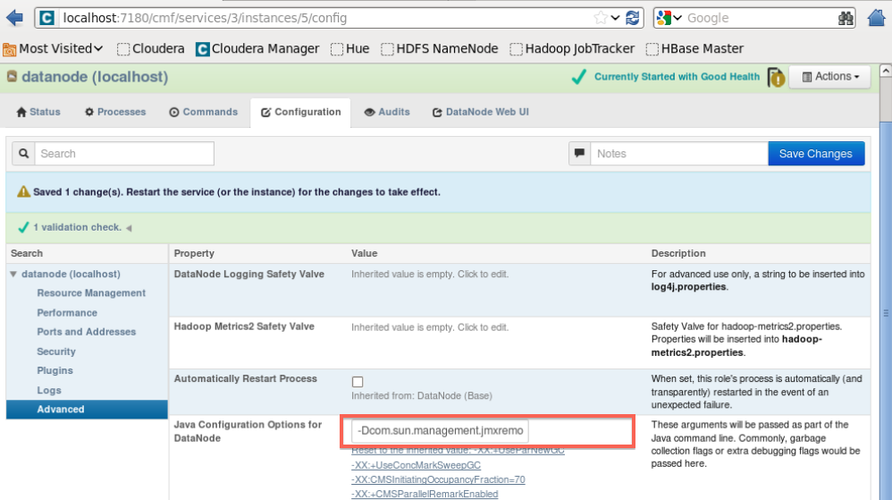

## Introduction

Unlike the [Embedded, Javaagent-based
monitor](SPM-Monitor---Javaagent), the Standalone monitor
is started as a separate process on each machine running the
application(s) you want to monitor. A separate monitor process should be
started for each application monitored on a machine. The installer adds
the /etc/init.d/spm-monitor startup script and adjusts your rc.local to
start it automatically when your machine starts. Before starting the
monitor one should first adjusting the following:  
  

  - Enable JMX for the application which will be monitored
  - Depending on JMX configuration of monitored server, adjust SPM
    monitor's JMX settings in **monitor properties** file (whose exact
    location and name for your application are mentioned in step 3 on
    <http://apps.sematext.com/spm-reports/client.do>)

  
After that, SPM monitor can be (re)started with:

``` syntaxhighlighter-pre
sudo service spm-monitor restart
```

## JMX Setups (i.e. How to Configure the Monitored App/Server)

There are 3 basic JMX setups (all explained below):

  - No security setup
  - Security with password file
  - Security with SSL and keystore/trustore

 

#### No Security Setup

  
Simple setup useful for testing, but you may want to consider using one
of the other types of setup for your production servers.  
This setup requires adding the following arguments to your Java process
(your Elasticsearch, Solr, HBase...):

``` syntaxhighlighter-pre
-Dcom.sun.management.jmxremote
-Dcom.sun.management.jmxremote.port=3000
-Dcom.sun.management.jmxremote.ssl=false
-Dcom.sun.management.jmxremote.authenticate=false
```

  
The only thing you can customize here is the port. This port has to be
reflected in monitor config, in **spm.remote.jmx.url** argument, as
shown below.  
In this example, **SPM\_MONITOR\_JMX\_PARAMS** property in **monitor
properties** file should be adjusted as follows (leave other properties
unchanged):

``` syntaxhighlighter-pre
SPM_MONITOR_JMX_PARAMS="-Dspm.remote.jmx.url=localhost:3000"  # MUST match the port in -Dcom.sun.management.jmxremote.port=3000 above
```

 

#### Security with Password File

  
You should define the role and its password in separate files for
monitored service (say for your tomcat server 
**/home/tomcat/passwordServer.tx**t) and for monitor itself (say
**/home/spm/passwordMonitor.txt**). Each file should be owned by the
user which runs the process (in case of **passwordServer.txt**, owner
could be ubuntu, jetty, tomcat... whoever is running the monitored
service; in case of **passwordMonitor.txt**, user always has to be
**spmmon** which is created during SPM client installation). Access
rights on these files should be set to **600**.  
  
These files should contain space-separated role-password pairs, for
example:

``` syntaxhighlighter-pre
monitorRole somepassword123
```

**Note:** when choosing the role name, make sure it is defined in
jmxremote.access file of your JRE (for example, in location like:
/usr/lib/jvm/java-7-oracle/jre/lib/management/jmxremote.access). By
default, role named **monitorRole** is defined and can be used
out-of-the-box. If you want to use some other role name, you should
first define it in jmxremote.access file.

  
The **passwordServer.txt** file can have multiple such lines,
while **passwordMonitor.txt** must contain only one line and this line
has to exist in the **passwordServer.txt** file.  
  
In this case, Java process of monitored service should be started with
following arguments (again, port can be adjusted and it has to be
reflected in SPM **monitor properties** below in **spm.remote.jmx.url**
argument):

``` syntaxhighlighter-pre
-Dcom.sun.management.jmxremote
-Dcom.sun.management.jmxremote.port=3000
-Dcom.sun.management.jmxremote.ssl=false
-Dcom.sun.management.jmxremote.authenticate=true
-Dcom.sun.management.jmxremote.password.file=/home/tomcat/passwordServer.txt
```

  
while **monitor properties** file should be adjusted like (leave other
properties in that file
unchanged):

``` syntaxhighlighter-pre
SPM_MONITOR_JMX_PARAMS="-Dspm.remote.jmx.url=localhost:3000 -Dspm.remote.jmx.password.file=/home/spm/passwordMonitor.txt"
```

 

#### Security with SSL and Keystore/Trustore

  
In this case, monitored service should get the following java arguments:

``` syntaxhighlighter-pre
-Dcom.sun.management.jmxremote
-Dcom.sun.management.jmxremote.port=3000
-Dcom.sun.management.jmxremote.ssl=true
-Djavax.net.ssl.keyStorePassword=password123
-Djavax.net.ssl.keyStore=/home/tomcat/server.ks
-Dcom.sun.management.jmxremote.authenticate=false
```

  
  
Port, password and keystore path should match your local setup.  
  
**Monitor properties** file should be adjusted like this (change just
**SPM\_MONITOR\_JMX\_PARAMS** property):

``` syntaxhighlighter-pre
SPM_MONITOR_JMX_PARAMS="-Dspm.remote.jmx.url=localhost:3000
-Djavax.net.ssl.trustStore=/home/spm/monitor.ts 
-Djavax.net.ssl.trustStorePassword=password456 
-Dcom.sun.management.jmxremote.ssl.need.client.auth=true"
```

  
where **spm.remote.jmx.url** argument, **trustStore** path and
**trustStorePassword** match your setup.

 

## Specifics Related to Various Servers

  
SPM monitor is always configured and started in the same way (by
adjusting **monitor properties** file, see description above). However,
there are different ways in which you can start your server, so here are
some examples:

 

#### Starting with Java Command

Here is example of starting Jetty server (any jar could have been used
here; the Jetty started here could have run Solr or some other
application):

``` syntaxhighlighter-pre
java -Dcom.sun.management.jmxremote 
-Dcom.sun.management.jmxremote.port=3000 
-Dcom.sun.management.jmxremote.ssl=true 
-Djavax.net.ssl.keyStorePassword=password123 
-Djavax.net.ssl.keyStore=/home/jetty/server.ks 
-Dcom.sun.management.jmxremote.authenticate=false 
-jar start.jar
```

#### Jetty (to run Solr or other apps)

See [Starting with Java
Command](#SPMMonitor-Standalone-StartingwithJavaCommand).

#### Tomcat (to run Solr or other apps)

There are various ways of adjusting your Tomcat, depending on the
version and on how it was installed (whether you just unpacked tomcat
package or installed it with apt-get install). One way is editing
**/etc/default/tomcat6** (if it exists) by adding:

``` syntaxhighlighter-pre
CATALINA_OPTS="${CATALINA_OPTS} -Dcom.sun.management.jmxremote 
-Dcom.sun.management.jmxremote.port=3000 
-Dcom.sun.management.jmxremote.ssl=false 
-Dcom.sun.management.jmxremote.authenticate=true 
-Dcom.sun.management.jmxremote.password.file=/home/tomcat/passwordTomcat.txt"
```

In some other cases, you may want to make similar addition for
**CATALINA\_OPTS** variable in your **bin/catalina.sh** file.

#### Elasticsearch

No need for any adjustments since SPM monitor uses JSON API calls to
collect Elasticsearch metrics.

#### HBase

Adjust your **hbase-env.sh** file. For instance, **hbase master** could
get the following
parameters:

``` syntaxhighlighter-pre
export HBASE_JMX_BASE="-Dcom.sun.management.jmxremote.ssl=false -Dcom.sun.management.jmxremote.authenticate=false"
export HBASE_MASTER_OPTS="$HBASE_JMX_BASE -Dcom.sun.management.jmxremote.port=3000"
```

  
while **region server** could
get:

``` syntaxhighlighter-pre
export HBASE_JMX_BASE="-Dcom.sun.management.jmxremote.ssl=false -Dcom.sun.management.jmxremote.authenticate=false"
export HBASE_REGIONSERVER_OPTS="$HBASE_JMX_BASE -Dcom.sun.management.jmxremote.port=3000"
```

  
In case you are running **hbase master** and **region server** on the
same machine, ensure they use different JMX ports (and adjust the config
of their **monitor properties** files).

When installing spm client, both **monitor properties** files will be
prepared for you (exact locations and names for your application are
mentioned in step 3 on
<http://apps.sematext.com/spm-reports/client.do>).

 

#### Sensei

Adjust your **start-sensei-node.sh** by changing **JAVA\_OPTS** like
this:

``` syntaxhighlighter-pre
JAVA_OPTS="$JAVA_OPTS -Dcom.sun.management.jmxremote 
-Dcom.sun.management.jmxremote.port=3000 
-Dcom.sun.management.jmxremote.ssl=true 
-Djavax.net.ssl.keyStorePassword=password123 
-Djavax.net.ssl.keyStore=/home/sensei/elasticsearch.ks 
-Dcom.sun.management.jmxremote.authenticate=false"
```

 

#### Hadoop

With Hadoop, each Hadoop node has a separate configuration of java
arguments. If you are using **hadoop-env.sh** file (located in
/**etc/hadoop/conf** or **HADOOP\_HOME/conf** dir; **NOTE:** in case it
doesn't exist, usually it is enough to create it in Hadoop's **conf**
subdir, it will automatically be used by Hadoop; please also check with
your Hadoop distribution docs what is the alternative), you can adjust
them by adding some of (example for simple no-security jmx setup):

``` syntaxhighlighter-pre
# both MRv1 (0.22 and earlier, 1.0, 1.1) and YARN (0.23, 2.*)
export HADOOP_NAMENODE_OPTS="$HADOOP_NAMENODE_OPTS -Dcom.sun.management.jmxremote
-Dcom.sun.management.jmxremote.port=3000
-Dcom.sun.management.jmxremote.ssl=false
-Dcom.sun.management.jmxremote.authenticate=false"

# both MRv1 (0.22 and earlier, 1.0, 1.1) and YARN (0.23, 2.*)
export HADOOP_SECONDARYNAMENODE_OPTS="$HADOOP_SECONDARYNAMENODE_OPTS -Dcom.sun.management.jmxremote
-Dcom.sun.management.jmxremote.port=3001
-Dcom.sun.management.jmxremote.ssl=false
-Dcom.sun.management.jmxremote.authenticate=false"

# both MRv1 (0.22 and earlier, 1.0, 1.1) and YARN (0.23, 2.*)
export HADOOP_DATANODE_OPTS="$HADOOP_DATANODE_OPTS -Dcom.sun.management.jmxremote
-Dcom.sun.management.jmxremote.port=3002
-Dcom.sun.management.jmxremote.ssl=false
-Dcom.sun.management.jmxremote.authenticate=false"

# only MRv1 (0.22 and earlier, 1.0, 1.1)
export HADOOP_TASKTRACKER_OPTS="$HADOOP_TASKTRACKER_OPTS -Dcom.sun.management.jmxremote
-Dcom.sun.management.jmxremote.port=3003
-Dcom.sun.management.jmxremote.ssl=false
-Dcom.sun.management.jmxremote.authenticate=false"

# only MRv1 (0.22 and earlier, 1.0, 1.1)
export HADOOP_JOBTRACKER_OPTS="$HADOOP_JOBTRACKER_OPTS -Dcom.sun.management.jmxremote
-Dcom.sun.management.jmxremote.port=3004
-Dcom.sun.management.jmxremote.ssl=false
-Dcom.sun.management.jmxremote.authenticate=false"

# only YARN (0.23, 2.*)
export YARN_RESOURCEMANAGER_OPTS="$YARN_RESOURCEMANAGER_OPTS -Dcom.sun.management.jmxremote
-Dcom.sun.management.jmxremote.port=3005
-Dcom.sun.management.jmxremote.ssl=false
-Dcom.sun.management.jmxremote.authenticate=false"

# only YARN (0.23, 2.*)
export YARN_NODEMANAGER_OPTS="$YARN_NODEMANAGER_OPTS -Dcom.sun.management.jmxremote
-Dcom.sun.management.jmxremote.port=3006
-Dcom.sun.management.jmxremote.ssl=false
-Dcom.sun.management.jmxremote.authenticate=false"

# only YARN (0.23, 2.*)
export HADOOP_JOB_HISTORYSERVER_OPTS="$HADOOP_JOB_HISTORYSERVER_OPTS -Dcom.sun.management.jmxremote
-Dcom.sun.management.jmxremote.port=3007
-Dcom.sun.management.jmxremote.ssl=false
-Dcom.sun.management.jmxremote.authenticate=false"

# only YARN (0.23, 2.*)
export YARN_PROXYSERVER_OPTS="$YARN_PROXYSERVER_OPTS -Dcom.sun.management.jmxremote
-Dcom.sun.management.jmxremote.port=3008
-Dcom.sun.management.jmxremote.ssl=false
-Dcom.sun.management.jmxremote.authenticate=false"
```

 

If you are using **CDH GUI** to administer your Hadoop setup, you can
adjust "**Java Configuration Options**" for each Hadoop node through the
console. For instance, for DataNode, you would go to **Services** ==\>
**hdfs** ==\> **DataNode **(link in status column) ==\>
**Configuration**. Expanding options shown for datanode **under Search
column** (click on arrow) shows **Advanced**. Under Advanced, **Value**
for "**Java Configuration Options for DataNode**" should be with same
values added to **HADOOP\_DATANODE\_OPTS** variable in the example
above.

**Alternatively**, even when using **CDH** **GUI** to administer Hadoop,
you can still choose to manually add definitions to **hadoop-env.sh**
file, you may just have to create it in **conf/** subdir if it doesn't
exist yet. ****

Below is the image of CDH UI:

``` 
 
```



#### ZooKeeper

Adjust your **zkServer.sh **(usually found
at /usr/lib/zookeeper/bin/zkServer.sh) by changing **JVMFLAGS** as
follows:

``` syntaxhighlighter-pre
export JVMFLAGS="$JVMFLAGS -Dcom.sun.management.jmxremote
-Dcom.sun.management.jmxremote.port=3000
-Dcom.sun.management.jmxremote.ssl=false
-Dcom.sun.management.jmxremote.authenticate=false"
```

#### Kafka

Kafka Broker has no port opened for JMX by default. To fix this
edit **kafka-server-start.sh** by changing JMX\_PORT as follows:

``` syntaxhighlighter-pre
export JMX_PORT=9999
```

Or start Kafka Broker like:

``` syntaxhighlighter-pre
$ env JMX_PORT=9999  bin/kafka-server-start.sh config/server.properties
```

For enabling JMX on Producer and Consumer nodes do it like you would do
it for a [simple JVM
application](SPM-Monitor---Standalone/#jmx-setups-ie-how-to-configure-the-monitored-appserver).

#### Storm

Storm lets you specify Nimbus, Supervisor, and Workers' JMX ports by
editing the storm.yaml file:

For Nimbus (in this example we specify JMX port as
3000):

``` syntaxhighlighter-pre
nimbus.childopts: "-Dcom.sun.management.jmxremote -Dcom.sun.management.jmxremote.port=3000 -Dcom.sun.management.jmxremote.ssl=false -Dcom.sun.management.jmxremote.authenticate=false"
```

For Supervisor (in this example we specify JMX port as
4000):

``` syntaxhighlighter-pre
supervisor.childopts: "-Dcom.sun.management.jmxremote -Dcom.sun.management.jmxremote.port=4000 -Dcom.sun.management.jmxremote.ssl=false -Dcom.sun.management.jmxremote.authenticate=false"
```

For Workers (use this approach to have Storm dynamically assign a JMX
port to each Worker choosing from the port range specified in the
storm.yaml): 

``` syntaxhighlighter-pre
worker.childopts: "-Dcom.sun.management.jmxremote -Dcom.sun.management.jmxremote.ssl=false -Dcom.sun.management.jmxremote.authenticate=false -Dcom.sun.management.jmxremote.port=%ID%"
```

For the above to work make sure the JMX port range is defined in
storm.yml as follows: 

``` syntaxhighlighter-pre
supervisor.slots.ports:
    - 6700
    - 6701
    - 6702
    - 6703
```

 

 

 

## Additional Notes

  
1\) In some cases, monitored server should also get the following
argument:

``` syntaxhighlighter-pre
 -Djava.rmi.server.hostname=localhost
```

 

If you are having issues connecting SPM standalone monitor to your
server, you may want to add the said option to your server/java process
and restart it. After that, also restart SPM monitor:

``` syntaxhighlighter-pre
sudo service spm-monitor restart
```
