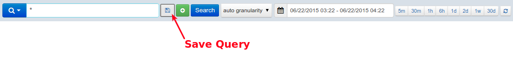

## Troubleshooting

#### Why am I not seeing my logs

A: The most common reason is that logs' timestamps are in the future,
and this most often happens when timestamps don't specify the timezone.
 For example, if you are east of UTC (e.g. in +0100 – 1 hour ahead of
UTC) and you send logs with timestamps in your local time, but without
specifying your local timezone, like this: 2016-01-30T14:00:00.000Z –
this timestamp actually represents 14:00 in UTC.  However, if it 14:00
in your timezone, which is 1 hour ahead of UTC, that means that 14:00
UTC is actually 1 hours in the future.  Currently, Logsene does not
display logs that have timestamps in the future, but it does accept
them, and shows them when those timestamps stop being in the future.

Another possibility why you are not seeing your logs is that their
structure clashes with the structure of your existing logs in the same
Logsene app.  For example, if you have sent logs with field "priority"
as integer field then Logsene will expect all future values of
"priority" field to be integers.  Sending a string value in a "priority"
field will fail.  Note that you *can* change the underlying field
"mapping" at any time - see [I have multiple different log structures,
each with a different set of fields. How should I handle
that](https://sematext.atlassian.net/wiki/display/PUBLOGSENE/Logsene+FAQ#LogseneFAQ-Ihavemultipledifferentlogstructures,eachwithadifferentsetoffields.HowshouldIhandlethat).

If none of the above turns out to be a problem in your case, please let
us know via <support@sematext.com> or via our live chat\!

#### How to check if there are any network connectivity issues

Things to check to ensure network connectivity is OK:

1\. Try to connect to logsene-receiver.sematext.com (port 80 or 443)
with the following command:

``` syntaxhighlighter-pre
nc -zv -w 20 logsene-receiver.sematext.com 443
```

or if you are using syslog, connect to
logsene-receiver-syslog.sematext.com (port 514 for TCP and UDP, port
20514 for RELP, port 10514 for TLS):

``` syntaxhighlighter-pre
nc -zv -w 20 logsene-receiver-syslog.sematext.com 10514
```

The output should show something like: Connection to
[logsene-receiver.sematext.com](http://spm-receiver.sematext.com) 443
port \[tcp/https\] succeeded\!

In case you see some other result:

  - if your server requires proxy to access the Internet, you'll have to
    adjust your log shipper config to use proxy settings
  - if firewall is used to protect your server, it may be blocking
    outbound traffic from it. Depending on which receiver and protocol
    you are using, please ensure with your IT/network admins that right
    ports are open for outbound traffic
  - check your DNS (see below)

2\. Check if your DNS has correct entries for Logsene Receiver:

``` syntaxhighlighter-pre
nslookup logsene-receiver.sematext.com
```

The output of this command should look like this, although the IP
addresses and names may be somewhat different, as they change
periodically:

``` syntaxhighlighter-pre
Server:        127.0.1.1
Address:    127.0.1.1#53

Non-authoritative answer:
logsene-receiver.sematext.com    canonical name = VPC-Logsene-Token-Receiver-LB-188765535.us-east-1.elb.amazonaws.com.
Name:    VPC-Logsene-Token-Receiver-LB-188765535.us-east-1.elb.amazonaws.com
Address: 52.54.165.65
Name:    VPC-Logsene-Token-Receiver-LB-188765535.us-east-1.elb.amazonaws.com
Address: 34.196.180.172
```

Or, if you are using syslog, try:

``` syntaxhighlighter-pre
nslookup logsene-receiver-syslog.sematext.com
```

The output should be similar to:

``` syntaxhighlighter-pre
Server:        127.0.1.1
Address:    127.0.1.1#53

Non-authoritative answer:
logsene-receiver-syslog.sematext.com    canonical name = ec2-52-44-248-43.compute-1.amazonaws.com.
Name:    ec2-52-44-248-43.compute-1.amazonaws.com
Address: 52.44.248.43
```

  

## General

#### How many logs can I store

A: There is no limit to how many logs you can store in your Logsene app.
 That said, you should try to pick the ideal Daily Volume when picking
your Logsene plan, as that is going to give you the most optimal $/GB
price.  If you pick too small Daily Volume and often go over the
selected volume your $/GB price will be higher than if you picked the
next higher Daily
Volume.

#### How can I check the number of logs I currently have in a Logsene app or how many GB/day I am shipping to Logsene

A: From the application, click the `App Actions` button and select
`Storage`. There's also `Settings` button next to [any of your Logsene
applications](https://apps.sematext.com/users-web/services.do#logsene) in
the `Services > See all Logsene apps`. You can also do that from Kibana
by searching for all your logs without adding any time filters. The
number of hits represents the number of all your logs.

#### How long are my logs stored

A: How long your logs are stored depends on what Data Retention you
selected when you picked your Logsene plan.  Each Logsene app can have a
different Daily Retention, Daily Volume, and plan.  You can change
retention, volume, and plan at any time.

#### Can I send old logs

A: Yes, you can send all logs.  However, keep in mind your Logsene app's
Data Retention settings.  For example, if your retention is set to 7
days and you send logs that are 10 days old (i.e. they contain a
timestamp from 10 days ago), they will get accepted, but will get
removed shortly after. Thus, check your app's data retention before
importing old data.

#### How can I send old logs

A: Use [Logagent](https://github.com/sematext/logagent-js).  With
Logagent you can then do: cat /path/to/old/log | logagent -t
YOUR\_LOGSENE\_APP\_TOKEN

#### Are logs shipped to Logsene ever rejected

A: When you pick a Daily Volume we automatically set another Logsene App
property called *Max* Daily Volume.  By default we set it to 2x the
selected Daily Volume.  When this limit is hit Logsene will stop
accepting new logs for that Logsene app until the next day (00:00 UTC).
 This Max Daily Volume is adjustable, so you can set it to whichever
value you'd like.  This Max Daily Volume limit prevents run-away logging
from causing over-billing.  Logsene will send email notifications before
this limit is reached.

#### What is the maximum log size Logsene will accept

A: That depends on the plan you selected for your application. If your
application is using the *Basic* plan, Logsene will accept logs up to 64
KB in size. If your application is using the *Standard* plan, Logsene
will allow logs up to 128 KB. If your application is using the *Pro*
plan, Logsene will accept logs up to 256 KB in size. If your logs are
larger than the mentioned limits, please consider using the *Enterprise*
plan.

#### My logs have special structure.  Can Logsene handle that

A: Yes, if the default log index fields (also known as index mapping)
don't fit your needs you can create completely custom index mapping.
See [Custom Logsene Mapping Template
How-To](http://blog.sematext.com/2015/01/20/custom-elasticsearch-index-templates-in-logsene/).

#### I have multiple log sources - should I send them all to the same Logsene app

A: Sending logs from multiple log sources to the same Logsene app is not
a problem at all.  However, if you have multiple different log
structures (different "fields" in the logs), see the next FAQ
entry.

#### I have multiple different log structures, each with a different set of fields.  How should I handle that

A: If you have N different log structures, the best way to handle that
is by creating N Logsene Apps, each with its own index mapping.  For
example, you may have web server logs, your system logs in
/var/log/messages, and your custom application logs.  Each of these 3
types of logs has a different structure.  The web server logs probably
use Apache Common Log format, the logs in /var/log/messages have syslog
structure, and your own application's logs can be in any format your
application happens to use.  To handle all 3 log formats elegantly
simply create 3 separate Logsene Apps and use a different format for
each of them.  If you want to be able to search all logs together, even
when they have different fields, you can do that - just ship them all to
the same Logsene App.  The thing to watch out for are fields that have
the same name, but different data type.  For example, if one log source
has a purely numeric field "size" and another log source also has a
field "size", but can have non-numeric values, this will cause issues.
 Thus, either keep logs of different structures in separate Logsene
Apps or make sure there are no conflicting fields.

## Plans & Prices

#### How much does Logsene cost

A: Check the [Logsene Plans &
Prices](http://www.sematext.com/logsene/#plans-and-pricing)
table.

#### What happens with my logs when I change from the free to a paid plan or vice versa

A: You don't have to worry about your data when you switch from the free
plan to a paid one. Your logs will remain safe and you can still be able
to search them. Your data will remain accessible based on your data
retention settings.  However, when you move from a paid plan to a free
plan, free plan restrictions will be applied to your data, which
including data retention, too. 

#### What is data retention and how does it work

A: Data retention mechanism is responsible for removing old log events.
If a log is 15 days old and you have retention set to 7 days, that log
will remain in Logsene until the retention mechanism deletes it. For
paid plans we remove whole 24-hour periods once a day. For free plans we
remove old data every 30
minutes.

#### Is data retention based on index/import/upload time or the actual log event @timestamp

A: Data retention is based on log event @timestamp. Logsene app's
retention removes data whose @timestamp is older than the retention
setting.

#### What happens if I go over the selected daily log volume and how much does that cost

A: The GB/day volume is **not** a limit. That number controls only *cost
per GB*. When you go over the GB/day number you had selected we do not
reject your data (for protection, use Max Daily Volume). Instead, we
keep track of how much data over the selected daily volume was shipped
and add that to the monthly cost using the $/GB rate for the selected
daily volume.  The higher daily volume you select, the lower the per GB
price.  For example, if you picked 1 GB/day and you typically don't go
over it, or go over very little, then it pays to keep that 1 GB/day
selection.  However, if you ship closer to 5 GB/day, then you should
select 5 GB/day volume, because that will give you a lower $/GB rate
than if you stay with 1 GB/day
selection. 

## Security

#### **Can I ship data to Logsene using a secure and encrypted transport like TLS/SSL or HTTPS**

A: Yes, all data can be shipped both over encrypted channels like
TLS/SSL and HTTPS, or via their unencrypted counter-parts.
 See <https://apps.sematext.com/logsene-reports/client.do> for more
information about how to configure log shipping.

#### **How secure is my data**

Logsene runs on Amazon AWS, whose infrastructure follows IT security
best practices and adheres to a number of compliance standards such
as SOC 1/SSAE, SOC 2, SOC 3,16/ISAE 3402 (formerly SAS 70 Type II),
FISMA, DIACAP, FedRAMP, and HIPAA.  For more information about AWS
security and compliance certifications see:
<http://aws.amazon.com/security> and <https://aws.amazon.com/compliance/>.

#### **Where is my data stored**

Logsene runs and stores data in Amazon AWS in the US.

#### **How long is my data stored**

This depends on the data retention you selected for each of your Logsene
apps.  Backups are stored in S3 and kept for 90 days.

## Kibana

#### Can I use my own Kibana 4

A: Yes.  Please see [How to use Kibana 4 with Logsene Log
Management](http://blog.sematext.com/2015/04/21/how-to-use-kibana-4-log-management/).

#### How can I get a nice map of the world in Kibana

Like this:


A: In Kibana itself, you need to add a new **map** panel. In the panel's
settings, you need to specify a field from your logs to be used to build
the map. That field has to contain a country code.

If you don't have a country field in your logs, but you have an IP, you
can use **Logstash's [geoip
filter](http://logstash.net/docs/latest/filters/geoip)**. For example, a
configuration like this:

``` syntaxhighlighter-pre
input {
  stdin {
    type => "human"
  }
}
filter {
  geoip {
    source => "message"
  }
}
output {
  elasticsearch_http {
          host => "logsene-receiver.sematext.com"
          port => 80
          index => "YOUR-APPLICATION-TOKEN-GOES-HERE"
  }
}
```

If you then start Logstash and type in an IP, you'll see in Kibana an
object called **geoip**, which contains lots of information, including
country codes. Back to Kibana, you can type in
***geoip.country\_code2*** **** as your field in the map panel.

#### Why are new fields not visible in Kibana 4 and how do I fix it

Kibana 4 doesn't update field lists automatically. This problem is not
specific to Logsene, but is a general Kibana issue. If you add new
fields to an index you must navigate to 'Settings / Index' in Kibana and
refresh the fields using the refresh button as shown in the screenshot
below. The new fields will appear and will be ready to use in your
visualizations and searches.


#### Can I run Kibana 4 locally and point it to Logsene

Yes.** I**f you prefer to run Kibana locally (e.g., on your laptop or
one of your company's servers) and point it to Logsene, yes, you can do
that - see [How to use Kibana 4 with
Logsene](http://blog.sematext.com/2015/04/21/how-to-use-kibana-4-log-management/).

#### How do I create a dashboard in Kibana 4

Kibana 4 requires the following high level steps to create a dashboard:

1.  Create a visualization - click to 'Visualize' and save it when
    finished. See
    also: <https://www.elastic.co/guide/en/kibana/current/visualize.html>
2.  Create a "Search" in the Discover view and save it.  Once you do
    that you can add it as table to your Dashboard later (See screenshot
    "Log View").  See
    also: <https://www.elastic.co/guide/en/kibana/current/discover.html>
3.  Go to the Dashboard view and add the saved visualizations to it.
     See
    also: <https://www.elastic.co/guide/en/kibana/current/dashboard.html>
4.  Save the Dashboard

#### Why I cannot draw charts (dashboards) using a given field

By default all string values sent to Logsene are analyzed. For each
analyzed fields we also create .raw field which is not analyzed. If you
want to use string field for drawing charts you should either use .raw
field or change index templates to use not\_analyzed type
(<https://sematext.com/blog/2015/01/20/custom-elasticsearch-index-templates-in-logsene/>).
 Let's consider and example. We have a field called 'title'. Logsene
uses this field as analyzed one so it is not possible to use it in
dashboards. Logsene also creates automatically a field called
'title.raw' and this one can be used for charts.

## Timestamps

#### Why does my syslog timestamp have a different time zone

A: The [original syslog
specification](http://tools.ietf.org/html/rfc3164) (RFC 3164) has a date
field that doesn't contain any time zone information. Fortunately,
there's a [new specification](http://tools.ietf.org/html/rfc5424) (RFC
5424) that uses [ISO 8601](https://en.wikipedia.org/wiki/ISO_8601)
timestamp. That's why we recommend using the new format for syslog
daemons that support it, such as [rsyslog](rsyslog.html) or
[syslog-ng](syslog-ng.html). If you use an older
[syslogd](syslogd.html) implementation, or you simply prefer to
use the older format, you have two options to have a correct timestamp:

  - set the system time on your server to UTC, or
  - change the timestamp for your logs to ISO 8601. For example, rsyslog
    does it with the default
    [template](http://www.rsyslog.com/doc/rsyslog_conf_templates.html)
    RSYSLOG\_ForwardFormat. For instance, to forward all logs via TCP,
    with the original specification, but with the ISO timestamp, you'd
    add the following line to your config:

<!-- end list -->

    *.* @@logsene-receiver-syslog.sematext.com:514;RSYSLOG_ForwardFormat

#### What are the supported timestamp formats

If you send your logs via the [Elasticsearch
API](Index-Events-via-Elasticsearch-API.html), you can use:

  - **ISO8601**. For example, **2001-06-08T08:00:01.123Z** or
    **2001-06-08T08:00:01+03:00**. A timezone must be there after the
    time (use **Z** for UTC), so *2001-06-08T08:00:01.123* won't work.
    You can also send timestamps with just the date (**2001-06-08**),
    and we'll count them as occurring at 00:00
  - **UNIX time in milliseconds**, for example **1487854172123**. UTC is
    assumed here, so we recommend setting the system time to UTC if you
    go this route

If you send your logs via syslog, you can use **ISO8601**, too
(recommended, see the previous question) or the legacy **RFC-3164
timestamp** (like **Oct 11 22:14:15**). The legacy format assumes UTC
and assumes the current year. It doesn't have sub-second precision,
either.

See [Supported Date Formats](Supported-Date-Formats.html) for
more examples of supported date and time
formats.

#### What happens if I try to send data with @timestamp older than my retention time

A: You can send old logs.  However, keep in mind your Logsene app's
retention settings.  For example, if your retention is set to 7 days and
you send logs that are 10 days old (i.e. they contain a timestamp from
10 days ago), they will get accepted and processed, but will get removed
within the next 24
hours.

#### What happens if I try to send data with @timestamp that is in the future

A: You can send logs with timestamps in the future, but they will not be
shown in Logsene until their timestamps stops being in the future.  For
example, if you send logs that are "2 hours ahead of real time" they
will be accepted, but will not be displayed until 2 hours
later.

## Log Shipping

#### Which log shippers, logging libraries, and platform integrations are supported

A: You can use [numerous log shippers, logging libraries, and platform
integrations](https://apps.sematext.com/logsene-reports/client.do).

#### How can I import logs from an existing Elasticsearch / ELK stack system

A: You can use [elk2logsene](https://github.com/sematext/elk2logsene) to
do that or even just Logstash - see [Elastic Stack Import-Export with
Logstash &
Logsene](https://sematext.com/blog/2016/08/22/logstash-migrating-data-logsene/).

#### How can I ship logs from Android and iOS apps

A: For shipping logs from Android apps
use <https://github.com/sematext/sematext-logsene-android> and for
shipping logs from iOS apps
use <https://github.com/sematext/sematext-logsene-ios>.

#### How can I ship AWS CloudTrail logs, AWS VPC logs, and other logs from S3

A: Use the
<https://github.com/sematext/logsene-aws-lambda-cloudwatch> AWS Lambda
function. See [Forwarding CloudTrail or Other Logs from AWS S3 to
Logsene](https://sematext.com/blog/2016/01/05/forwarding-cloudtrail-or-other-logs-from-aws-s3-to-logsene/)
and [Sending AWS Cloudwatch Logs to
Logsene](https://sematext.com/blog/2016/03/21/sending-aws-cloudwatchvpc-logs-to-logsene/)
for detailed description of how to do
this.

#### Why is it that I can forward logs with rsyslog via TCP or UDP, but not via RELP

A: You probably need to install the [omrelp
module](http://www.rsyslog.com/doc/omrelp.html) first. If you have
rsyslog installed in your system, there's probably a package that you
can install:

For RedHat and CentOS:

    % yum install rsyslog-relp

For Debian and Ubuntu:

    % apt-get install rsyslog-relp

For SUSE and OpenSUSE:

    % zypper install rsyslog-module-relp

If you compiled rsyslog manually, you need to supply **--enable-relp**
to the configure script. You can check if rsyslog starts properly by
starting it in foreground:

    % rsyslogd -n

You will get an error if the module is not found or you have any other
problem. For debug mode, add **-d** as
well.

#### How do I ship exception stack traces and other multi-line logs with Logstash without breaking them into multiple log events

A: Please see [Handling Stack Traces with
Logstash](http://blog.sematext.com/2015/05/26/handling-stack-traces-with-logstash/).

  

## Logsene Alerts

#### What are Logsene Alerts

A: Logsene alerts are based on saved searches that trigger alert
notifications when these saved searches meet a certain threshold
condition in your logs - e.g. less than N matches in 5 minutes, more
than M matches in 3 minutes, etc., or when such saved searches detect
*sudden changes* in the number/volume of matching logs - i.e.,
anomalies.

#### How to create Logsene Alerts

A: Logsene Alerts are added by clicking the disk icon on the right side
of the search box. Please see screenshots
below.

  

  

#### How to view Logsene Alerts

A: All saved queries are listed in "Search Queries" modal because all
Alert Queries are also Saved Queries. To view this modal just click a
magnifying glass icon left of the search field. Alert Queries are marked
with bell icon on "Saved" tab. If you want to see only Alert Queries
choose the "Alert"
tab.

  

 

#### What is the difference between threshold-based Alerts and Anomaly Detection (aka Algolerts)

A: If you have a clear idea about how many logs should be matching a
given Alert Query, then simply use threshold-based Alerts. In other
words, if you know that you always have some ERROR-level log events, you
may want to use threshold-based alerts for that. For example, if your
logs typically have \< 100 ERROR-level messages per minute you may want
to create an Alert Query that matches ERROR log events and notifies you
when there are more than 100 such matches in 1 minute.  

  

If you do not have a sense of how many matches a given Alert Query
matches on a regular bases, but you want to watch out for sudden changes
in volume, whether dips or spikes, use Algolerts (Anomaly
Detection-based Alerts). An extreme example that you may actually like
is an Alert Query that matches all logs - "\*" - a single wildcard
character for a query. If you use that for an Algolert then Logsene will
notify you when the overall volume of your logs suddenly changes, which
may be a signal that you should look for what suddenly increased logging
(e.g. maybe something started logging lots of errors, exceptions,
timeouts, or some such), or why logging volume suddenly dropped (e.g.
maybe some of your server(s) or app(s) stopped working and sending
logs).

#### Can I send Alerts to HipChat, Slack, Nagios, or other WebHooks

A: Logsene lets one configure arbitrary WebHooks to call with Alert
event information when Alert events are triggered. The details for
HipChat integration are
described [here](https://sematext.atlassian.net/wiki/display/PUBSPM/Alerts+-+HipChat+Integration). 

  

## S3 Archiving

#### How to obtain credentials from AWS

A: For Logsene AWS S3 Settings, besides S3 bucket name, you'll need
`Access Key ID` and `Secret Access Key`. 

Log in to your AWS account, go to `IAM > Users` and open (or create) a
user that you want to use for S3 uploads:


Click on `Create Access Key`:


Note down `Access Key ID` and `Secret Access Key` (you can `Download
Credentials` to a safe place if you like, but it's not necessary).

**How to setup S3 archiving for your Logsene app:**

A: In Sematext web app, go to `Integrations > Apps` view
and choose `Configure S3` using row context menu (*three-dots* icon)
of the app whose logs you want to ship to S3:

  

Paste `Access key ID` and `Secret access key` to the corresponding
fields. 

Enter `Bucket name` (just the simple name, not fully qualified ARN) and
choose `Compression` (read on for more details about compression) and
confirm with `Verify and save`.

At this point, Logsene is going to check whether the information is
valid using the AWS S3 API.

After the check is done you'll see a feedback message confirming
information validity or an error
message.

#### Which credentials are required when using AWS S3 Bucket Access Policy

A: In order to verify access to your S3 bucket, Logsene will first use
the credentials to log in and, if successful, it will proceed to create
a dummy object inside the bucket.

If object creation was successful it will delete the object.

For those reasons, the following credentials must be given to the bucket
when saving AWS S3 settings:

  - `s3:GetObject`
  - `s3:PutObject`
  - `s3:DeleteObject`

After the verification is done you can
remove `s3:DeleteObject` permission from the bucket policy.

#### How are logs compressed in S3

A: You have the option of choosing between two modern, lossless
compression codecs from the [`LZ77`
family](https://en.wikipedia.org/wiki/LZ77_and_LZ78), with excellent
speed/compression ratio, **`LZ4`** and **`LZF`**.  

If you choose `No compression` option, logs will be stored in raw,
uncompressed format, as JSON files.

#### How can I decompress logs archived in S3

A: You can decompress by installing these command line programs (then
use` man lz4 `or` man lzf` for further instructions):

**Ubuntu/Debian:**  
`sudo apt-get install liblz4-tool`  
`sudo apt-get install libcompress-lzf-java` (landed in Ubuntu 15.04)

**OSX:**  
`brew install lz4`  
`brew install liblzf`

#### **Which folder structure Logsene uses when uploading logs to S3**

A: Inside a bucket that you specify in settings, the following folder
hierarchy is created:

`sematext_[app-token-start]/[year]/[month]/[day]/[hour]`

Where `[app-token-start]` is the first sequence of app's token.

E.g. for app with token `f333a7d7-``ab55-4ce9-94a5-``cdb44a704740`,
folder will have the following path on `May 01, 2017 at 11:20PM UTC`:` `

`sematext_f333a7d7/2017/05/01/23/`

 

") **Note:**

Before **May 01, 2017 **the folder hierarchy was more flat:

`/<tokenMD5HexHash>/logsene_<date>/<hour>`

For example: `856f4f9c3c084da08ec7ea9ad5d4cadf/logsene_2016-07-20/18`

  
