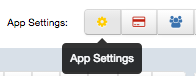

## In Slack

1.  Navigate to “/services/new” 

2.  Choose “Incoming Webhook”

3.  Press “Add” and copy the content of  “Webhook URL”

  

  

## In SPM

1.  Navigate to “SPM Application Settings“ of your SPM App by clicking
    the “App Settings“ button.  
      
      

2.  Navigate to “Alerts / WebHooks“

3.  Paste the Webhook URL from Slack  to the field "Webhook URL"

4.  In the field “Description” enter the word “text” for detailed
    notifications, or use the field "Title" for sending just the alert
    title to the Slack room.  
    Choose HTTP Method “POST” and “JSON” format. The resulting
    configuration is shown in this screenshot:  
    

5.  Click the “Test” button and when Slack returns status code 200 you
    will know everything is configured correctly. Check your Slack
    channel for the test message from SPM.  
    

6.  Click the “Save” button.

  

That's it. Notifications sent to Slack can also be sent via other
channels such as e-mail, PagerDuty, Nagios, etc. - at the same time, the
alert is displayed in the SPM event graph to overlay it with the
triggering metrics:

