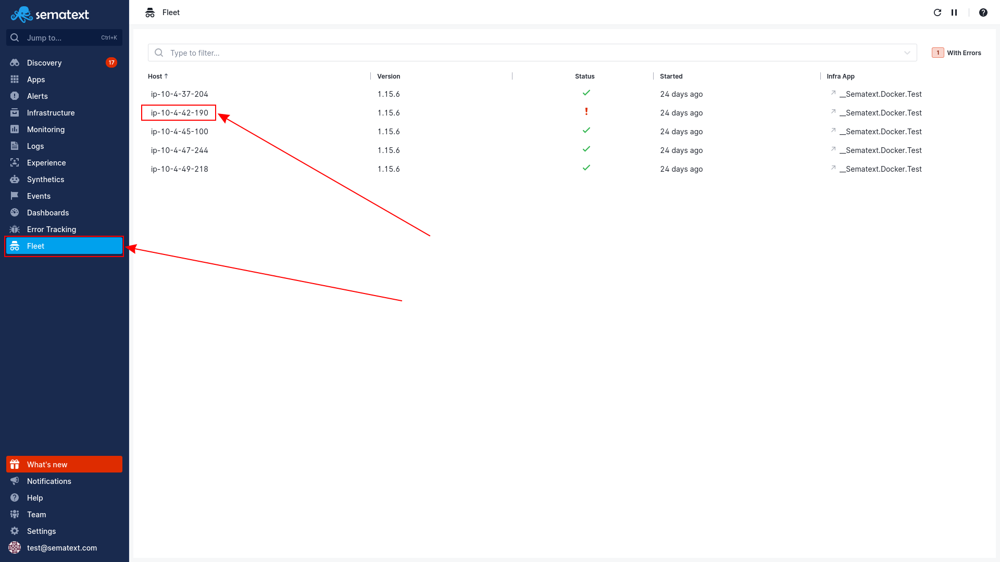
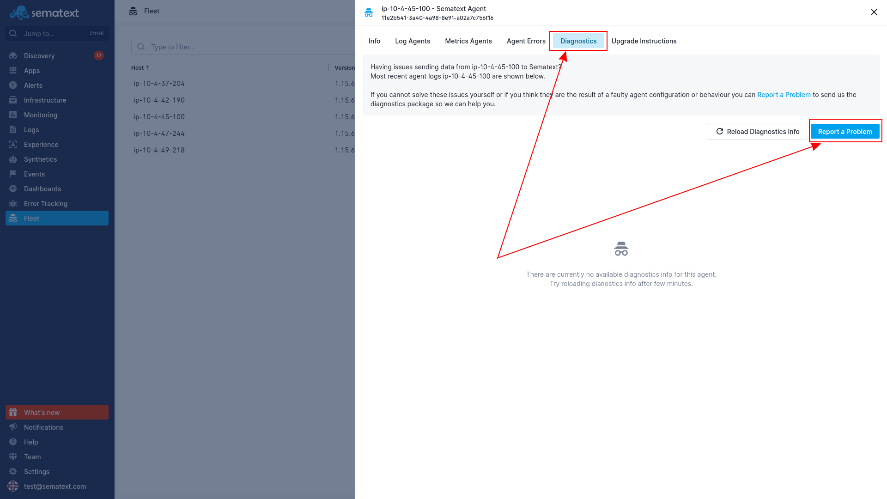
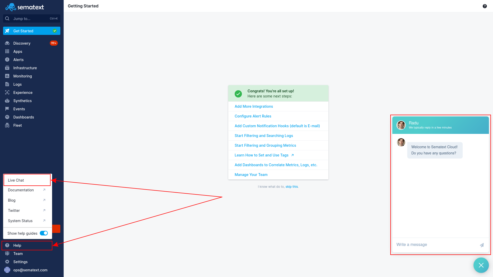

title: Agent Troubleshooting

If you are experiencing issues with the Sematext Agent, there are some things you can try.

1. Check the Sematext Agent logs and filter by errors. By default they'll be located at `/opt/spm/spm-monitor/logs/st-agent`. 
   1. If you see errors related to permission denied while accessing log files or system information, [restart the agent](https://sematext.com/docs/agents/sematext-agent/starting-stopping) with [elevated privileges](https://sematext.com/docs/agents/sematext-agent/permission-requirements/). 
   2. If you see errors like `"cloud" collector failed to complete the initial run` check out our [tags common schema docs](https://sematext.com/docs/tags/common-schema/#cloud-tags) and verify your IAM roles are set up correctly.
   

2. Try restarting the agent. Specific instructions on how to do so depending on your environment can be found [here](https://sematext.com/docs/agents/sematext-agent/starting-stopping).

3. Update the agent to the latest version. For more details on how to do that, see our [Agent Upgrade Instructions](https://sematext.com/docs/monitoring/spm-faq/#agent-updating). You can see which agents need to be updated in the Fleet section of Sematext Cloud.

If there is an update available for a particular agent, you'll see a warning next to the agent's version.

Find the full Fleet documentation [here](https://sematext.com/docs/fleet/).

4. If data cannot be shipped, you may be behind a proxy. If that's the case, follow [these instructions](https://sematext.com/docs/monitoring/spm-faq/#can-i-install-sematext-agent-on-servers-that-are-behind-a-proxy) to configure the agent.

5. Journal is a buffer we use to store data when shipping fails. In case of outages or internal communication issues, the Journal files may grow rapidly and produce high system load. If you are experiencing high CPU usage, do the following:
   1. Navigate to the Journal directory, by default `/opt/spm/spm-monitor/st-agent/journal`.
   2. See if it contains a large number of files. If it does, it might be the cause of high CPU usage.
   
   Disabling Journal may lower the CPU usage. However, data that fails to ship will be lost, so disabling Journal may lead to gaps in the data stored in Sematext Cloud. You can disable Journal by following these steps:
   1. Open the following file in your text editor: `/opt/spm/properties/st-agent.yml`. 
   2. Comment out the `journal` section by adding the character `#` at the beginning of every line in the section.
   3. [Restart](https://sematext.com/docs/agents/sematext-agent/starting-stopping) the Sematext Agent.
   Note that this is a temporary solution, and you should contact [our support team](https://sematext.com/docs/agent/agent-troubleshooting/#support) to help you identify and solve the root cause of your issue.
   
6. If you are still having trouble, you can send us the diagnostics package, and we will assist you as soon as possible. To do so:
   1. Go to your Sematext Cloud dashboard.
   2. On the menu on the left, select `Fleet`.
   
   3. Find your host on the list and click on it.
   4. Navigate to the `Diagnostics` tab.
   
   5. Click on `Report a problem` and describe your issue.
   6. Once you're done, click on `Send a report` and we will reply shortly.

## Support
Remember you can always contact us via chat on the bottom right corner of [our webpage](https://sematext.com/) and the Help button on Sematext Cloud, or via email at [support@sematext.com](mailto:support@sematext.com).

