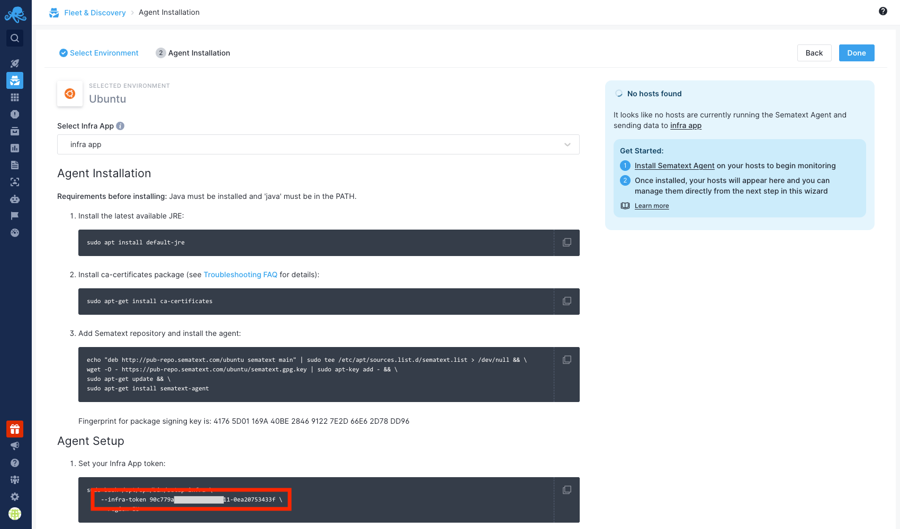

title: Installing Sematext Agent on Linux

The Sematext Agent is available as a package (DEB, RPM, etc.) called sematext-agent:

<div class="mdl-tabs mdl-js-tabs mdl-js-ripple-effect">
 <div class="mdl-tabs__tab-bar">
     <a href="#redhat" class="mdl-tabs__tab is-active">Red Hat</a>
     <a href="#centos" class="mdl-tabs__tab">CentOS</a>
     <a href="#debian" class="mdl-tabs__tab">Debian</a>
     <a href="#ubuntu" class="mdl-tabs__tab">Ubuntu</a>
     <a href="#amazonlinux" class="mdl-tabs__tab">Amazon</a>
     <a href="#fedora" class="mdl-tabs__tab">Fedora</a>
     <a href="#suse" class="mdl-tabs__tab">SuSE</a>
 </div>

 <div class="mdl-tabs__panel is-active" id="redhat">
   <pre>
sudo wget https://pub-repo.sematext.com/redhat/sematext.repo -O /etc/yum.repos.d/sematext.repo
sudo yum clean all
sudo yum install sematext-agent
   </pre>
 </div>
 <div class="mdl-tabs__panel" id="centos">
   <pre>
sudo wget https://pub-repo.sematext.com/centos/sematext.repo -O /etc/yum.repos.d/sematext.repo
sudo yum clean all
sudo yum install sematext-agent
   </pre>
 </div>
 <div class="mdl-tabs__panel" id="debian">
   <pre>
echo "deb http://pub-repo.sematext.com/debian sematext main" | sudo tee /etc/apt/sources.list.d/sematext.list > /dev/null
wget -O - https://pub-repo.sematext.com/debian/sematext.gpg.key | sudo apt-key add -
sudo apt-get update
sudo apt-get install sematext-agent
   </pre>
 </div>

 <div class="mdl-tabs__panel" id="ubuntu">
   <pre>
echo "deb http://pub-repo.sematext.com/ubuntu sematext main" | sudo tee /etc/apt/sources.list.d/sematext.list > /dev/null
wget -O - https://pub-repo.sematext.com/ubuntu/sematext.gpg.key | sudo apt-key add -
sudo apt-get update
sudo apt-get install sematext-agent
   </pre>
 </div>

 <div class="mdl-tabs__panel" id="amazonlinux">
   <pre>
sudo wget https://pub-repo.sematext.com/centos/sematext.repo -O /etc/yum.repos.d/sematext.repo
sudo yum clean all
sudo yum install sematext-agent
   </pre>
 </div>

 <div class="mdl-tabs__panel" id="fedora">
   <pre>
sudo wget https://pub-repo.sematext.com/fedora/sematext.repo -O /etc/yum.repos.d/sematext.repo
sudo dnf clean all
sudo dnf install sematext-agent
   </pre>
 </div>

 <div class="mdl-tabs__panel" id="suse">
   <pre>
sudo zypper ar -r https://pub-repo.sematext.com/suse/11/sematext.repo
sudo zypper up
sudo zypper in sematext-agent
   </pre>
 </div>
</div>


Note: if you have SELinux enabled, see [How can I get the Agent running when SELinux is enabled](/monitoring/spm-faq/#how-can-i-get-the-agent-running-when-selinux-is-enabled).


After the install completes, set your Infra App token by running the command below:

```
sudo bash /opt/spm/bin/setup-infra --infra-token <YOUR_INFRA_APP_TOKEN_HERE>
```

If you're setting up the agent in the EU region, you'll have to provide the `region` option:

```
sudo bash /opt/spm/bin/setup-infra --infra-token <YOUR_INFRA_APP_TOKEN_HERE> --region eu
```

To obtain the Infra App token, navigate to `Discovery > Agent Installation` and pick your target distribution.


