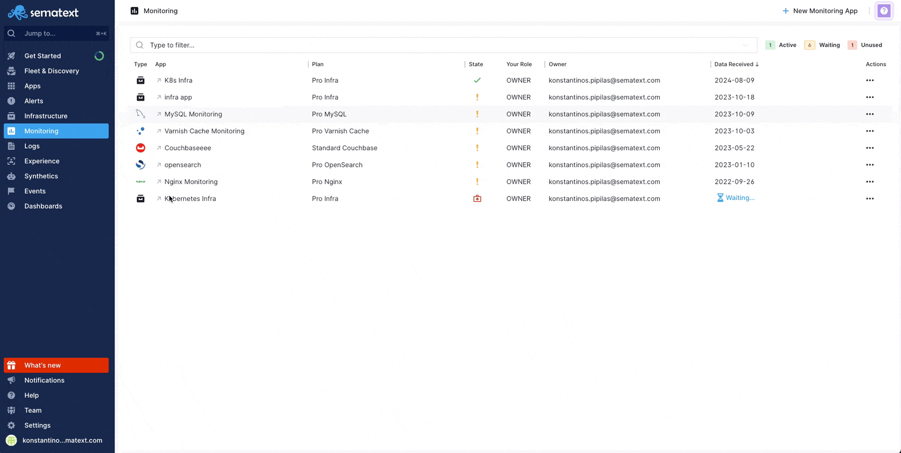

title: Installing Sematext Agent on Linux

The Sematext Agent is available as a package (DEB, RPM, etc.) called `sematext-agent`:

<div class="mdl-tabs mdl-js-tabs mdl-js-ripple-effect">
 <div class="mdl-tabs__tab-bar">
     <a href="#redhat" class="mdl-tabs__tab is-active">Red Hat</a>
     <a href="#centos" class="mdl-tabs__tab">CentOS</a>
     <a href="#debian" class="mdl-tabs__tab">Debian</a>
     <a href="#ubuntu" class="mdl-tabs__tab">Ubuntu</a>
     <a href="#amazonlinux" class="mdl-tabs__tab">Amazon</a>
     <a href="#fedora" class="mdl-tabs__tab">Fedora</a>
     <a href="#suse" class="mdl-tabs__tab">SuSE</a>
 </div>

 <div class="mdl-tabs__panel is-active" id="redhat">
   <h3>Installing on Red Hat</h3>
   <pre>
sudo wget https://pub-repo.sematext.com/redhat/sematext.repo -O /etc/yum.repos.d/sematext.repo
sudo yum clean all
sudo yum install sematext-agent
   </pre>

   <h3>Upgrading/Updating on Red Hat</h3>
   1. Update the repository file and GPG key:
   <pre>
sudo wget https://pub-repo.sematext.com/redhat/sematext.repo -O /etc/yum.repos.d/sematext.repo
sudo rpm --import https://pub-repo.sematext.com/redhat/sematext.gpg.key
   </pre>
   2. Upgrade the Sematext Agent:
   <pre>
sudo yum update sematext-agent
   </pre>

   <h3>Uninstalling on Red Hat</h3>
   <pre>
sudo yum remove sematext-agent
   </pre>
   To ensure all configuration files and logs are removed, delete the main installation directory:
   <pre>
sudo rm -rf /opt/spm
   </pre>
 </div>

 <div class="mdl-tabs__panel" id="centos">
   <h3>Installing on CentOS</h3>
   <pre>
sudo wget https://pub-repo.sematext.com/centos/sematext.repo -O /etc/yum.repos.d/sematext.repo
sudo yum clean all
sudo yum install sematext-agent
   </pre>

   <h3>Upgrading/Updating on CentOS</h3>
   1. Update the repository file and GPG key:
   <pre>
sudo wget https://pub-repo.sematext.com/centos/sematext.repo -O /etc/yum.repos.d/sematext.repo
sudo rpm --import https://pub-repo.sematext.com/centos/sematext.gpg.key
   </pre>
   2. Upgrade the Sematext Agent:
   <pre>
sudo yum update sematext-agent
   </pre>

   <h3>Uninstalling on CentOS</h3>
   <pre>
sudo yum remove sematext-agent
   </pre>
   To ensure all configuration files and logs are removed, delete the main installation directory:
   <pre>
sudo rm -rf /opt/spm
   </pre>
 </div>

 <div class="mdl-tabs__panel" id="debian">
   <h3>Installing on Debian</h3>
   <pre>
echo "deb http://pub-repo.sematext.com/debian sematext main" | sudo tee /etc/apt/sources.list.d/sematext.list > /dev/null
wget -O - https://pub-repo.sematext.com/debian/sematext.gpg.key | sudo apt-key add -
sudo apt-get update
sudo apt-get install sematext-agent
   </pre>

   <h3>Upgrading/Updating on Debian</h3>
   1. Update the repository file and GPG key:
   <pre>
echo "deb http://pub-repo.sematext.com/debian sematext main" | sudo tee /etc/apt/sources.list.d/sematext.list > /dev/null
wget -O - https://pub-repo.sematext.com/debian/sematext.gpg.key | sudo apt-key add -
sudo apt-get update
   </pre>
   2. Upgrade the Sematext Agent:
   <pre>
sudo apt-get upgrade sematext-agent
   </pre>

   <h3>Uninstalling on Debian</h3>
   <pre>
sudo apt-get remove --purge sematext-agent
   </pre>
   To ensure all configuration files and logs are removed, delete the main installation directory:
   <pre>
sudo rm -rf /opt/spm
   </pre>
 </div>

 <div class="mdl-tabs__panel" id="ubuntu">
   <h3>Installing on Ubuntu</h3>
   <pre>
echo "deb http://pub-repo.sematext.com/ubuntu sematext main" | sudo tee /etc/apt/sources.list.d/sematext.list > /dev/null
wget -O - https://pub-repo.sematext.com/ubuntu/sematext.gpg.key | sudo apt-key add -
sudo apt-get update
sudo apt-get install sematext-agent
   </pre>

   <h3>Upgrading/Updating on Ubuntu</h3>
   1. Update the repository file and GPG key:
   <pre>
echo "deb http://pub-repo.sematext.com/ubuntu sematext main" | sudo tee /etc/apt/sources.list.d/sematext.list > /dev/null
wget -O - https://pub-repo.sematext.com/ubuntu/sematext.gpg.key | sudo apt-key add -
sudo apt-get update
   </pre>
   2. Upgrade the Sematext Agent:
   <pre>
sudo apt-get upgrade sematext-agent
   </pre>

   <h3>Uninstalling on Ubuntu</h3>
   <pre>
sudo apt-get remove --purge sematext-agent
   </pre>
   To ensure all configuration files and logs are removed, delete the main installation directory:
   <pre>
sudo rm -rf /opt/spm
   </pre>
 </div>

 <div class="mdl-tabs__panel" id="amazonlinux">
   <h3>Installing on Amazon Linux</h3>
   <pre>
sudo wget https://pub-repo.sematext.com/centos/sematext.repo -O /etc/yum.repos.d/sematext.repo
sudo yum clean all
sudo yum install sematext-agent
   </pre>

   <h3>Upgrading/Updating on Amazon Linux</h3>
   1. Update the repository file and GPG key:
   <pre>
sudo wget https://pub-repo.sematext.com/centos/sematext.repo -O /etc/yum.repos.d/sematext.repo
sudo rpm --import https://pub-repo.sematext.com/centos/sematext.gpg.key
   </pre>
   2. Upgrade the Sematext Agent:
   <pre>
sudo yum update sematext-agent
   </pre>

   <h3>Uninstalling on Amazon Linux</h3>
   <pre>
sudo yum remove sematext-agent
   </pre>
   To ensure all configuration files and logs are removed, delete the main installation directory:
   <pre>
sudo rm -rf /opt/spm
   </pre>
 </div>

 <div class="mdl-tabs__panel" id="fedora">
   <h3>Installing on Fedora</h3>
   <pre>
sudo wget https://pub-repo.sematext.com/fedora/sematext.repo -O /etc/yum.repos.d/sematext.repo
sudo dnf clean all
sudo dnf install sematext-agent
   </pre>

   <h3>Upgrading/Updating on Fedora</h3>
   1. Update the repository file and GPG key:
   <pre>
sudo wget https://pub-repo.sematext.com/fedora/sematext.repo -O /etc/yum.repos.d/sematext.repo
sudo rpm --import https://pub-repo.sematext.com/fedora/sematext.gpg.key
   </pre>
   2. Upgrade the Sematext Agent:
   <pre>
sudo dnf update sematext-agent
   </pre>

   <h3>Uninstalling on Fedora</h3>
   <pre>
sudo dnf remove sematext-agent
   </pre>
   To ensure all configuration files and logs are removed, delete the main installation directory:
   <pre>
sudo rm -rf /opt/spm
   </pre>
 </div>

 <div class="mdl-tabs__panel" id="suse">
   <h3>Installing on SuSE</h3>
   <pre>
sudo zypper ar -r https://pub-repo.sematext.com/suse/11/sematext.repo
sudo zypper up
sudo zypper in sematext-agent
   </pre>

   <h3>Upgrading/Updating on SuSE</h3>
   1. Update the repository file and GPG key:
   <pre>
sudo zypper rr sematext
sudo zypper ar -r https://pub-repo.sematext.com/suse/11/sematext.repo
sudo rpm --import https://pub-repo.sematext.com/suse/sematext.gpg.key
   </pre>
   2. Upgrade the Sematext Agent:
   <pre>
sudo zypper update sematext-agent
   </pre>

   <h3>Uninstalling on SuSE</h3>
   <pre>
sudo zypper rm sematext-agent
   </pre>
   To ensure all configuration files and logs are removed, delete the main installation directory:
   <pre>
sudo rm -rf /opt/spm
   </pre>
 </div>
</div>

---

**Note:** If you have SELinux enabled, see [How can I get the Agent running when SELinux is enabled](/monitoring/spm-faq/#how-can-i-get-the-agent-running-when-selinux-is-enabled).


## Configure communication with Sematext Cloud using your Infra App Token

Once the Sematext Agent is installed, you need to configure it to communicate with Sematext Cloud. This is done by setting your Infra App token using the following command:

```
sudo bash /opt/spm/bin/setup-infra --infra-token <YOUR_INFRA_APP_TOKEN_HERE>
```

If you're setting up the agent in the EU region, you'll have to provide the `region` option:

```
sudo bash /opt/spm/bin/setup-infra --infra-token <YOUR_INFRA_APP_TOKEN_HERE> --region eu
```

You can find your Infra App token by navigating to `Fleet and Discovery > Agents > Install Agent` and selecting your Linux distribution.


## Extra configuration for Monitoring and Logs Integrations

To fully enable monitoring and logging for specific integrations, additional configuration steps are required after the Sematext Agent installation or upgrade. These steps are provided directly after the installation instructions for each integration in Sematext Cloud:



The integrations that require this extra configuration include:

- Cassandra
- Couchbase
- Hadoop
- HBase
- Kafka
- Solr
- Solr Cloud
- Spark
- Storm
- Tomcat
- Zookeeper
- Jenkins
- JVM
- Elasticsearch
- OpenSearch
- Redis
- HAProxy
- MySQL
- Nginx Plus
- ClickHouse
- PostgreSQL
- RabbitMQ

Follow the specific setup instructions for each integration to ship metrics and logs from the agent to Sematext Cloud.
