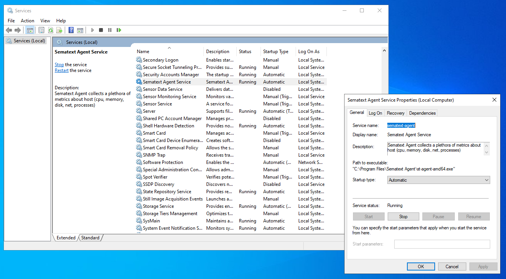

title: Installing Sematext Agent on Windows

Sematext Agent collects a plethora of metrics about Windows hosts (cpu, memory, disk, network, processes). The installer is responsible to install the Sematext Agent, configuring it, and starting it as a Windows service.

Installation can be done either by using the GUI installer or through the command line.

## Pre-requirements

Before starting, please check the [platform support policy](https://sematext.com/docs/agents/sematext-agent/platform-support-policy/) page to make sure your Windows platform is supported.

To see your Windows host metrics in Sematext Cloud, you need to [create an Infra App](https://sematext.com/docs/monitoring/infrastructure/#create-an-infra-app) and select the Windows environment. This will provide you with an Infra token, which is essential for establishing a secure link between Sematext Cloud and Sematext Agent.

## Install from GUI

1. Download the [Sematext Agent installer](https://todo-add-public-installer-repo)
2. Run the installer as an Administrator
3. Follow the installation steps and accept the license agreement 
4. Set the Infra token
5. Select a region (EU or US) based on where you created your account in Sematext Cloud

After completing these steps, Sematext Agent will be automatically started as a Windows Service.


## Install from command line

Download the [Sematext Agent installer](https://todo-add-public-installer-repo).

### Using PowerShell

Run the following command as Administrator from the folder that you downloaded the installer:

    ```
    Start-Process -Wait msiexec -ArgumentList "/qn /i $($msiFileName = 'sematext-agent-VERSION.msi'; $msiFileName) /L*V `"$msiFileName.log`" INFRA_TOKEN=YOUR_INFRA_TOKEN REGION=YOUR_REGION_EU_or_US"
    ```

Make sure to replace `YOUR_INFRA_TOKEN` with your Infra token and `YOUR_REGION_EU_or_US` with your region. For example:

    ```
    Start-Process -Wait msiexec -ArgumentList "/qn /i $($msiFileName = 'sematext-agent-3.3.0.2.msi'; $msiFileName) /L*V `"$msiFileName.log`" INFRA_TOKEN=7511db7f-c060-4e10-b667-5f2653d4933e REGION=EU"
    ```

### Using command line:

Run the following command as Administrator from the folder that you downloaded the installer:

    ```
    start /wait msiexec /qn /i "sematext-agent-VERSION.msi" /L*V "sematext-agent-VERSION.msi.log" INFRA_TOKEN=YOUR_INFRA_TOKEN REGION=YOUR_REGION_EU_or_US
    ```

Make sure to replace `YOUR_INFRA_TOKEN` with your Infra token and `YOUR_REGION_EU_or_US` with your region. For example:

    ```
    start /wait msiexec /qn /i "sematext-agent-3.3.0.2.msi" /L*V "sematext-agent-3.3.0.2.msi.log" INFRA_TOKEN=7511db7f-c060-4e10-b667-5f2653d4933e REGION=EU
    ```

After completing these steps, Sematext Agent will be automatically started as a Windows Service.

## How to check the Sematext Agent service status

### Windows Services

Open Windows Services and find the Sematext Agent service:



### Command line

Run the following command:

```
cd  'C:\Program Files\Sematext Agent\' .\st-agent-amd64.exe windows-service status
```

## How to start / stop / restart Sematext Agent

Run one of the following commands to start, stop or restart Sematext Agent

Start:

```
cd  'C:\Program Files\Sematext Agent\' .\st-agent-amd64.exe windows-service start
```

Stop:

```
cd  'C:\Program Files\Sematext Agent\' .\st-agent-amd64.exe windows-service stop
```

Restart:

```
cd  'C:\Program Files\Sematext Agent\' .\st-agent-amd64.exe windows-service restart
```

## How to check Sematext Agent logs

Sematext Agent logs are located in the `%LOCALAPPDATA%\sematext-agent\logs\` folder.

## How to change Infra token and region

You can either reinstall Sematext Agent through GUI or by running the following command from command line:

```
cd  'C:\Program Files\Sematext Agent\'
.\st-agent-amd64.exe windows-config set-token -t "YOUR_INFRA_TOKEN"
.\st-agent-amd64.exe windows-config set-region -r "YOUR_REGION_EU_or_US"
```

## How to unistall Sematext Agent

You can uninstall Sematext Agent using the GUI installer or by from Windows Settings > Apps
