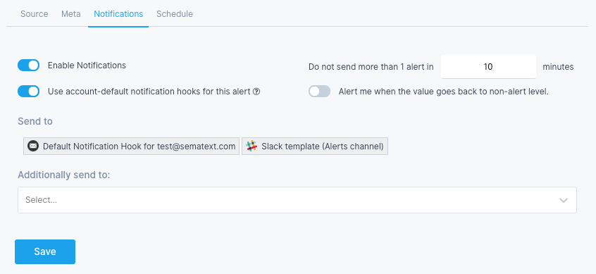
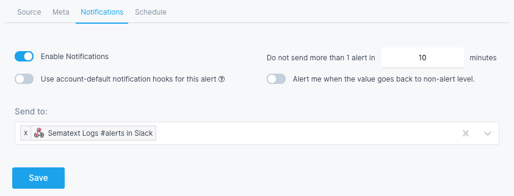

title: Account-default hooks
description: Configuring default alert hooks for Alerts

Each alert rule can be configured to send notifications to one or more notification hooks. But what do you do when you want to change where all alert notifications are sent? For example, what if you had them sent to VictorOps, but your team switched from VictorOps to OpsGenie?

To make it easy to change where alert notifications are sent for the whole Sematext Cloud account, without needing to modify each and every alert rule individually, Sematext has the concept of "account default hook".

Notification hooks can be marked as "account default hook" in the Notification Hooks view. 

While creating or modifying an alert rule one can choose whether to send notifications to whichever hook, or hooks, defined as default. This setting is turned on by default when a new alert rule is created. 

*Send to* section is read-only, because it merely shows the current state of *account-default* notification hooks. 

Besides *account-default notification hooks*, you can specify additional hooks that pertain only to this particular alert rule. The following alert would send notifications to 4 different destinations when triggered.

Each alert gives you the option to opt-out from **"Using account-default hooks for that alert"**, by simply turning off that toggle.

If you turn off notifications for an *alert rule* the only consequence of that alert being triggered will be to generate events in the [Events view](./alert-events).

When alerts are defined to use default notification hooks then where they send notifications can be changed by simply changing which notification hooks are marked as default!

More than one notification hook can be marked as default. Which hooks are marked as default can be changed at any time. The change is instantaneous and applies to the whole account. Only alert rules that were defined to use the default notification hook(s) are affected. Any additional notification hooks specified for the alert rule will not be touched and will remain associated with the alert rule.

This gives you the ability to configure notifications for all your alerts without editing all of them individually.