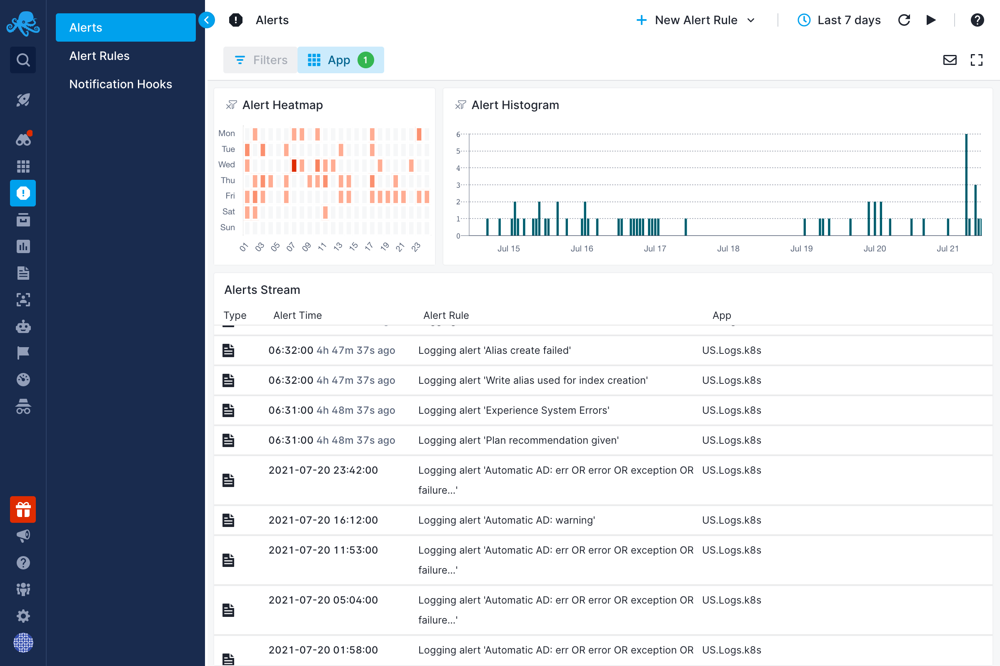
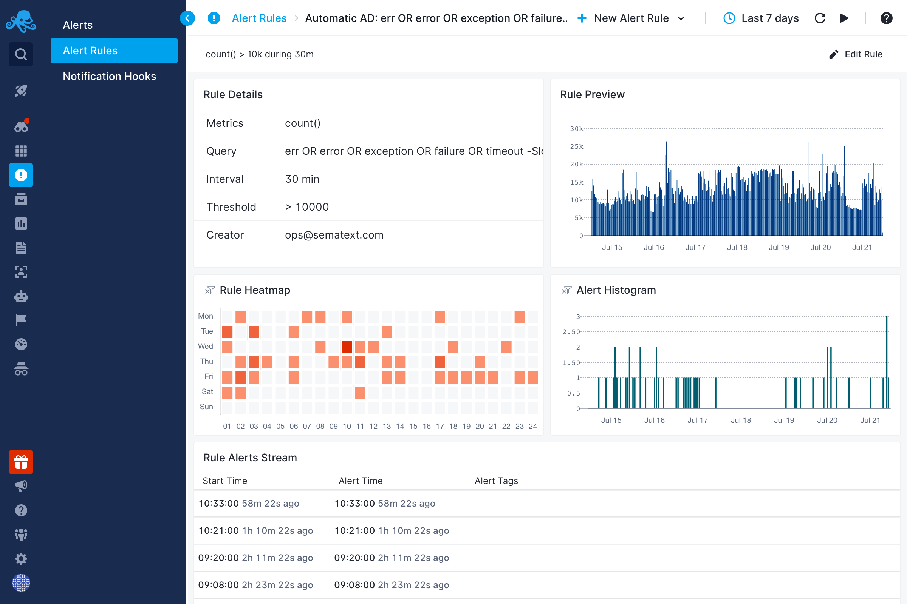
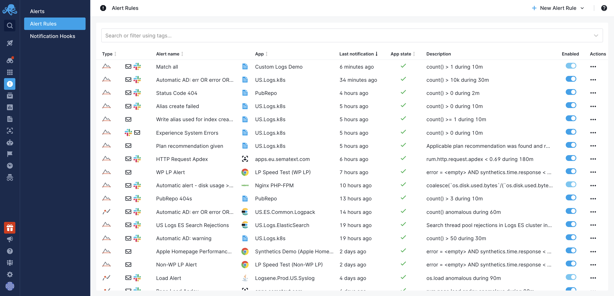

title: Alert Events
description: Observe triggered alerts

Alerts view shows overview of triggered alerts. You can see 24x7 heatmap, histogram and table with alerts triggered within selected time period. By default, alerts for all Apps are displayed, but there is ability to filter alerts for only one or more Apps.

Upon clicking on alert time in the table, details for the selected alert event will be opened. Depending on type of alert event, different overview can be displayed. Here is an example of Logs alert event.

You can also open overview report for some alert rule if you click on alert rule name in the alert events table. It will be opened in a flyout, but you can also open it as a full page.

By default, alert rules are sorted so that alert rules which were triggered most recently show up first.

Similar to alert events table, clicking on `Last notification` will open details about that particular event and clicking on alert rule name will open alert rule overview page.

