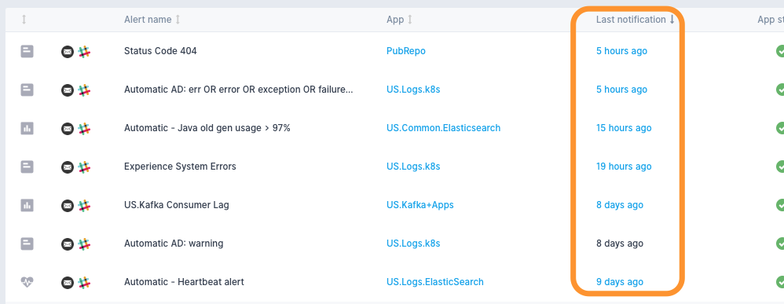
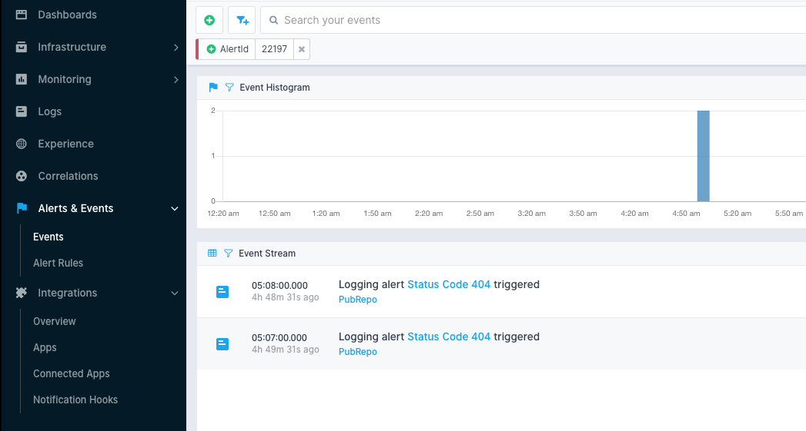

title: Alert Events
description: Observe triggered alerts in the Events view

By default, alert rules are sorted so that alert rules which were triggered most recently show up first.

Upon clicking on the last notification of a particular alert you're taken to [Events view](../events), filtered only to events that originated from that particular alert rule.

