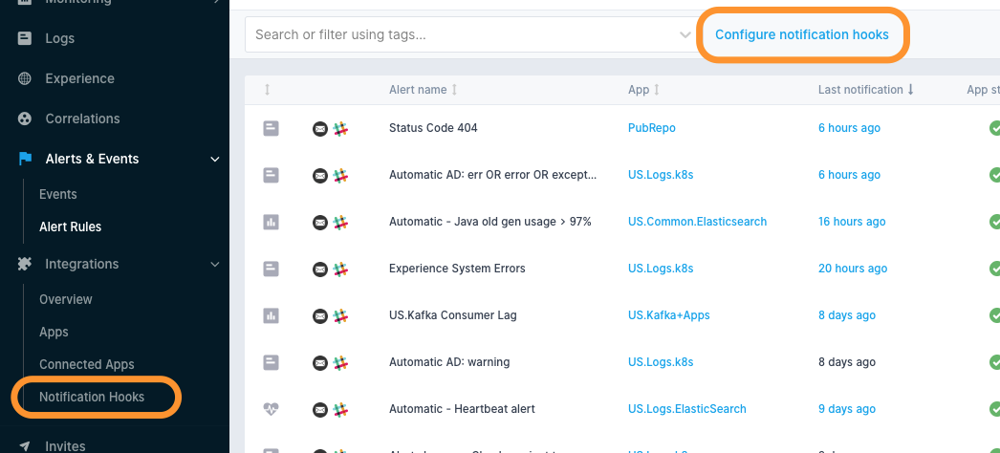

title: Alerts Notifications
description: Configuring notifications for Alerts

The primary purpose of alert rules is to send notifications when triggered. This is the job of Notification Hooks.

    

        <a href="/docs/integration/alerts-bigpanda-integration/">
            

                

                    

                        

                            
                        

                        

                            <h5>BigPanda</h5>
                            Alerts integrations with BigPanda's event management and incident management process platform.
                        

                    

                

            

        </a>
    

    

        <a href="/docs/integration/alerts-email-integration/">
            

                

                    

                        

                            
                        

                        

                            <h5>Email</h5>Want alerts via email? That’s the default, of course. Email notifications include embedded
                            charts, so you can quickly assess the situation.
                        

                    

                

            

        </a>
    

    

        <a href="/docs/integration/alerts-hipchat-integration/">
            

                

                    

                        

                            
                        

                        

                            <h5>Hipchat</h5>Send your alerts to Hipchat internal private online chat and instant messaging platform.

                    

                

            

        </a>
    

    

        <a href="/docs/integration/alerts-nagios-integration/">
            

                

                    

                        

                            
                        

                        

                            <h5>Nagios</h5>
                            Still using Nagios? Yes, you can get your Sematext alerts sent to Nagios IT, network, server, and applications monitoring
                            system.

                    

                

            

        </a>
    

    

        <a href="/docs/integration/alerts-opsgenie-integration/">
            

                

                    

                        

                            
                        

                        

                            <h5>Opsgenie</h5>Easy integration with OpsGenie incident response orchestration platform for DevOps
                            & ITOps teams. Streamline your alerts and incident resolution processes.
                        

                    

                

            

        </a>
    

    

        <a href="/docs/integration/alerts-pagerduty-integration/">
            

                

                    

                        

                            
                        

                        

                            <h5>PagerDuty</h5>Send alerts to PagerDuty's SaaS incident response platform for IT departments.
                            Improve visibility & agility across your organization.
                        

                    

                

            

        </a>
    

    

        <a href="/docs/integration/alerts-pushover-integration/">
            

                

                    

                        

                            
                        

                        

                            <h5>Pushover</h5>Like to get your alert notifications via your mobile device? Use Sematext with Pushover
                            real-time notifications integration!

                    

                

            

        </a>
    

    

        <a href="/docs/integration/alerts-slack-integration/">
            

                

                    

                        

                            
                        

                        

                            <h5>Slack</h5>Easy Sematext alerts integration with Slack's team collaboration tools and services.

                    

                

            

        </a>
    

    

        <a href="/docs/integration/alerts-victorops-integration/">
            

                

                    

                        

                            
                        

                        

                            <h5>Victorops</h5>Fast alerts integration with Victorops' incident management software purpose-built
                            for DevOps.
                        

                    

                

            

        </a>
    

    

        <a href="/docs/integration/alerts-webhooks-integration/">
            

                

                    

                        

                            
                        

                        

                            <h5>Webhooks</h5>Have a custom WebHook you’d like to call? No problem – define the endpoint, format
                            (JSON, HTTP params, form-encoded), optional URL parameters and optional HTTP request headers.
                        

                    

                

            

        </a>
    

    

        <a href="/docs/integration/alerts-zapier-integration/">
            

                

                    

                        

                            
                        

                        

                            <h5>Zapier</h5>Need to ship your Sematext alerts somewhere else? Use Zapier integration.

                    

                

            

        </a>
    

An email notification hook is created automatically during signup. Additional notification hooks can be created on the Notification Hooks view. A convenient way to navigate here is using the shortcut on top of the Alert Rules view.

It’s a shortcut for Integrations > Notification Hooks.

