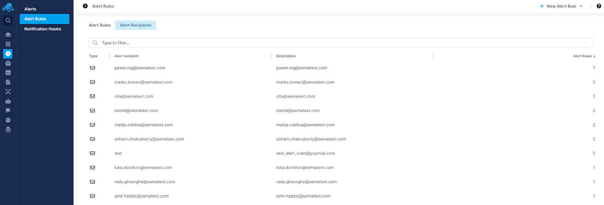
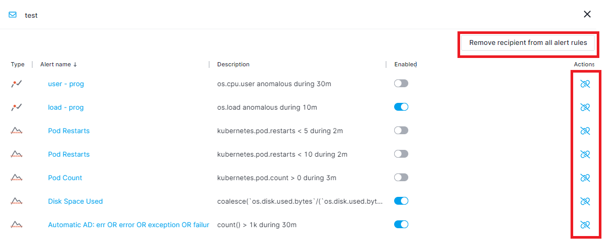
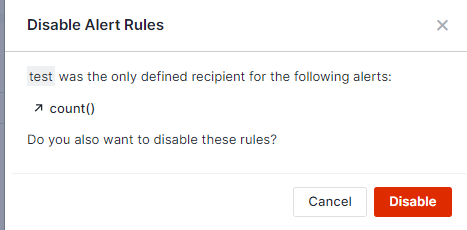

title: Alert Recipients

This tab is used to list all the notification hooks that are being used by alert rules. 

Let's say you want to remove _test_ user from all the alert rules. You would first navigate to the Alert Recipients tab from the Alert Rules page, then click on the _test user_ row. This will open a flyout and list all the alert rules that are using this email address as a notification hook.

You can unlink the recipient from all the alert rules by clicking the _“Remove recipient from all alert rules”_ button or remove it from a single alert by clicking the _“unlink”_ icon under Actions column.

If an alert rule doesn’t have any other notification hook defined, we will show you a warning message and you can choose to disable the alert rule altogether.

