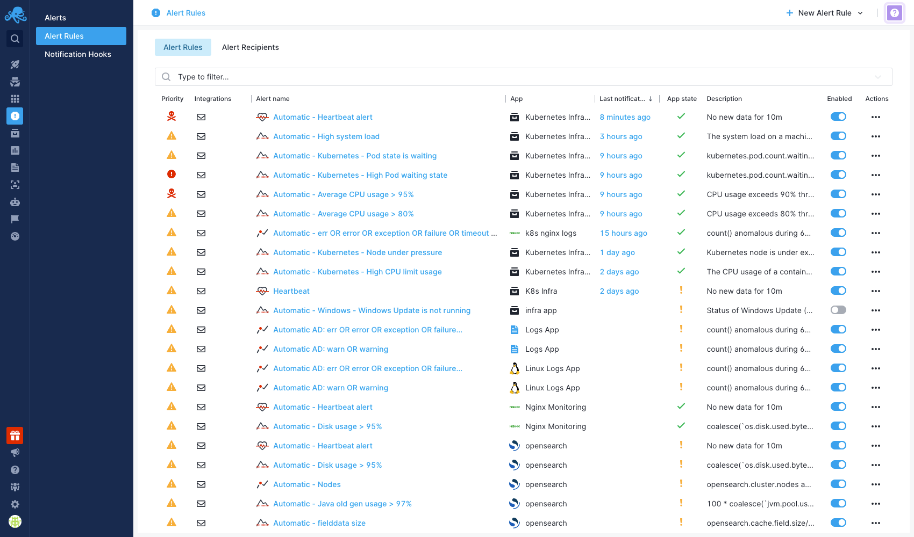
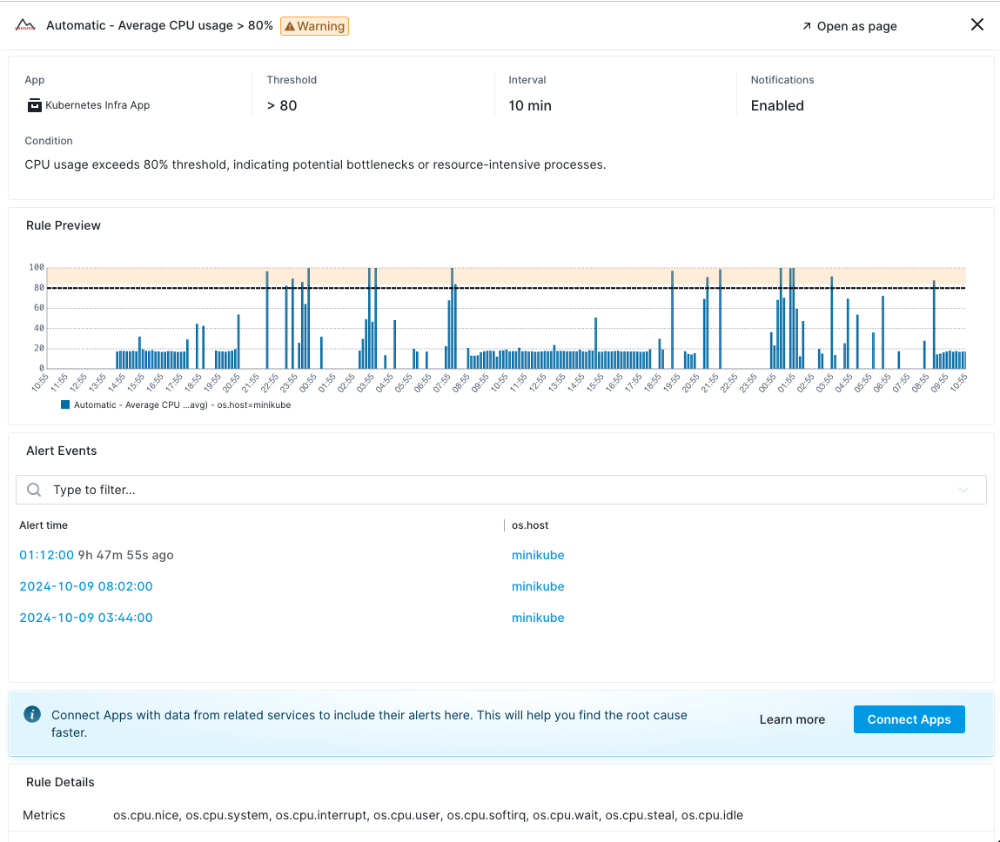
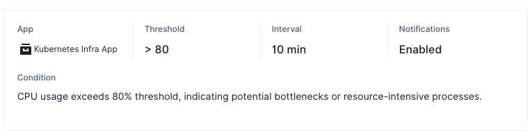
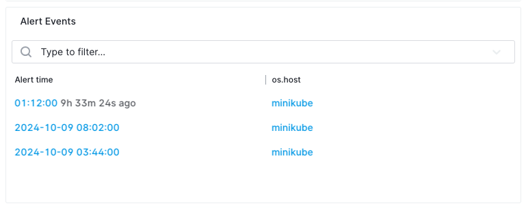
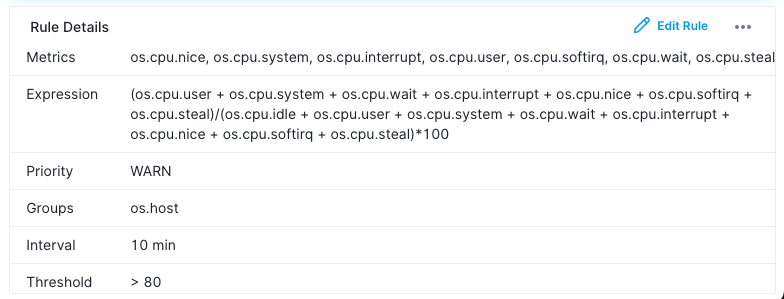
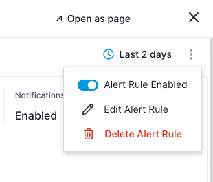

title: Alert Rules
description: Alert rules are essential for monitoring your applications and infrastructure. They allow you to set specific conditions under which you will be notified of changes in metrics or log events

Alert rules are critical for maintaining the health and performance of your applications and infrastructure. By setting specific conditions, you can get notified on unexpected changes, helping you respond quickly to issues like outages or performance drops.

## Viewing Alert Rules

The **Alert Rules** page ([US](https://apps.sematext.com/ui/alerts/rules) or [EU](https://apps.eu.sematext.com/ui/alerts/rules)) provides an organized list of all defined alert rules within your Apps and offers a clear overview of their current status and configuration. 



Fields available:

- **Priority:** Specifies the importance of the alert rule.
- **Integrations:** Lists the [notification methods](https://sematext.com/docs/alerts/alert-notifications/) (e.g., Email, Slack, Webhook) tied to the alert.
- **Alert Rule Name:** The name of the alert rule.
- **App:** The App to which this alert rule is applied.
- **Last Notification:** Shows the time the last alert was triggered. Clicking on this leads to the specific [alert event](https://sematext.com/docs/alerts/alert-events/) details.
- **App State:** Indicates whether the App is currently receiving data.
- **Description:** A short description of the alert rule.
- **Enabled:** A toggle switch to enable or disable the alert rule.
- **Actions:** Available actions for each alert rule (Edit, Clone, Delete).

## Alert Rule Details

When clicking on a specific alert rule, detailed information about that rule is displayed. It contains important information that helps you better understand and manage the alert rule. 



The information is organized into the following subsections:

### Alert Rule Summary

The alert rule summary gives you a quick overview of the rule’s key configuration details.



Fields available:

- **App:** The App to which this alert rule is applied.
- **Threshold:** The condition that triggers the alert (e.g., CPU usage > 80%).
- **Interval:** The time interval for which the threshold must be crossed before triggering the alert.
- **Notifications:** Whether notifications for this rule are enabled or disabled.
- **Filters:** Any filtering conditions to limit when and where the alert rule applies (e.g., specific hosts).
- **Grouping Method:** The method used to group the data series (e.g., by host).
- **Condition:** A detailed description of what will trigger the alert and under what conditions.

### Rule Preview

The **Rule Preview** chart visualizes the performance of the metric(s) that the alert rule monitors. This chart provides a live or recent historical view of the metric and shows when the conditions defined by the alert rule have been met.


It displays the relevant metric over time along with the threshold set by the alert rule. Hovering over specific points on the chart reveals detailed information.

### Triggered Alert Events

This section lists all triggered alert events that have occurred based on this alert rule.



The table includes:

- **Alert Time:** The exact time when the alert was triggered. Clicking on this leads to the specific alert event details.
- **Tags used for Grouping:** A list of tags by which the alert metric is grouped, such as `os.host`.

This section helps you track historical alert events.

### Rule Details

The **Rule Details** section provides a quick view of the alert rule’s configuration.



Fields included:

- **Metrics:** The specific metric(s) being monitored.
- **Priority:** The priority of the alert rule.
- **Groups:** How data is grouped (e.g., by host).
- **Interval:** The time interval before the alert triggers.
- **Threshold:** The conditions that trigger the alert.
- **Creator:** The creator of the alert rule.

You can configure the alert rule by clicking the three vertical dots in the top right corner and selecting **Edit Alert Rule**.



## Creating an Alert Rule

There are multiple methods to create an alert rule:

1. **From a Chart:** Hover over any chart within an App report and click the small alert icon that appears at the top. This action opens the **'Create Alert Rule'** dialog, automatically populating properties such as filtering and grouping based on the settings applied within that specific chart.

2. **From the App Report:** Navigate to any App report and click on the alert icon in the actions menu at the top of the report.

3. **From the Alerts Page:** Access the Alerts page through the left menu panel and select **'+ New Alert Rule'** from the dropdown menu located at the top right of the screen.


Once the **New Alert Rule** window opens, you can edit the rule name and select one of the available options (tabs) on the left to configure the alert, as detailed in the following subsections.

### Alert Metric

If you open the **New Alert Rule** window from a specific App, that App will be automatically selected in the dialog. Next to the App selection, a dropdown allows you to choose one or multiple metrics to receive alerts for.

#### Transformation

Transformations modify metrics using mathematical expressions and functions. For instance, if you want to be alerted when both `request.size` and `response.size` exceed a threshold or become anomalous, you can transform them into a single data series using an expression like:

```
request.size + response.size
```

You can then create an alert based on this new data series. For more information on transformations, visit [Transformations](../dashboards/chart-builder/#transformation).

#### Filter by

The **Filter** section [defines criteria](https://sematext.com/docs/dashboards/chart-builder/#filter-by) that will trigger an alert only under specific conditions. For example, if you collect data from multiple hosts and want to create an alert for a specific host, choose the tag name `os.host` and set the value to `host-x`.

#### Group by

In the **Group by** section, select what [data series to group on](https://sematext.com/docs/dashboards/chart-builder/#group-by). For example, choosing the `os.host` tag and setting the aggregation in the **Aggregation** field to `all separately` means the alert will trigger for each host individually.

#### Rollup by

Data points sent to Sematext Cloud have a time label. If a metric is updated every 10 seconds and you’re looking at a 24-hour time range, you need 14,400 points to display all data points. The **Rollup by** function groups data points into time buckets. Metrics coming in within the alert's specified time window will be aggregated by the selected function in this section. Refer to [Rollup By](../dashboards/chart-builder/#rollup-by) for more details.

### Alert Condition

Here, you will select the [alert type](https://sematext.com/docs/alerts/#alert-types) and priority. If you select a threshold type alert, enter the threshold value required to trigger an alert and specify a time window.

#### Ignore Regularly Occurring Spikes and Dips

Historical data is analyzed to determine if an alert fits the regular stream of spikes and dips in metrics. If it does, notifications will not be sent. The filter combination is used to identify previous spikes and dips, grouping them into similar values (±5% assumed to be the same). The least common multiple (LCM) in these groups is calculated to check if the current value fits any of them.

### Meta Data

The **Meta Data** tab allows you to enter details about the alert, such as the alert name, description, and runbook.

#### Runbook

The [runbook](https://sematext.com/glossary/runbook/) serves as a detailed guide outlining procedures, recommended actions, and best practices to follow when an alert is triggered. It ensures a standardized and efficient approach to managing routine operations, handling system updates, addressing issues, and promptly restoring services upon alert activation.

### Notifications

The **Notifications** tab enables you to designate recipients for alert notifications (see [alert recipients](https://sematext.com/docs/alerts/alert-recipients/)). You can set limits on the frequency of alerts within a specified timeframe. Additionally, enabling the **Use Account-Default Notification Hooks** option will automatically set the [account default hooks](https://sematext.com/docs/alerts/account-default-hooks/) as recipients for the alert.

### Schedule

The **Schedule** tab is used to establish a detailed weekly schedule for when notifications will be active. By default, notifications are always active. For instance, if you specify an interval of Monday from 09:00 to 17:00, notifications for any triggered alerts will be sent only during this timeframe. For details, see [Alert Scheduling](https://sematext.com/docs/alerts/alert-scheduling/).

## Additional Resources on Alert Rules

Below are some additional resources to alert rules, each providing specific guidance on different types of alerts:

- **[Creating Logs Alerts](https://sematext.com/docs/alerts/creating-logs-alerts/):** A guide on how to create alerts for logs to monitor specific events or patterns in your application logs.
- **[Creating Metrics Alerts](https://sematext.com/docs/alerts/creating-metrics-alerts/):** Instructions for setting up alerts based on various metrics to keep track of performance and resource usage.
- **[Creating Heartbeat Alerts](https://sematext.com/docs/alerts/creating-heartbeat-alerts/):** Information on configuring heartbeat alerts.
- **[Creating Experience Alerts](https://sematext.com/docs/alerts/creating-experience-alerts/):** Guidelines for creating alerts focused on user experience metrics.
- **[Creating Synthetics Alerts](https://sematext.com/docs/alerts/creating-synthetics-alerts/):** Instructions on setting up alerts based on synthetic monitoring.
- **[Alert Scheduling](https://sematext.com/docs/alerts/alert-scheduling/):** Details on establishing a schedule for when alert notifications will be active.
- **[Default Alert Rules](https://sematext.com/docs/alerts/default-alerts/):** A list of predefined and fine-tuned alert rules that can be used for monitoring your applications.

