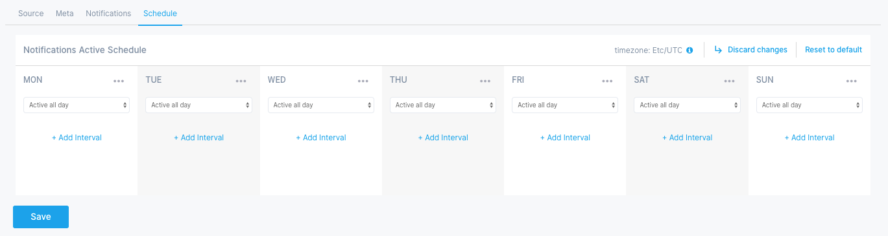
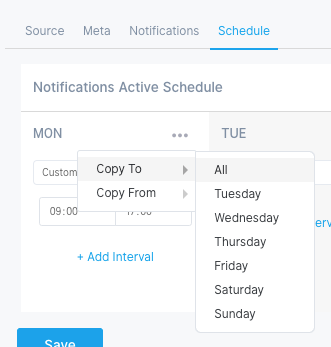
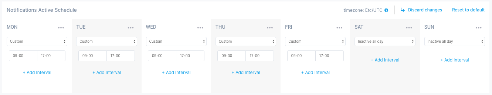

title: Alert Scheduling
description: Configuring schedules for Alerts

This tab is used to set a detailed weekly schedule when notifications will be active. Default is *always active*.  Thus, if you specify e.g. Monday 09:00 - 17:00 interval then on Mondays you will receive notifications for any alerts that are triggeed between 9 AM and 5 PM, and on Mondays you will not receive notifications for any alerts outside that time period.

Let's say you want to receive notifications only to workdays between 9AM and 5PM. You would first +Add Interval 09:00 - 17:00 to Monday, copy Monday to all other days with Copy To > All action.

The last step would be to set Saturday and Sunday to Inactive all day.

Reset to default action is used to go back to default, *always active* schedule. Discard changes is used to revert all changes back to the initial state, as it was previously saved. 

These two actions have the same effect when creating a new alert rule, since the starting schedule is the default - *always active*. Discard changes becomes useful when editing an existing schedule, where you perhaps made changes in other tabs and cancelling the whole alert rule would also lose those other changes. In that case you use Discard changes to revert just the Schedule tab back to the state it had when you started editing alert rule.
