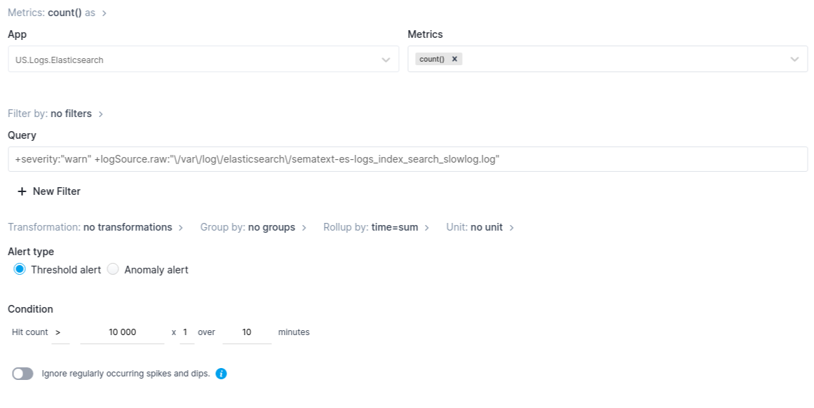
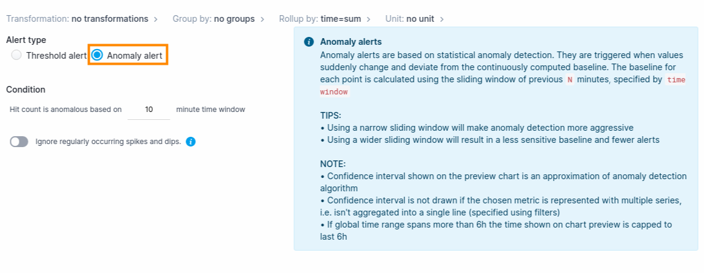
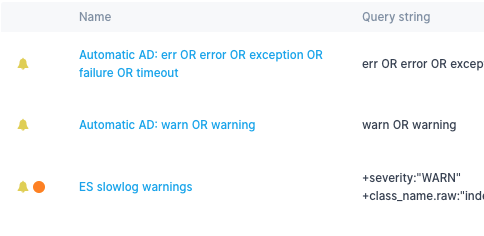

title: Creating Alerts
description: Step-by-step alert creation instructions

## Creating Logs Alerts

In a Logs app, *saved queries* are used to save search queries that you want to reuse.

For example, let's say you used *include/exclude filters* to search for *Elasticsearch slowlogs warnings*.

Clicking on the bell icon creates a new *saved query*, where filters are transformed into `Query string`.

You can save this query as is and use it in future searches.

Clicking on the *alert view* icon  opens the view where you can edit *saved queries*.

The bell icon here means that *saved query* has *alert rule* attached to it.

Let's attach an *alert rule* to the *saved query* we've just created - click on `Edit`.  

### Source tab

By turning on `Enable alert` toggle *saved query* is expanded into *alert rule*.  

Let's say we want to get notified if the number of *slowlog warnings* reaches 10 in any 10 minutes. Notice that *Chart Preview* shows the threshold line to help you visualize the threshold value in context.  

The field next to threshold value allows you to easily multiply the threshold and thus has a default value of 1, which is neutral for multiplication.  

Although less applicable in the case of our *slowlog warnings*, `Ignore regularly occurring spikes and dips` tells the algorithm to ignore regular outliers that are not really anomalies, but are caused by regular spikes/dips.  

If you wanted to avoid using a specific threshold value and instead get notified when the number of *slowlog warnings* deviates from a continuously computed baseline, you'd change `Alert type` to `Anomaly alert`.

Notice that the chart changed to help you get a sense of what would constitute an anomalous value in your case (dots outside the gray *confidence interval*). 

The *confidence interval* is an approximation of Sematext Cloud's anomaly detection algorithm, so don't expect each and every red dot on the chart to have triggered the alert.

### Meta tab

Meta tab allows you to tag alert rule with a specific color and specify further details, like Runbook and Description.

 When you tag an alert with a color it looks like this:

### Notifications tab

The primary purpose of alert rules is to send notifications when triggered. This is the job of Notification Hooks.

    

        <a href="/docs/integration/alerts-bigpanda-integration/">
            

                

                    

                        

                            
                        

                        

                            <h5>BigPanda</h5>
                            Alerts integrations with BigPanda's event management and incident management process platform.
                        

                    

                

            

        </a>
    

    

        <a href="/docs/integration/alerts-email-integration/">
            

                

                    

                        

                            
                        

                        

                            <h5>Email</h5>Want alerts via email? That’s the default, of course. Email notifications include embedded
                            charts, so you can quickly assess the situation.
                        

                    

                

            

        </a>
    

    

        <a href="/docs/integration/alerts-hipchat-integration/">
            

                

                    

                        

                            
                        

                        

                            <h5>Hipchat</h5>Send your alerts to Hipchat internal private online chat and instant messaging platform.

                    

                

            

        </a>
    

    

        <a href="/docs/integration/alerts-nagios-integration/">
            

                

                    

                        

                            
                        

                        

                            <h5>Nagios</h5>
                            Still using Nagios? Yes, you can get your Sematext alerts sent to Nagios IT, network, server, and applications monitoring
                            system.

                    

                

            

        </a>
    

    

        <a href="/docs/integration/alerts-opsgenie-integration/">
            

                

                    

                        

                            
                        

                        

                            <h5>Opsgenie</h5>Easy integration with OpsGenie incident response orchestration platform for DevOps
                            & ITOps teams. Streamline your alerts and incident resolution processes.
                        

                    

                

            

        </a>
    

    

        <a href="/docs/integration/alerts-pagerduty-integration/">
            

                

                    

                        

                            
                        

                        

                            <h5>PagerDuty</h5>Send alerts to PagerDuty's SaaS incident response platform for IT departments.
                            Improve visibility & agility across your organization.
                        

                    

                

            

        </a>
    

    

        <a href="/docs/integration/alerts-pushover-integration/">
            

                

                    

                        

                            
                        

                        

                            <h5>Pushover</h5>Like to get your alert notifications via your mobile device? Use Sematext with Pushover
                            real-time notifications integration!

                    

                

            

        </a>
    

    

        <a href="/docs/integration/alerts-slack-integration/">
            

                

                    

                        

                            
                        

                        

                            <h5>Slack</h5>Easy Sematext alerts integration with Slack's team collaboration tools and services.

                    

                

            

        </a>
    

    

        <a href="/docs/integration/alerts-victorops-integration/">
            

                

                    

                        

                            
                        

                        

                            <h5>Victorops</h5>Fast alerts integration with Victorops' incident management software purpose-built
                            for DevOps.
                        

                    

                

            

        </a>
    

    

        <a href="/docs/integration/alerts-webhooks-integration/">
            

                

                    

                        

                            
                        

                        

                            <h5>Webhooks</h5>Have a custom WebHook you’d like to call? No problem – define the endpoint, format
                            (JSON, HTTP params, form-encoded), optional URL parameters and optional HTTP request headers.
                        

                    

                

            

        </a>
    

    

        <a href="/docs/integration/alerts-zapier-integration/">
            

                

                    

                        

                            
                        

                        

                            <h5>Zapier</h5>Need to ship your Sematext alerts somewhere else? Use Zapier integration.

                    

                

            

        </a>
    

An email notification hook is created automatically during signup. Additional notification hooks can be created on the Notification Hooks view. A convenient way to navigate here is using the shortcut on top of the Alert Rules view.

It’s a shortcut for Integrations > Notification Hooks.

### Account-default hooks

Each alert rule can be configured to send notifications to one or more notification hooks. But what do you do when you want to change where all alert notifications are sent? For example, what if you had them sent to VictorOps, but your team switched from VictorOps to OpsGenie?

To make it easy to change where alert notifications are sent for the whole Sematext Cloud account, without needing to modify each and every alert rule individually, Sematext has the concept of "account default hook".

Notification hooks can be marked as "account default hook" in the Notification Hooks view. 

While creating or modifying an alert rule one can choose whether to send notifications to whichever hook, or hooks, defined as default. This setting is turned on by default when a new alert rule is created. 

*Send to* section is read-only, because it merely shows the current state of *account-default* notification hooks. 

Besides *account-default notification hooks*, you can specify additional hooks that pertain only to this particular alert rule. The following alert would send notifications to 4 different destinations when triggered.

Each alert gives you the option to opt-out from **"Using account-default hooks for that alert"**, by simply turning off that toggle.

If you turn off notifications for an *alert rule* the only consequence of that alert being triggered will be to generate events in the [Events view](../events).

When alerts are defined to use default notification hooks then where they send notifications can be changed by simply changing which notification hooks are marked as default!

More than one notification hook can be marked as default. Which hooks are marked as default can be changed at any time. The change is instantaneous and applies to the whole account. Only alert rules that were defined to use the default notification hook(s) are affected. Any additional notification hooks specified for the alert rule will not be touched and will remain associated with the alert rule.

This gives you the ability to configure notifications for all your alerts without editing all of them individually.

### Schedule tab

This tab is used to set a detailed weekly schedule when notifications will be active. Default is *always active*.

Let's say you want to restrict notification only to workdays between 9AM and 5PM. You would first +Add Interval 09:00 - 17:00 to Monday, copy Monday to all other days with Copy To > All action.

The last step would be to set Saturday and Sunday to Inactive all day.

Reset to default action is used to go back to default, *always active* schedule. Discard changes is used to revert all changes back to the initial state, as it was previously saved. 

These two actions have the same effect when creating a new alert rule, since the starting schedule is the default - *always active*. Discard changes becomes useful when editing an existing schedule, where you perhaps made changes in other tabs and cancelling the whole alert rule would also lose those other changes. In that case you use Discard changes to revert just the Schedule tab back to the state it had when you started editing alert rule.

## Creating Metric Alerts

Each metric chart has a bell icon which, when clicked, shows a dropdown menu of all metrics. Selecting one of the metrics opens a panel with a new alert rule.

Similarly, alert rule can be created using a chart's more (**...**) menu.

## Creating Experience Alerts

Experience App allows you to create alert rules based on [Apdex score](https://en.wikipedia.org/wiki/Apdex) of Page Loads, HTTP Requests and On-Page Transactions.

You can set condition based on standard Apdex user satisfaction measurement:

* Excellent
* Good
* Fair
* Poor

Here's how to setup an *Experience* *alert rule* that will be triggered when the `HTTP Requests` *Apdex score* remains worse than `Good` for 10 minutes:

