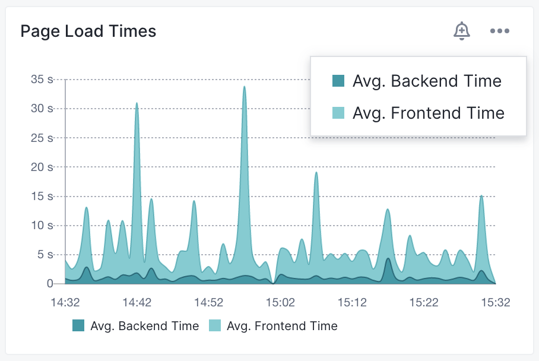
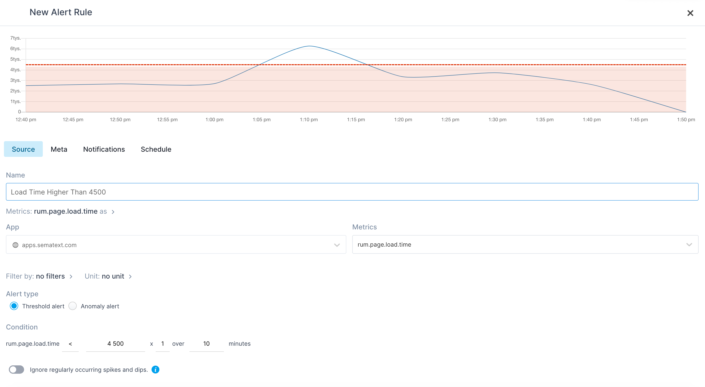
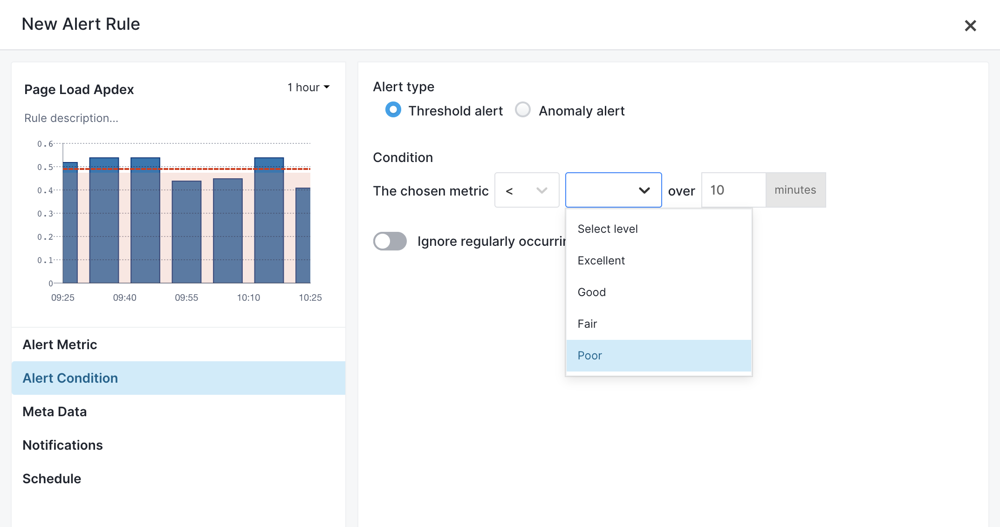

title: Creating Experience Alerts
description: Step-by-step alert creation instructions for Experience

Each Experience App metric that you can create alert rules on has a bell icon, when clicked, shows a dropdown menu listing the metrics that you can choose. 

The supported Experience metrics are:

- Apdex score for Page load
- Apdex score for HTTP requests  
- Apdex score for on page transactions
- First contentful paint time
- First paint (FP) time
- HTTP requests count
- HTTP requests load time
- Long tasks count
- Long tasks duration
- Page load backend load time
- Page load frontend load time
- Page load time
- HTTP resource load count
- HTTP resource load time
- HTTP resource transfer size
- User sessions count
- Users count

The above metrics can also be chosen from in the alert rule creation dialog:

While creating an alert you'll get a chart preview of the alert threshold or anomaly. For example, to set up a new alert rule for that would be triggered for page load time higher than 4500 milliseconds on average this is how the preview screen would look like:

When setting up the [Apdex score](../experience/configure-requirements.md) based alert rule, the threshold can be set to one of the following values:

* Excellent
* Good
* Fair
* Poor

Here's how to setup an *Experience* *alert rule* that will be triggered when the `HTTP Requests` *Apdex score* remains worse than `Good` for 10 minutes:

