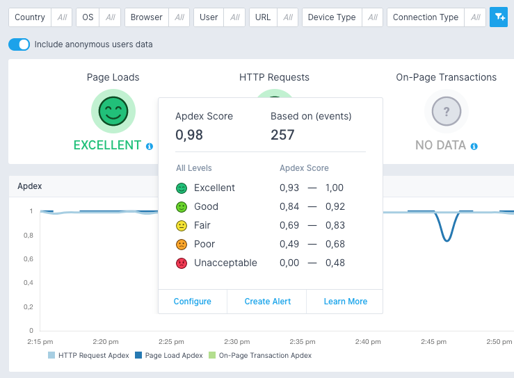

title: Creating Experience Alerts
description: Step-by-step alert creation instructions for Experience

Experience App allows you to create alert rules based on [Apdex score](https://en.wikipedia.org/wiki/Apdex) of Page Loads, HTTP Requests and On-Page Transactions.

You can set condition based on standard Apdex user satisfaction measurement:

* Excellent
* Good
* Fair
* Poor

Here's how to setup an *Experience* *alert rule* that will be triggered when the `HTTP Requests` *Apdex score* remains worse than `Good` for 10 minutes:

