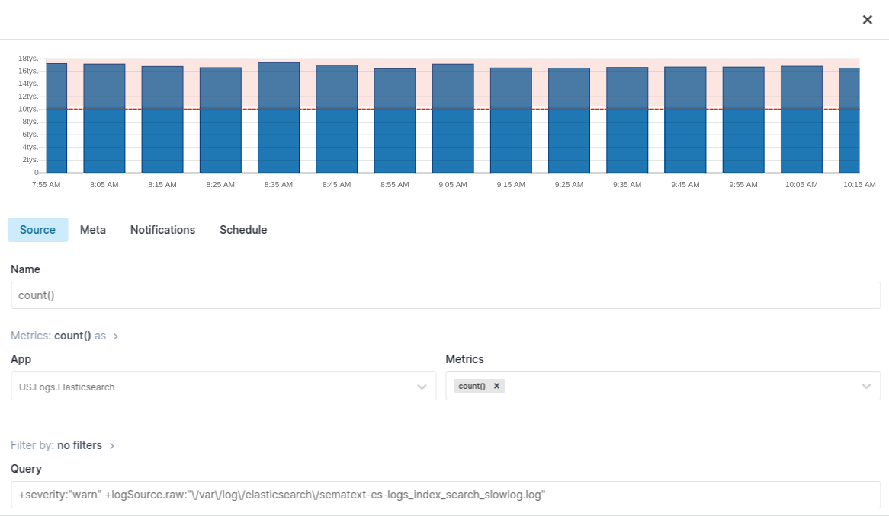
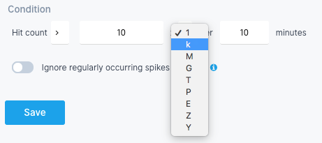

title: Creating Logs Alerts
description: Step-by-step alert creation instructions for Logs

In a Logs App you can create an Alert Rule which will trigger notifications when a condition is met.

For example, let's say you used *include/exclude filters* to search for *Elasticsearch slowlogs warnings*.

Clicking on the bell icon creates a new Alert Rule with the applied query and filters.

Let's say we want to get notified if the number of *slowlog warnings* reaches 10 in any 10 minutes. Notice that *Chart Preview* shows the threshold line to help
you visualize the threshold value in this context.

Apart from a simple log count you can choose any numeric field in the *Metrics* section.

The field next to threshold value allows you to easily multiply the threshold and thus has a default value of 1, which is neutral for multiplication.  

Although less applicable in the case of our *slowlog warnings*, `Ignore regularly occurring spikes and dips` tells the algorithm to ignore regular outliers that are not really anomalies, but are caused by regular spikes/dips.

If you wanted to avoid using a specific threshold value and instead get notified when the number of *slowlog warnings* deviates from a continuously computed baseline, you'd change `Alert type` to `Anomaly alert`.

Notice that the chart changed to help you get a sense of what would constitute an anomalous value in your case (dots outside the gray *confidence interval*). 

The *confidence interval* is an approximation of Sematext Cloud's anomaly detection algorithm, so don't expect each and every red dot on the chart to have triggered the alert.
