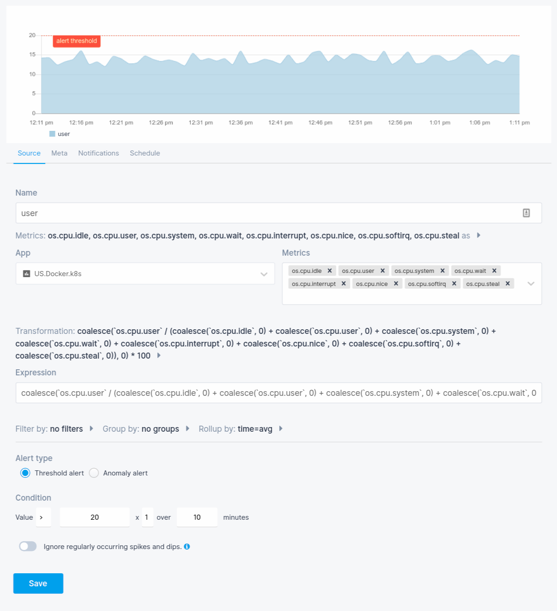
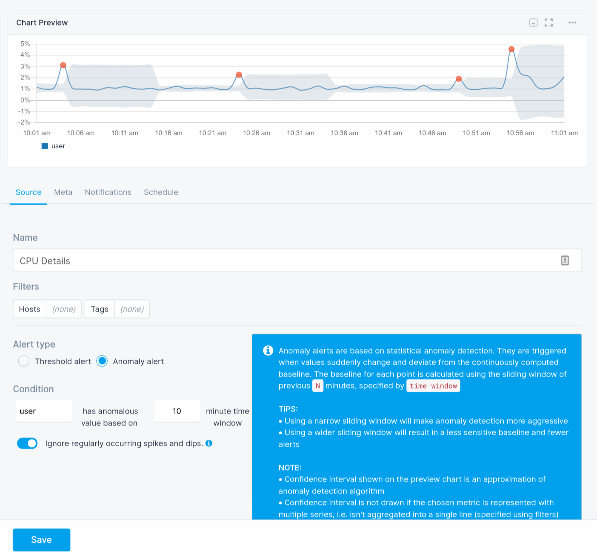

title: Creating Metrics Alerts
description: Step-by-step alert creation instructions for Monitoring

Each metric chart has a bell icon which, when clicked, shows a dropdown menu of all metrics. Selecting one of the metrics opens a panel with a new alert rule. Similarly, alert rules can be created using a chart's more (**...**) menu.

  

    
  

  

    
  

While creating an alert you'll get a chart preview of the alert threshold or anomaly.

Let's say you want to configure an alert to notify you when the CPU is over 20% during a 10 minute period. Here you configure the conditions, multipliers, and time frame for your alerts.

If you don't want to use a specific threshold value and instead get notified when the CPU usage deviates from a continuously computed baseline, you'd change `Alert type` to `Anomaly alert`.

Notice that the chart changed to help you get a sense of what would constitute an anomalous value. In this case, the dots outside the gray confidence interval.

The confidence interval shown in the preview is an approximation of Sematext Cloud's anomaly detection algorithm, so don't expect each and every red dot on the chart to have triggered the alert.
