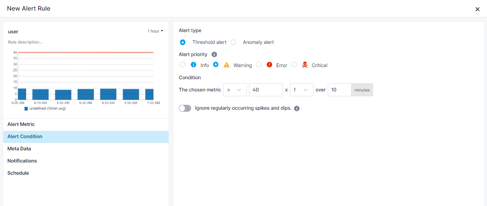
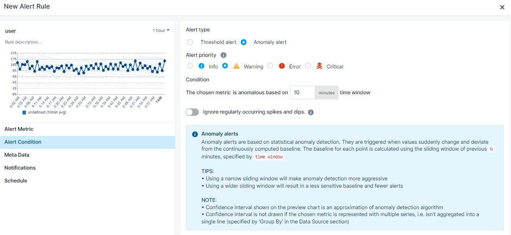
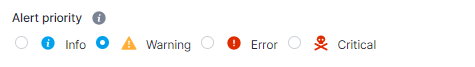
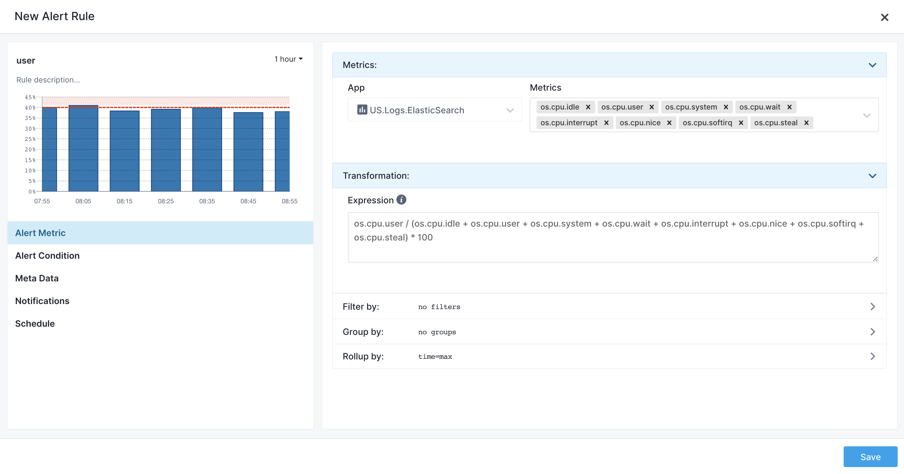

title: Creating Metrics Alerts
description: Step-by-step alert creation instructions for Monitoring

Each metric chart has a bell icon which, when clicked, shows a dropdown menu of all metrics. Selecting one of the metrics opens a panel with a new alert rule. Similarly, alert rules can be created using a chart's more (**...**) menu.

<div class="mdl-grid">
  <div class="mdl-cell mdl-cell--4-col">
    
  </div>
  <div class="mdl-cell mdl-cell--8-col">
    
  </div>
</div>

While creating an alert you'll get a chart preview of the alert threshold or anomaly.

Let's say you want to configure an alert to notify you when the CPU is over 40% during a 10 minute period. You can start from OS CPU chart and select to create alert for `user` metric. All you have to do is set 40 for the threshold value.



If you don't want to use a specific threshold value and instead get notified when the CPU usage deviates from a continuously computed baseline, you'd change `Alert type` to `Anomaly alert`.



Notice that the chart changed to help you get a sense of what would constitute an anomalous value. In this case, the dots outside the gray confidence interval.

The confidence interval shown in the preview is an approximation of Sematext Cloud's anomaly detection algorithm, so don't expect each and every red dot on the chart to have triggered the alert.

You can assign priority and define the level of importance of an alert. Include this information in the payload of various [Notification Hooks](../alerts/alert-notifications).


You can see and adjust alert metric details in `Alert Metric` tab.



# Transformation

Transformations are used to modify metrics using mathematical expressions and functions. For example, imagine you want to get alerted when both `os.cpu.user` and `os.cpu.system` together exceed some threshold or become anomalous.  You would then transform them into a single dataseries by using an expression like this:

```
(os.cpu.user + os.cpu.system) / (os.cpu.idle + os.cpu.user + os.cpu.system + os.cpu.wait + os.cpu.interrupt + os.cpu.nice + os.cpu.softirq + os.cpu.steal) * 100
```

And then you would create an alert on this new data series.

Read about [Transformations](../dashboards/chart-builder/#transformation) to learn more about transformations, functions, and expressions used to perform transformations.
