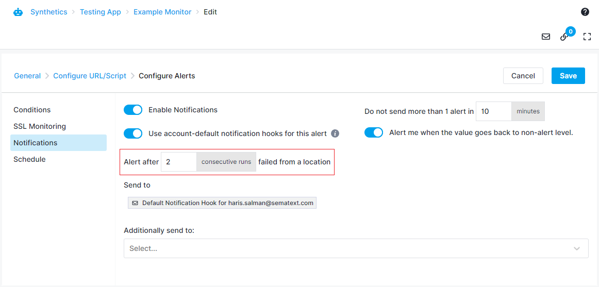
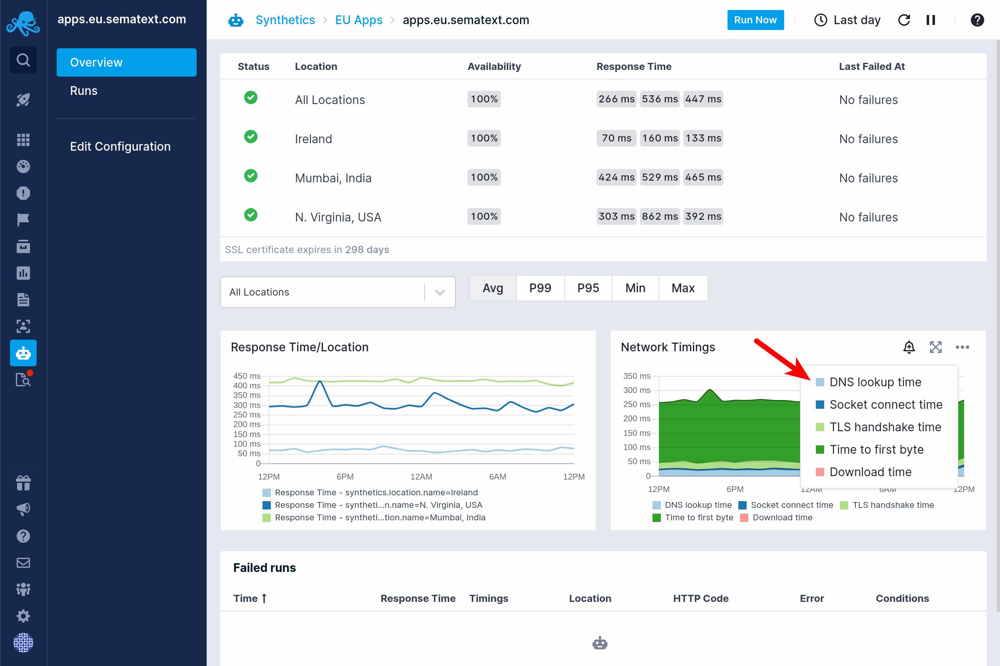
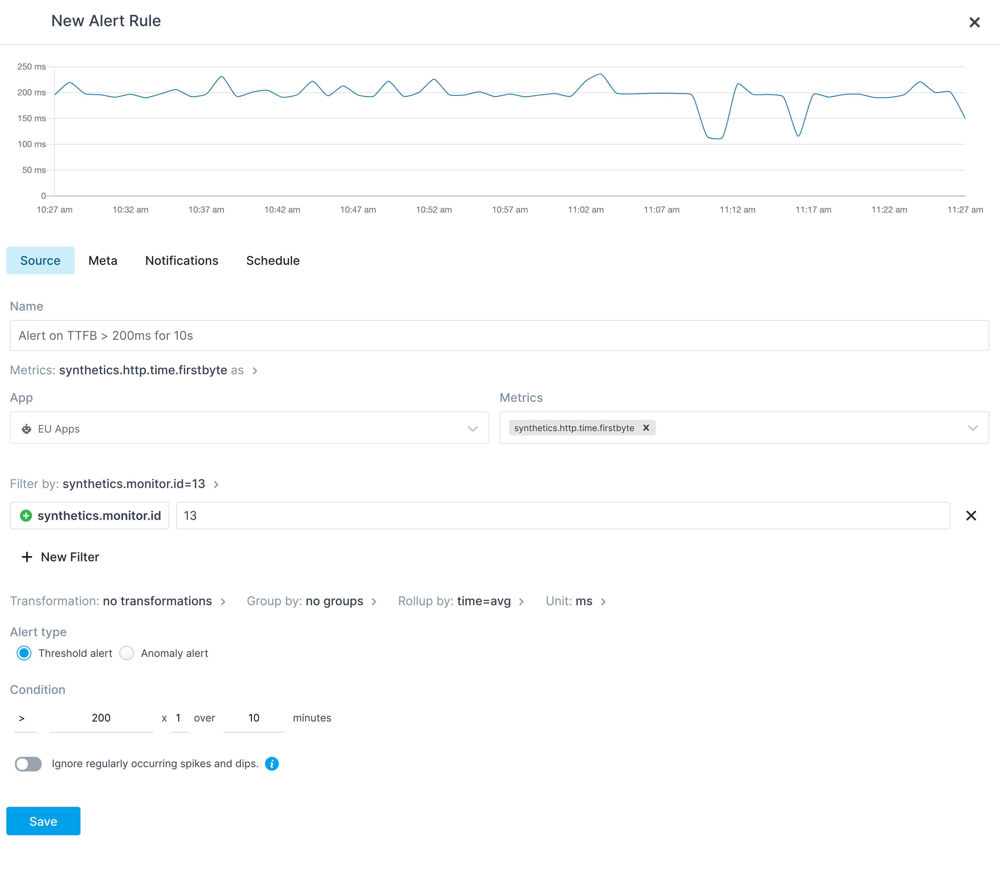

title: Creating Alerts 
description: Step by step guide for creating Synthetics Alerts

Synthetics Apps support two types of alerts:

* Synthetics Alerts - These alerts are raised when a run fails based on the configured conditions and the alert rule is auto-created while creating the monitor.
* Metric Alerts - These are threshold and anomaly alerts that can be created on Synthetics metrics.

## Synthetics Alerts
Synthetics alerts are the alerts that notify about the failure of a monitor. They are auto-created while creating the monitor. During monitor creation you can specify the list of conditions that have to be met for the monitor to pass. If any of these conditions fail, then the run will be declared failed and a Synthetics alert will be raised. The conditions are different for [HTTP](/synthetics/http-monitor/#conditions) and [Browser](/synthetics/browser-monitor/#conditions) monitors.

You can customize the alert priority, notification settings and schedule while creating the monitor. You can disable notifications by turning off `Enable Notifications`. When you turn off the notifications, the monitor will continue to run, but no notifications will be sent on failure. 

You can control when the alert should be triggered based on the consecutive run failures. By default, the alert will be triggered when the monitor fails from any of the locations. You could change the below parameter to control this behavior. For example, by setting this to 2 for a monitor that runs every 10 minutes from Frankfurt and Mumbai, the alert will be triggered only when the monitor fails twice consecutively from Frankfurt or Mumbai.

## Metric Alerts
Apart from the auto-created Synthetics alerts, you can create a custom alert on any of the [Synthetics metrics](/synthetics/metrics) and get notified when they are triggered. This could be used to set performance budgets for any of the metrics like page size, resource count, etc. You could create a threshold or anomaly alert. Metric alerts can be created directly from Synthetics charts in the monitor overview page or from custom charts for Synthetics metrics on your [dashboards](/dashboards). You can select the metric to create the alert rule by clicking the bell icon when you hover over the chart.

This opens the Create Alert Rule dialog, where you can set up a threshold or anomaly alert for the selected metric.

### SSL Certificate Alerts
SSL certificate alerts are generated on the following conditions for both HTTP and Browser monitors:

* 28, 14, 7 and 3 days before the expiry of leaf, intermediate, or root certificate in the chain
* If an SSL certificate change is detected

For more information, refer to the [SSL Certificate Monitoring](/synthetics/ssl-certificate-monitoring.md) page.