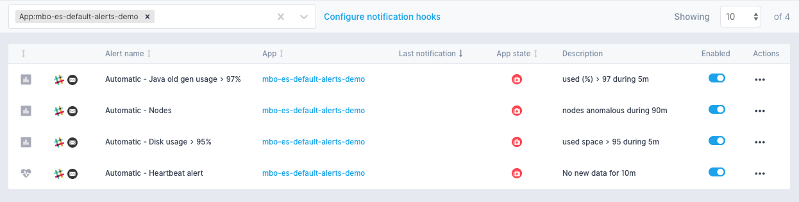

title: Default Alerts
description: Each new App comes with its own set of alerts

When you create a new App, not only do you get a set of pre-built reports that display various metrics, logs, and other data in a well thought-out fashion, but you also get one or more "default alert rules" that are created for you automatically.

It is important to note that, just like the out-of-the-box reports are specific to what is being monitored, these default alert rules are also very specific to the integration.  Thus, as soon as you set things up you will benefit from these alert rules that, like the pre-build reports, you didn't have to manually configure yourself.  All default alerts can, of course, be modified, temporarily disabled, or permanently deleted.

The names of all default rules start with `Automatic - `.  For example, here's a set of alert rules that gets created with a new Elasticsearch monitoring App:

Default alert rules are created for [Monitoring](../monitoring), [Logs](../logs), [Experience](../experience) Apps, and for [Synthetics](../synthetics) Monitors.
