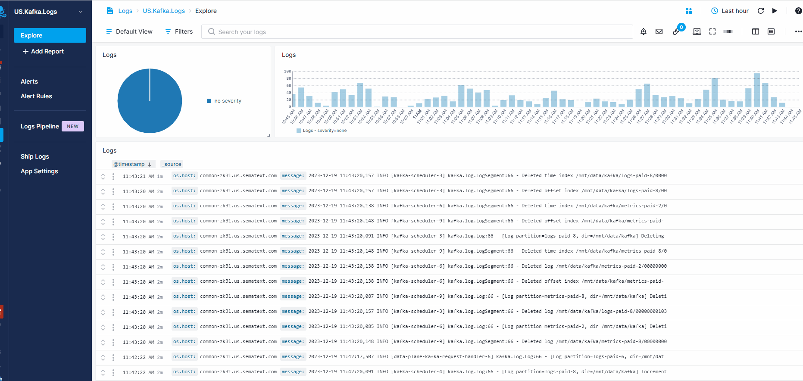

title: Alerts Overview
description: Threshold, anomaly, and heartbeat alerts for your logs, infrastructure and user-experience metrics with email notifications and various 3rd party integrations and notification hooks such as PagerDuty, Slack and more

<iframe src="https://www.youtube.com/embed/ik_L7Qk_Aug" 
frameborder="0" allow="autoplay; encrypted-media" 
allowfullscreen class="video"></iframe>

Alerts are used to notify you when one or more pre-defined conditions in your *metrics*, *logs* or *experience* data are met.  

For example, you might want to be notified when available disk space reaches a certain threshold - *metrics alert*, or when the number of logs with `severity: warning` gets too high - *logs alert*, or when your users start experiencing high response time - *experience alert*.

<!--iframe width="800" height="450" src="https://www.youtube.com/embed/WE9xAUud28o?rel=0" frameborder="0" allow="autoplay; encrypted-media" allowfullscreen></iframe-->

 

## Alert Types
[Sematext Cloud](https://sematext.com/cloud) includes multiple **types** of alerts that integrate with [PagerDuty](https://sematext.com/docs/integration/alerts-pagerduty-integration/), [Slack](https://sematext.com/docs/integration/alerts-slack-integration/), [email](https://sematext.com/docs/alerts/alert-notifications/#email-notification-hooks), and [other 3rd party services](alert-notifications).  

1. **Threshold** alerts are the classic threshold based alerts. They are triggered when a certain pre-defined threshold is met.
1. **Heartbeat** alerts are triggered when [Sematext Cloud](https://sematext.com/cloud) stops receiving data from your server, container, application, etc.  
1. **Anomaly** alerts are based on statistical anomaly detection. They are triggered when values suddenly change and deviate from the continously computed baseline.

 

## Alert Sources
Alerts can operate on three different **sources** of data:  

1. **Metrics** alerts work with infrastructure metrics
1. **Logs** alerts are based on various types of logs
1. **Experience** alerts are concerned with *real user monitoring* data - RUM

Alert type | Metrics | Logs | Experience
--- | --- | --- | ---
Threshold | yes | yes | yes
Anomaly | yes | yes | yes
Heartbeat | yes | no | no

You can manage Alert rules interactively via the UI, or you can [manage alerts via the API](../api).

## Creating an Alert Rule

There are multiple methods to create an alert rule. One approach is to access any App report, hover over a chart, and click on the small alert icon that appears at the top. This action will prompt a 'Create Alert Rule' dialog, automatically populating properties such as filtering and grouping based on the settings applied within that specific chart.

Alternatively, you can create an alert rule by navigating to any App report and clicking on the alert icon in the actions menu at the top of the report.

Additionally, you have the option to access the Alerts page through the left menu panel and select '+ New Alert Rule' from the dropdown menu located at the top right of the screen.

### Alert Metric Tab

If you open the Create Alert Rule page from a specific App, that particular App will be automatically selected by default in the dialog. Next to the App selection, you'll find a dropdown where you can choose one or multiple metrics you wish to receive alerts for.

#### Transformation

Transformations are used to modify metrics using mathematical expressions and functions. For example, imagine you want to get alerted when both `request.size` and `response.size` together exceed some threshold or become anomalous.  You would then transform them into a single dataseries by using an expression like this:

`request.size + response.size`

And then you would create an alert on this new data series.

Read about [Transformations](../dashboards/chart-builder/#transformation) to learn more about transformations, functions, and expressions used to perform transformations.

####  Filter by

The Filter section is used to define criteria that will trigger an alert only when specific conditions are met.
Suppose you collect data from multiple hosts but you'd like to create an alert for a specific host only.
You would choose tag name `os.host` and single value `host-x`.

####  Group by

In the Group by section you choose what data series to group on. For example, if you choose the `os.host` tag and for the aggregation in `Aggregation` field you choose `all separately` the alert will trigger for each host separately.

####  Rollup by

Data points sent to Sematext Cloud have a time label. If a metric is updated every 10 seconds, and you are looking at a 24-hour time range, you need 14,400 points to display all data points. Rollup by is a function used to group data points in time buckets. So the metrics coming in within the specified time window of the alert (which is set in the condition tab) will be aggregated by the selected function in this section.

Refer to [Rollup By](../dashboards/chart-builder/#rollup-by) to learn more.

### Alert Condition Tab

This is where you select the [alert type](https://sematext.com/docs/alerts/#alert-types) and the priority. If you select threshold type alert then you need to enter the threshold value to trigger an alert and specify a time window.

#### Ignore regularly occuring spikes and dips 

Where we look at historical data and try to decide if an alert fits the regular stream of spikes and dips in metrics. If it does, we won't interrupt you with notifications.
Based on the filter combination we find all previous spikes and dips from the past. Split them into group-by values (+-5% we assume as the same), find LCM (least common multiple) in the groups. This means we're trying to include the current value into our LCM groups to check if it fits any of them or not. If it fits, we assume this is a regular event and ignore it.

### Meta Data

Meta Data tab lets you enter alert details such as alert name, description, runbook.

#### Runbook

Runbook serves as a detailed guide outlining procedures, recommended actions, and best practices to follow when an alert is triggered. This ensures a standardized and efficient approach in managing routine operations, handling system updates, addressing issues, and promptly restoring services upon alert activation. Runbook provides efficient management of actions to be taken when specific alerts are triggered.

### Notifications

The Notification tab enables you to designate recipients for alert notifications (see [alert recipients](https://sematext.com/docs/alerts/alert-recipients/)). You can configure settings to limit the frequency of alerts within a specified time frame. Additionally, if you toggle on the 'Use Account-Default Notification Hooks', the [account default hooks](https://sematext.com/docs/alerts/account-default-hooks/) will be automatically set as recipients for the alert.

### Schedule

This tab is used to set a detailed weekly schedule when notifications will be active. Default is always active. Thus, if you specify e.g. Monday 09:00 - 17:00 interval then on Mondays you will receive notifications for any alerts that are triggeed between 9 AM and 5 PM, and on Mondays you will not receive notifications for any alerts outside that time period. See [Alert Scheduling](https://sematext.com/docs/alerts/alert-scheduling/) for more details.
