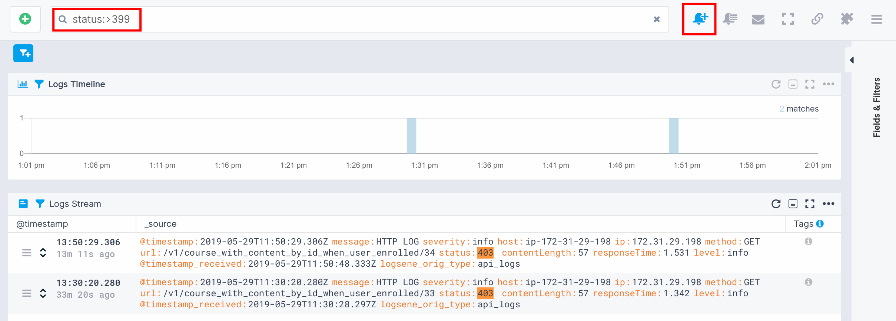
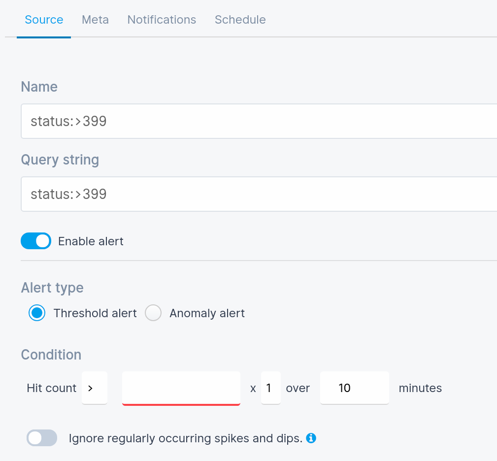
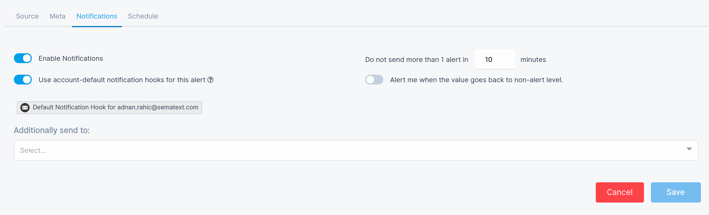

title: Alerts Overview
description: Threshold, anomaly, and heartbeat alerts for your logs, infrastructure and user-experience metrics with email notifications and various 3rd party integrations and notification hooks such as PagerDuty, Slack and more

Alerts are used to notify you when one or more predefined conditions in your *metrics*, *logs* or *experience* data are met.  

For example, you might want to be notified when available disk space reaches a certain threshold - *metrics alert*, or when the number of logs with `severity: warning` gets too high - *logs alert*, or when your users start experiencing high response time - *experience alert*.

<iframe width="800" height="450" src="https://www.youtube.com/embed/WE9xAUud28o?rel=0" frameborder="0" allow="autoplay; encrypted-media" allowfullscreen></iframe>

 

## Alert Types
[Sematext Cloud](http://sematext.com/cloud) includes multiple **types** of alerts that integrate with PagerDuty, Slack, email, and [other 3rd party services](#notifications-tab).  

1. **Threshold** alerts are the classic threshold based alerts. They are triggeed when a certain pre-defiend threshold is met.
1. **Anomaly** alerts are based on statistical anomaly detection. They are triggeed when values suddenly change and deviate from the continously computed baseline.
1. **Heartbeat** alerts are triggered when [Sematext Cloud](http://sematext.com/cloud) stops receiving data from your server, container, application, etc.  

 

## Alert Sources
Alerts can operate on three different **sources** of data:  

1. **Metrics** alerts work with infrastructure metrics
1. **Logs** alerts are based on various types of logs
1. **Experience** alerts are concerned with *real user monitoring* data - RUM

Alert type | Metrics | Logs | Experience
--- | --- | --- | ---
Threshold | yes | yes | yes
Anomaly | yes | yes | yes
Heartbeat | yes | no | no

You can manage Alert rules interactively via the UI, or you can [manage alerts via the API](../api).

**Threshold** and **Anomaly** Alerts can be triggered for both Monitoring and Logs Apps, while **Heartbeat** Alerts are only available for Monitoring Apps.

Sematext lets you manage Alert Rules across your whole stack. You can use various notification channels to get alerted when critical issues occur so you can take action and resolve them. Our Alerts easily integrate with notification and chat software. 

- PagerDuty
- OpsGenie
- HipChat
- Slack, and [many more](https://sematext.com/docs/integration/). 

## Default Alerts

As soon as an [App](./app-guide) is created, either for [Logs](./logs-guide) or [Monitoring](./monitoring-guide), you will see several app-specific Alerts Rules created for you by default. 

Default Alerts for a Logs App:

- **Anomaly Alerts** for **Error and Warning** search queries

Default Alerts for a Monitoring App: 

- **Metric Alert for Disk Usage**
- **Heartbeat Alert** if the **Agent stops sending data to the Monitoring App**
- **Metric Anomaly Alert** for misbehaving Nodes

In this example which is an Elasticsearch Monitoring App, the Java usage threshold and Elasticsearch Node Anomalies are integration-specific default Alerts.

You can view all the default and custom Alerts on the [Alert Rules](https://apps.sematext.com/ui/events/alerts/rules) page. This is where you can toggle, edit or delete any existing Alerts.

## Creating Alerts

Sematext Alerts can cover both complicated alerting scenarios with multiple rules for both Logs and Monitoring, as well as Events. A basic Alert Rule with an email or Slack notification is enough to cover elementary alerting needs.

### Alerting on Logs

To **create an Alert** you need to run a **search query** and press **Save Query/Alert Rule**. 

A **Save Query** window will open with the option to **Enable Alert**. When it's toggled, the **Alert Type picker** and **Condition** will expand, and the **Notifications** and **Schedule** tabs will be enabled. You'll see:

- **Alert Type**, to choose either Threshold Alerts or Anomaly Alerts. For more information on alerting capabilities check [alerts](https://sematext.com/docs/alerts/) documentation pages.
- **Condition**, to choose when the Alert will be triggered.
- **Ignore regularly occuring spikes and dips**, where we look at historical data and try to decide if an alert fits the regular stream of spikes and dips in metrics. If it does, we won't interrupt you with notifications. 
    
    Based on the filter combination we find all previous spikes and dips from the past. Split them into group-by values (+-5% we assume as the same), find LCM (least common multiple) in the groups. This means we're trying to include the current value into our LCM groups to check if it fits any of them or not. If it fits, we assume this is a regular event and ignore it.

- **Notification hook details** with a **default email** notification hook used to send the message to your account. You can also add additional email addresses as well as other types of notification hooks.

- **Schedule**, to choose when the Alerts will notify you based on a period, schedule or time.

<video style="display:block; width:100%; height:auto;" autoplay controls loop>
  <source src="https://cdn.sematext.com/videos/alert-scheduling.mp4" type="video/mp4" />
</video>

Press Save and you're done. Check out the [integrations](https://sematext.com/docs/integration/) documentation for more information about alert notification hooks.

### Alerting on Metrics

Monitoring Apps have **metric-based Alerting**. Metrics have both **Threshold** and **Anomaly** Alerts which can be created on a per-metric basis.

Monitoring Apps also have **Heartbeat** Alerts as part of their settings. You can find it in the App Settings dropdown menu. They are triggered when what you are monitoring, like your servers, containers, or your applications stop sending data to Sematext.

