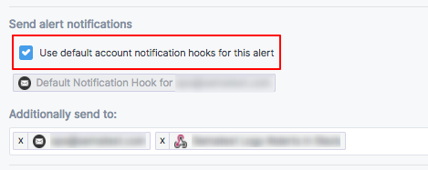

### Alert Types
[Sematext Cloud](http://sematext.com/cloud/) includes multiple types
of alerts that integrate with PagerDuty, Slack, email, and [other 3rd
party services](#alert-integrations).  

1. **Threshold** alerts are the classic threshold based alerts.  They are
triggeed when something crosses a pre-defiend threshold.
2. **Anomaly** alerts are based on statistical anomaly detection.  They
are triggeed when values suddenly change and deviate from the
continously computed baseline.
3. **Heartbeat** alerts are triggered when something you are monitoring,
like your servers, containers, or your applications stop emitting data
to Sematext.

### Alert Sources
Alerts can be triggered on both Metrics and Logs:

Alert type | Metrics | Logs
--- | --- | ---
Threshold | yes | yes |
Anomaly | yes | yes |
Heartbeat | yes | no |

You can manage Alert rules interactively via the UI, or you can
[manage alerts via the API](/docs/api).

### Alert Integrations

Alert rules that don't actually send notifications when alerts are
triggered are nearly useless.  While alert notifications are also
shown on the [Events view](../events), alert notifications are
typically sent to other destinations via Notification Hooks.  An email
notification hook is created automatically during signup.  Additional
notification hooks can be created to send notications to PagerDuty,
Slack, and more.

  - Email
  - [PagerDuty](../integration/alerts-pagerduty-integration)
  - [Slack](../integration/alerts-slack-integration)
  - [HipChat](../integration/alerts-hipchat-integration)
  - VictorOps
  - OpsGenie
  - BigPanda
  - Pushover
  - Nagios
  - Zapier
  - WebHooks for any other service

### Account Default Hooks

Each alert rule can be configured to send notifications to one or more
notification hooks.  But what do you do when you want to change where
all alert notifications are sent?  For example, what if you had them
sent to VictorOps, but your team switched from VictorOps to OpsGenie?

To make it easy to change where alert notifications are sent for the
whole Sematext Cloud account, without needing to modify each and every
alert rule individually, Sematext has the concept of "account default
hook".

Each notification hook can be marked as "account default hook".  While
creating or modifying an alert rule one can choose whether to send
notifications to whichever hook (or hooks!) is defined as default.

When alerts are defined to use default notification hooks then where
they send notifications can be changed by simply changing which
notification hooks are marked as default!

More than one notification hook can be marked as default.  Which hooks
are marked as default can be changed at any time.  The change is
instantaneous and applies to the whole account.  Only alert rules that
were defined to use the default notification hook(s) are affected.
Any additional notification hooks specified for the alert rule will
not be touched and will remain associated with the alert rule.
