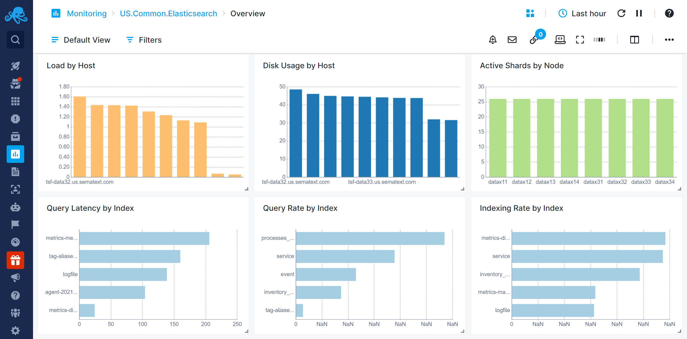
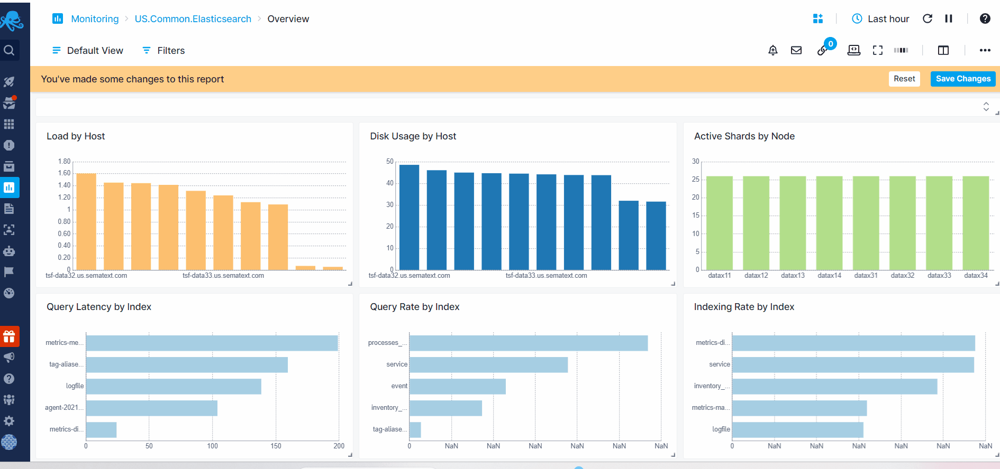

title: Bar, Pie, and Donut Charts
description: Shows multiple series from different Apps.

Bar chart is a graphical representation that uses rectangular bars to display data values for different categories or groups, offers comparisons among the items being measured based on the length or height of the bars. 

Pie chart is a circular statistical graphic divided into slices to show numerical proportions. Each slice represents a portion of the whole, and the size of each slice shows the relative quantity or percentage of that portion in relation to the total. The slices form a complete circle, and the emphasis is on comparing the sizes of the different slices to see proportions. Donut charts are like Pie Charts, but with the hole in the center.

The displayed values depends on the selected data time picker located at the top right of the dashboard.

## Configuration

You can configure these charts either during its initial creation or afterward by clicking on the three dots that appear on hover and selecting 'Edit Component'.

- Choose All Apps or a specific App that you want to fetch data from.
- Choose one or more metrics metric
- Enter optional parameters such as:
  - [Transformation](https://sematext.com/docs/dashboards/chart-builder/#transformation)
  - [Filter By](https://sematext.com/docs/dashboards/chart-builder/#filter-by)
  - [Group by](https://sematext.com/docs/dashboards/chart-builder/#group-by)
  - [Rollup By](https://sematext.com/docs/dashboards/chart-builder/#rollup-by)
    
While building the chart, a preview is available on the top left. Additionally, you have the option to add multiple data series, clone existing ones, adjust visibility.

