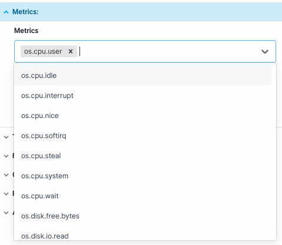
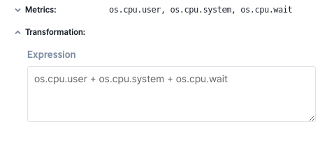
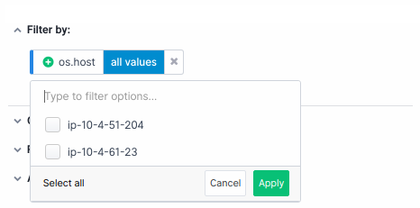
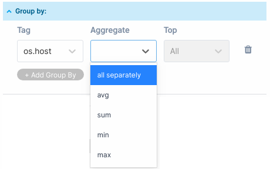
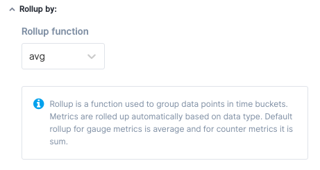
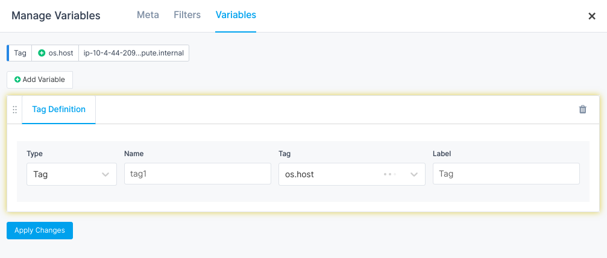
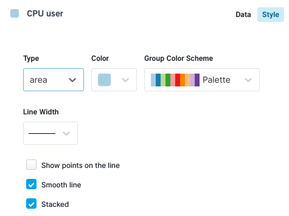
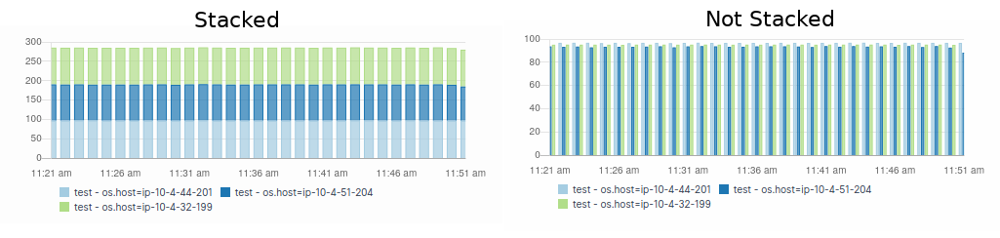

title: Chart Builder
description: Sematext Cloud exposes APIs and provides libraries that let you send custom metrics and turn them into custom charts and real-time visualizations

The Chart Builder lets you create visualizations of the data sent to Sematext. It lets
you build charts for metrics and logs. Charts created through the builder
are added to your [dashboards and reports](../reports-and-components/#dashboards-reports) as
[dashboard components](../dashboards/quick-start/#adding-components-to-a-dashboard). Configuring
a chart requires specifying a list of
series with metrics, optional filters, and groupings. Charts built through the
builder give you insight into spikes and trends, helping you to understand how your
infrastructure or applications behave now or how they behaved in the past.

<video style="display:block; width:100%; height:auto;" controls autoplay loop>
  <source src="https://cdn.sematext.com/videos/chart-builder-20200207-3.mp4" type="video/mp4" />
</video>

You can display many series on a single chart. Each of them can be configured to have its own color and
style:

* bar
* line
* area
* points
 
Each series should be configured in a series configuration panel. The panel where you change the settings of each series is split into a couple of sections.

## Metrics

In this section you pick one or more metrics which are used to build a data series. If you pick more
than one metric you have to apply transformations to let Chart Builder know what's
the relationship between the metrics. If you don't write your own
transformation expression then all metrics are added to each other producing
a single series.



## Transformation

Transformations are used to modify metrics with a formula. Why is this useful? Imagine you collect
all individual types of CPU usage separately, like `os.cpu.user`, `os.cpu.system`, `os.cpu.wait`.
If you want to chart all of them as a single series you can added them up using an expression like this:

```
os.cpu.user + os.cpu.system + os.cpu.wait
```



Another example is ratio. Imagine that you are interested in the ratio of the network input
traffic and output traffic so you can easily spot suspicious behavior in the system,
like a sudden jump of output traffic which does not correlate with the input traffic. In this
case you would divide one metric by another to get the required series:

```
os.network.out / os.network.in
```

### Math operators

Now you know why transformations are needed. Here is what you can use to build transformations.

We support math operators `+`, `-`, `*`, `/`, `%`. Parts of the expressions can be scoped
with parentheses `()`. Here's an example:

```
os.cpu.user / (os.cpu.user + os.cpu.system + os.cpu.wait) 
```

### Functions

In addition to math operations, there are functions you can use. The list of functions will grow over time.

##### ifNull

  Returns an alternative value if the main argument is NULL.

  __Usage__:

  ```ifNull(x, y)```

  __Example__:

```
ifNull(`os.disk.usage`, 0)
```


##### coalesce

  Checks from left to right whether NULL arguments were passed and returns the first
  non-NULL argument. This function takes any number of parameters.


  __Usage__:

```
coalesce(x, y, ...)
```

  __Example__:
  
  Consider you collect two different metrics with a similar meaning. On one host you collect a
  metric called `os.disk.usage` and on the second host you collect a metric called
  `os.disk.used`. You'd like to show a total disk usage from these two hosts. Unfortunately, metrics
  are named differently. This is where `coalesce` comes handy. You simply call the function 
  ```coalesce(`os.disk.usage`, `os.disk.used`, 0)```. Depending on the metrics' name for a given
  datapoint one of `os.disk.usage`, `os.disk.used` and `0` will be picked.


## Filter by

The Filter section is used to specify criteria that are used to find matching data points.
Suppose you collect data from multiple hosts but you'd like to see a chart containing only
two of them (`host1` and `host2`). You have to pick the right filter
in the [Filter by](#filter-by) section. You would choose tag name `os.host` and two tag values `host1` and `host2`.

You can use [variables](#variables) as tag values so they can be configured dynamically
from the report level.



## Group by

In the [Group by](#group-by) section you choose what data series to group on the graph. For example, if you
choose the `os.host` tag and for the aggregation in `Aggregation` field you choose `all separately`
the chart will show a data series for each host separately. Each data series is made up of
the selected metric on a particular host.

You can use [variables](#variables) as tag values so they can be configured dynamically
from the report level.



### Aggregation functions

Let's get back to the example from the section above. If you choose aggregation function instead of `all separately`
only one data series is created for all the hosts. The result depends on the aggregation
function you choose. The aggregation function determines how the metrics are
aggregated into a single data series. You can pick one of `avg`, `sum`, `min`, `max`.


## Rollup by

Data points sent to Sematext Cloud have a time label. If a metric is updated every 10 seconds, and you are
looking at a 24-hour time range, you need 14,400 points to display all data points.
Displaying so many data points on the chart would make it unreadable and would negatively impact
your web browser's performance. If we build time buckets each containing 600 data points
we will have 24 data points to display on the chart, one data point for each hour. The Rollup function
controls how time buckets are built, meaning what aggregation is performed. You can pick
one of `avg`, `sum`, `min`, `max` as a rollup aggregation function.
 

Each of the predefined metrics has its own default rollup function defined depending on the type of
the metric. All gauge metrics use the `avg` rollup function and all counter metrics
use `sum` rollup function. In some cases it makes sense to customize the setting.

_NOTE: Recommended for expert users._




## Variables

Variables are used to dynamically filter and group components by tags.

Filters from the `Filter by` section don't have to be configured statically when a chart
is created. Sometimes you need charts on the dashboard to react on a global filter
change.

Consider a case where you're troubleshooting a system and you realized that one of the
hosts has problems. You have a dashboard which contains aggregate information for all hosts. You can,
of course, reconfigure all components on the dashboard so they only show the data for the host you're interested in.
As you might expect this is not a very efficient way to troubleshoot. This is where Variables
come into play. You can create a tag variable that points to the `os.host` field.
This variable should later be added to the charts that listen for variable changes.
A variable is automatically added on top of the dashboard. A variable becomes a drop-down component
from which you can select tag values and charts automatically react on the change.

Variables can be used both in the [Filter by](#filter-by) section and in the [Group by](#group-by) section. Suppose you
have a dashboard with charts that show aggregated metrics about disk usage on several hosts.
You want to troubleshoot a problem you've spotted on one of the charts that looks like a small jump in disk usage.
To identify the root cause you can try to find the problem by grouping metrics by the `os.host`
tag. A group variable can let you do that from the dashboard level without changing the
definition of the series in any of the charts. Now imagine that you grouped data by `os.host` but still don't
see any obvious problem because the disk usage jumped on all hosts. Then you may decide
to also group by `os.disk` and by doing so you may realize that the problem was only
`/dev/nvme0n2` disks.

Variables can be created in Report options "Manage variables".




## Style

In the style tab, you configure what the chart looks like. You can select bar, line, area and point 
charts. In addition to the chart type, you can choose a color from the palette and group color scheme. The main
goal of a group color scheme is to determine the colors of the series from the same group. When you group a metric by
`os.host` as a result you get a couple of series. Each series can get a different color.



A very important feature in the styles tab is the "Stacked" option. When you select the checkbox data
of a given series is stacked. This is very useful for area and bar charts. Below you can see
a comparison of stacked and non-stacked bar charts.


