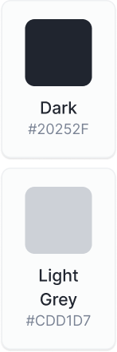
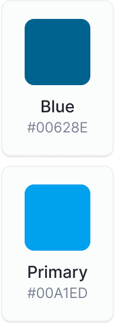
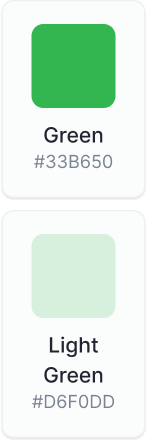
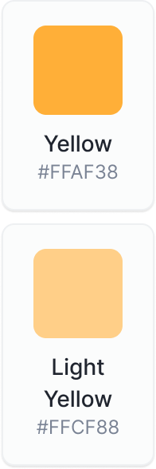
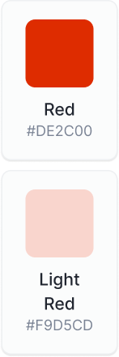
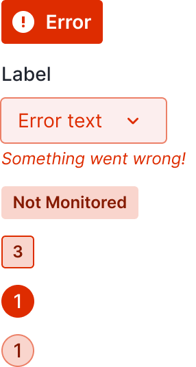

# Color Guidelines for Conditional Coloring

Welcome to the **Color Usage Guidelines for Conditional Coloring** in Sematext. 
These guidelines are designed to help you create clear and effective visualizations while ensuring accessibility for all users. 

> While we provide best practices and recommendations, please remember that users can customize their experience to their liking.  By following these guidelines, you can maintain consistency and clarity in your charts, ensuring that your data is presented in the most meaningful way possible.

 

## Color Usage
In Sematext, the effective use of colors is essential for conveying data insights clearly. 
 Here are some best practices to follow when using colors in your charts:

### Purposeful Color Application

Colors should have a clear and meaningful purpose in your charts. 
 Consider what each color represents and how it aids in user understanding. 
 Avoid using colors indiscriminately or for purely decorative purposes.

### Neutral

| Examples  |  | Elements |
| ------------- | ------------- |------------- |
|  | **When to Use:** Neutral grey is primarily used for non-essential or neutral elements in your charts. It helps create a visual hierarchy by distinguishing between critical and less important information.     **Examples of Use:** You can use grey for background elements, gridlines, or non-essential labels. It can also be used for secondary data or data that is less important in a specific context.  |   |

 

#### Informational

| Examples  |  | Elements |
| ------------- | ------------- |------------- |
|  | **When to Use:** Neutral grey is primarily used for non-essential or neutral elements in your charts. It helps create a visual hierarchy by distinguishing between critical and less important information.     **Examples of Use:** You can use grey for background elements, gridlines, or non-essential labels. It can also be used for secondary data or data that is less important in a specific context.  |   |

 

#### Success

| Examples  |  | Elements |
| ------------- | ------------- |------------- |
|  | **When to Use:** Neutral grey is primarily used for non-essential or neutral elements in your charts. It helps create a visual hierarchy by distinguishing between critical and less important information.     **Examples of Use:** You can use grey for background elements, gridlines, or non-essential labels. It can also be used for secondary data or data that is less important in a specific context.  |   |

 

#### Warning

| Examples  |  | Elements |
| ------------- | ------------- |------------- |
|  | **When to Use:** Neutral grey is primarily used for non-essential or neutral elements in your charts. It helps create a visual hierarchy by distinguishing between critical and less important information.     **Examples of Use:** You can use grey for background elements, gridlines, or non-essential labels. It can also be used for secondary data or data that is less important in a specific context.  |   |

 

#### Error

| Examples  |  | Elements |
| ------------- | ------------- |------------- |
|  | **When to Use:** Neutral grey is primarily used for non-essential or neutral elements in your charts. It helps create a visual hierarchy by distinguishing between critical and less important information.     **Examples of Use:** You can use grey for background elements, gridlines, or non-essential labels. It can also be used for secondary data or data that is less important in a specific context.  |   |

### Color for Highlighting

Use colors to highlight specific data points, trends, or anomalies.   
Highlighting can draw attention to critical information, making it easier for users to identify key insights at a glance.

### Color Consistency

Maintain consistency in your color usage throughout the app.    
For example, if you use green to represent success in one chart, continue using green consistently for success in other charts and visualizations.
