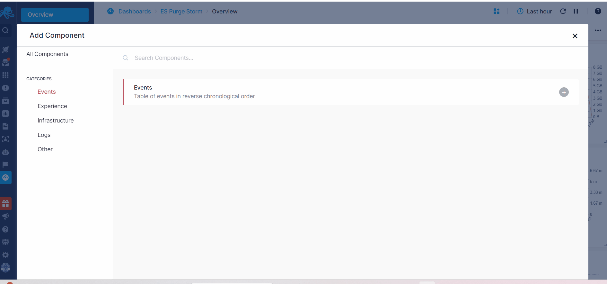

title: Overview
description: Components offered in chart builder.

As shown in the screenshot below, in the 'Other' tab within the left panel for component selection, you'll find a range of generic components. Once you select a component from this category, you'll begin by choosing the solution type from which you wish to retrieve data.
Next, complete the necessary and optional parameters, including metrics, filtering, grouping, transformations, styling, and more to start building your custom component.

Each of these components is extensively detailed on their dedicated page. For further insights into filter, grouping, and transformation functionalities, refer to the [Chart Builder](https://sematext.com/docs/dashboards/chart-builder/).

- [Time Series Chart](./time-series-chart)
- [Bar chart](./bar-pie-donut-chart)
- [Geo map](./geomap)
- [24x7 Heatmap](./heatmap)
- [Heatbar](./heatbar)
- [Numeric](./numeric-component)
- [Markdown](./markdown)
