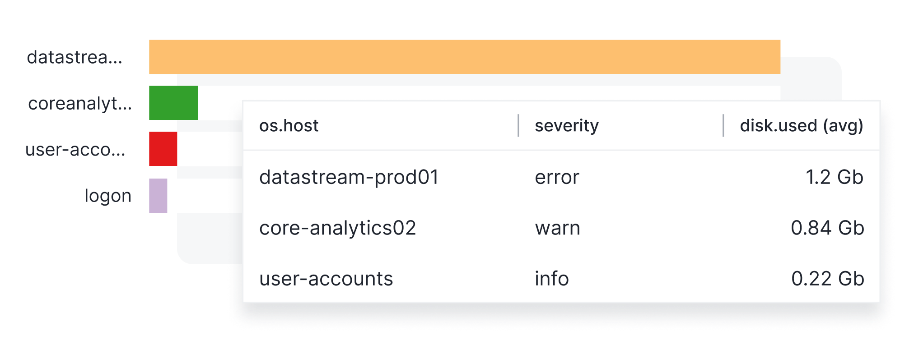
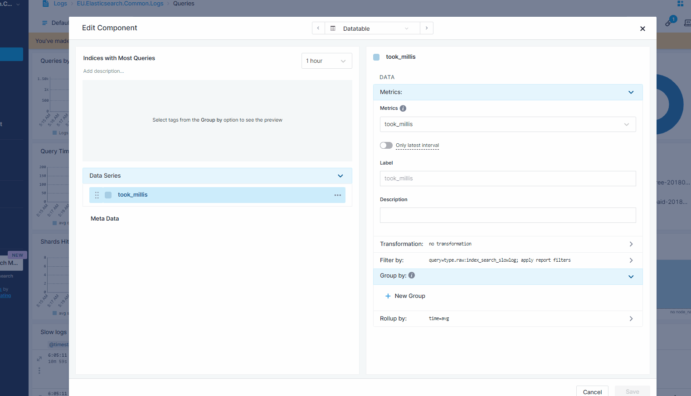
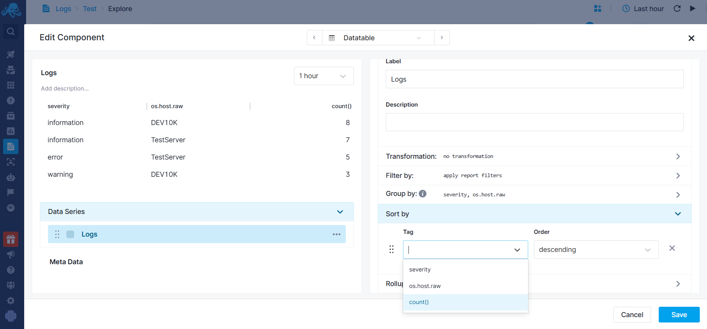
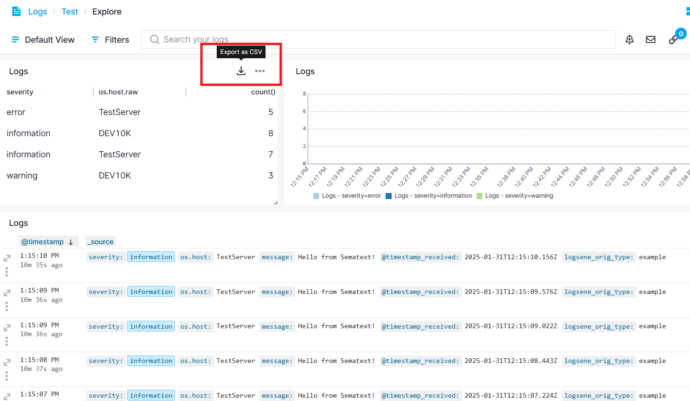

title: Data Table
description: Shows data in a tabular format.

The Data Table Component displays your data in a clear, easy-to-read table with rows and columns. Instead of showing data with bars or slices, it organizes information into a simple grid. This format is helpful when you need to focus on the full text that might be hard to see in charts like Bar Charts or Pie Charts. The Data Table emphasizes clear and detailed data presentation, giving you a straightforward way to view your metrics and logs.

The displayed values depend on the selected date and time picker located at the top right of the dashboard.

## Configuration

You can configure Data Table component either during its initial creation or afterward by clicking on the three dots that appear on hover and selecting 'Edit Component'.

- Choose All Apps or a specific App that you want to fetch data from.
- Choose a metric
- Choose tags from the [Group by](https://sematext.com/docs/dashboards/chart-builder/#group-by) section to display on the Data Table
- Enter optional parameters such as:
  - [Transformation](https://sematext.com/docs/dashboards/chart-builder/#transformation)
  - [Filter By](https://sematext.com/docs/dashboards/chart-builder/#filter-by)
  - [Rollup By](https://sematext.com/docs/dashboards/chart-builder/#rollup-by)
    
While building the chart, a preview is available in top left. 

You can sort data table columns by going into Edit Configuration, which will save this setting. 

You can also export the data table to a CSV file by hovering over the header and clicking on the export icon.

