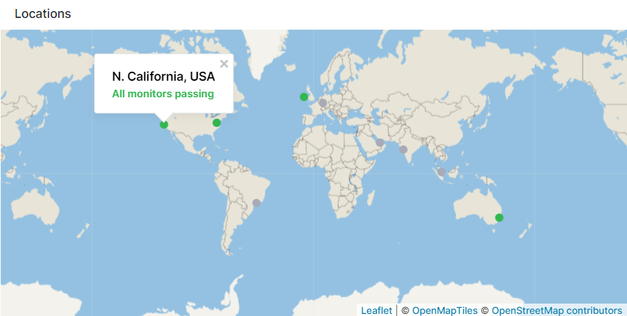

title: Geo Map
description: Shows a selected data series as country heatmap

A geo map chart is a type of data visualization that displays data values across geographical regions. It represents data points on a map using markers to indicate different values or categories within specific locations or regions. 
These charts are effective in visualizing geographical data such as population distribution, sales by region, or any data that has a geographic component.

## Configuration

You can configure these charts either during its initial creation or afterward by clicking on the three dots that appear on hover and selecting 'Edit Component'.

- Choose All Apps or a specific App that you want to fetch data from.
- Choose one or more metrics metric
- Enter optional parameters such as:
  - [Transformation](https://sematext.com/docs/dashboards/chart-builder/#transformation)
  - [Filter By](https://sematext.com/docs/dashboards/chart-builder/#filter-by)
  - [Group by](https://sematext.com/docs/dashboards/chart-builder/#group-by)
  - [Rollup By](https://sematext.com/docs/dashboards/chart-builder/#rollup-by)

Edit Component  has a geo section.  Here, you select the **Geo Tag**, which is the field containing geographical data, and from the **Tag Type** field, you should choose the format of the geographical data."

### Tag Types

- 2 Letter ISO Code
- 3 Letter ISO Code
- 2 Letter World Bank Code
- 3 Letter World Bank Code
- Country Name
