title: Heatbar
description: Heatbar is a single-line heatmap that is shown above the main, time-series chart.

Heatbar is a single-line <a href="https://en.wikipedia.org/wiki/Heat_map" target="_blank" title="Opens a new tab">heatmap</a> that is shown above the main, time-series chart.  
You can style any series as a heatbar, but it's especially suitable for events and logs.  

Here you can see a time-series chart which shows the total number of logs and, above it, a heatbar which tracks only errors among them.

A chart can have multiple series configured as heatbars, like in the following example:

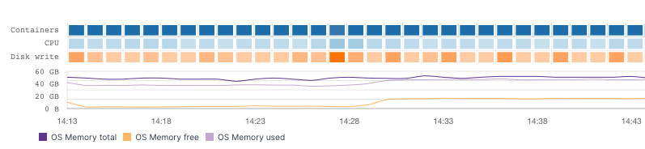

If all of the series are heatbars the main time-series chart is not even shown.  
For example, the following chart is configured to show a single heatbar series, `CPU User` [grouped by](#group-by) `OS Host`:

The chart shows six heatbars because the `CPU User` metric was reported by six different `OS Hosts` during the observed time range.

### Creating Heatbars

Let's build the [Usage logs with errors](#heatbar) component together.  

Since the total number of logs is not particularly interesting, we'll monitor a certain subset of logs, for example logs which contain the word `Usage`.  
We'll have our time-series chart tracking all *Usage* logs and additionally, we'll use a heatbar to track only errors, like we've seen in the first Heatbar example above.  

In your dashboard, click on the `Add component` button on the top of the screen, which looks like this:

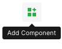

In the first dialog choose `Time Series Chart`:

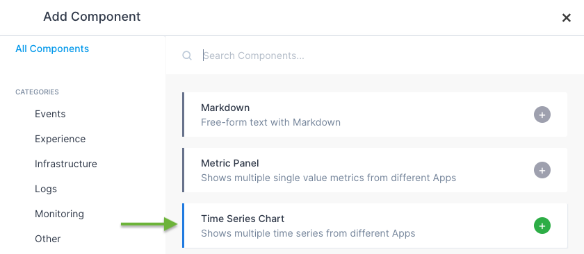

Then choose `Logs` data series:

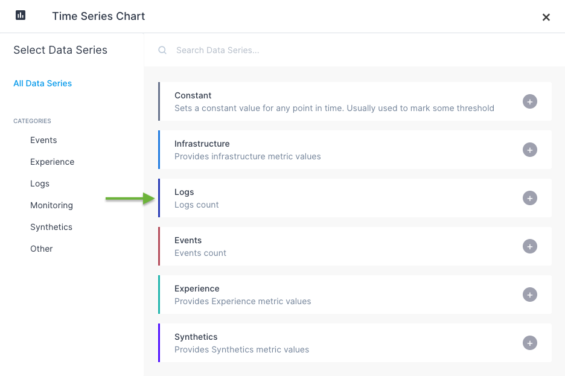

If you're creating your first chart, the initial result may look intimidating at first glance:

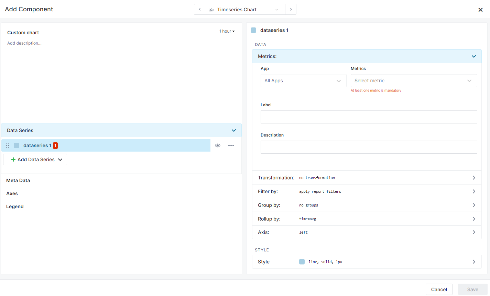

It's just a matter of choosing what we want our chart to show. So far we've chosen a type of chart, but haven't specified which **App** to use as the source of data and which **metric** from that App to show.  

In the `App` field, choose any *Logs App* that contains data and in the `Metric` field choose a special function `count()`, which represents the number of logs.
We'll name this data series `Usage logs`, so type that into the `Label` field.

Great, errors are gone and we already see data in our chart preview:

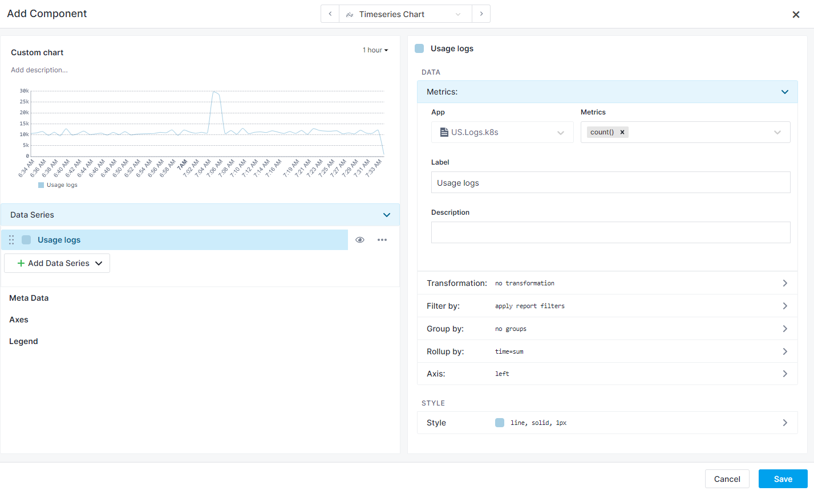

Let's keep things organized, change the `Custom chart` title in the upper left corner to `Usage`. You just need to click on the title to edit it in-place.  

Next, in the `Filter by` section, shown below, we are going to add a filter to our data series by typing `Usage` into the `Query` field. When you're done typing, you can apply the change with the Enter key (while the cursor is still in the `Query` field) and the chart will be updated, now containing only those logs which matched the query.

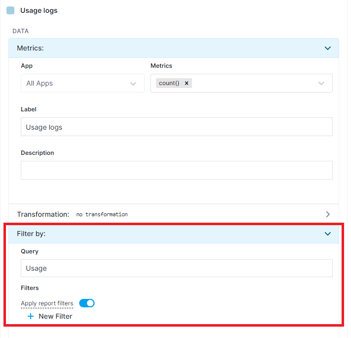

So far so good, we can see our `Usage logs` in the chart preview.

Now let's add a heatbar.  
Duplicate `Usage logs` series using the series action menu (`...`), like this:

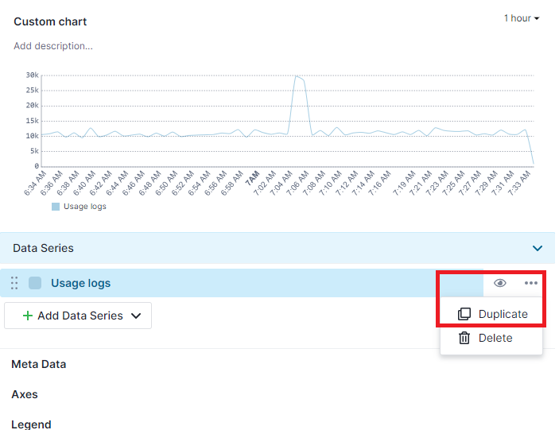

Change the label of the new series to `Errors`.  

Expand the `Filter by` section, under the `Label`. As you can see in the screenshot below and hopefully in your own chart, our `query: Usage` is still here, duplicated correctly from the first series. We'll additionally filter logs to only those with `severity: error`:

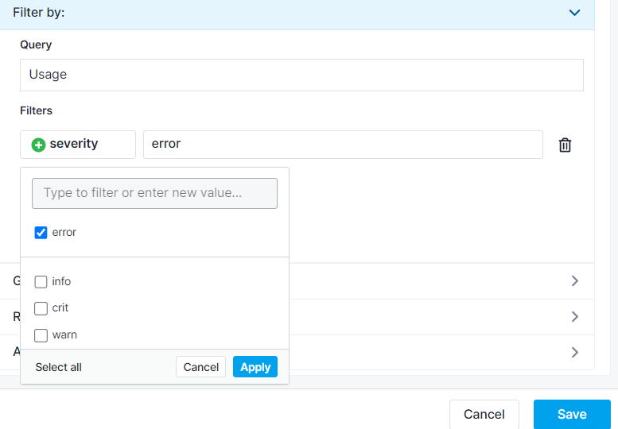

Finally, switch to the `Style` section of our second data series in the upper right corner and change its type to `heatbar` and color to red.

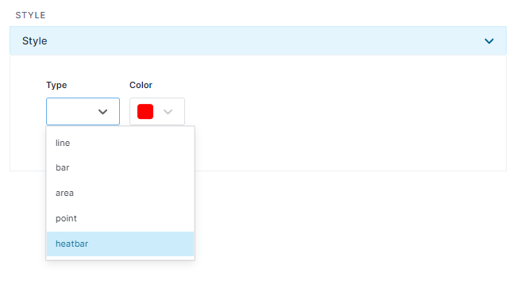

And just like that, we have our *Usage chart* with a heatbar of *Usage errors*.

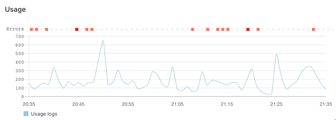

### Accessing data in Heatbars

Clicking on a heatbar square opens a panel with a list of *Usage errors* from the corresponding time range.

<video style="display:block; width:100%; height:auto;" controls>
  <source src="https://cdn.sematext.com/videos/chart-builder-heatbar-20201117-1.mp4" type="video/mp4" />
</video>
