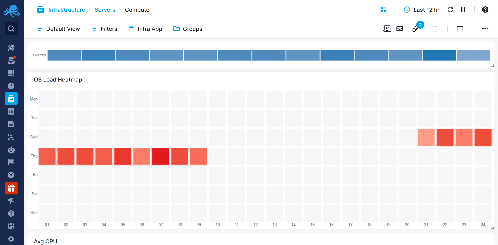

title: Heatmap
description: Shows a single data series in a 24x7 heatmap

The Heatmap is a two-dimensional representation of data, where values are represented using color saturation. The vertical axis shows weekdays, while the horizontal axis represents the hours in a day.

With Heatmap you can visually represent historical data to gain actionable insight into how to improve performance.

## Configuration

You can configure the chart either during its initial creation or afterward by clicking on the three dots that appear on hover and selecting 'Edit Component'.

- Choose All Apps or a specific App that you want to fetch data from.
- Choose one or more metrics metric
- Enter optional parameters such as:
  - [Transformation](https://sematext.com/docs/dashboards/chart-builder/#transformation)
  - [Filter By](https://sematext.com/docs/dashboards/chart-builder/#filter-by)
  - [Group by](https://sematext.com/docs/dashboards/chart-builder/#group-by)
  - [Rollup By](https://sematext.com/docs/dashboards/chart-builder/#rollup-by)

