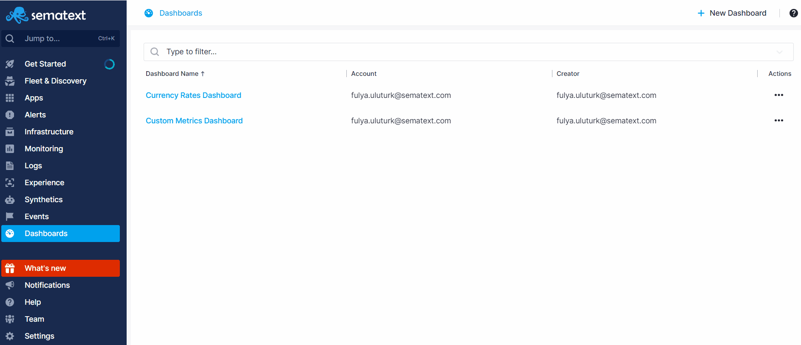
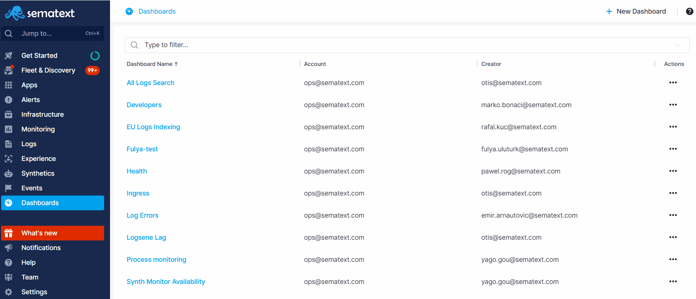

title: Sematext Dashboards
description: Sematext Cloud is a modern monitoring, log management, transaction tracing, real user monitoring, and synthetic monitoring system. Dashboards are a powerful feature for cohesive data analysis from multiple data sources such as logs, metrics, and events.

Dashboards are your central location where you put everything together. Logs, application performance metrics, infrastructure inventory and processes, cluster data with Docker and Kubernetes metrics, and events that give you insight into what is happening with your system in real-time. Everything in one place for easy correlation and troubleshooting. 

For example, if you have a development and a production environment, it might make sense to have one Dashboard for each. You can create as many Dashboards as you want.

You can create specific reports with various metrics, correlate them with logs and event timelines to get to the bottom of issues much easier.

Log data is hard to analyze and can be extremely tedious to understand. Dashboards provide the means to display one or more metrics in parallel with logs, and display them in a unified report for easy correlation and investigation.

## Creating Dashboards
To create a Dashboard, start by going to the Dashboards screen and click the **+ Add New Dashboard** button. Give your Dashbord a name and click save.

After creating your Dashboard, you'll notice that a default Overview Report is automatically generated in the left menu panel. Additionally, a dialog will appear on the screen, prompting you to create your first component using the [Chart Builder](https://sematext.com/docs/dashboards/chart-builder/) and add it to the report.

### Chart Builder

<iframe src="https://www.youtube.com/embed/8PxtgrwY8SQ" 
frameborder="0" allow="autoplay; encrypted-media" 
allowfullscreen class="video"></iframe>

Learn more about [Chart Builder](https://sematext.com/docs/dashboards/chart-builder/).

## Dashboard Settings

On the Dashboards overview page, you have the ability to edit, delete, or clone your dashboards. Upon opening a dashboard, all the reports you've created within it will be visible in the left menu panel. Hovering over a report name and clicking on the three dots presents options to edit, clone, delete the report, and define [report variables](https://sematext.com/docs/dashboards/report-variables/).

Every Dashboard can have multiple Reports that act as buckets for your metrics, logs, infrastructure, events, and experience data. The data in one report are separated into components, which all live under the same roof in a Dashboard for easy correlation and troubleshooting.

Follow along the [Quick Start](./quick-start) guide for more detailed instructions.

## Getting Support

We hope you enjoy using Sematext Dashboards. If you need further support or have any feedback regarding our products, please don't hesitate to [contact us](mailto:support@sematext.com)! You can also contact / talk to us using chat widget at the bottom right corner of the page or give us a shout [@Sematext](https://twitter.com/sematext). 
