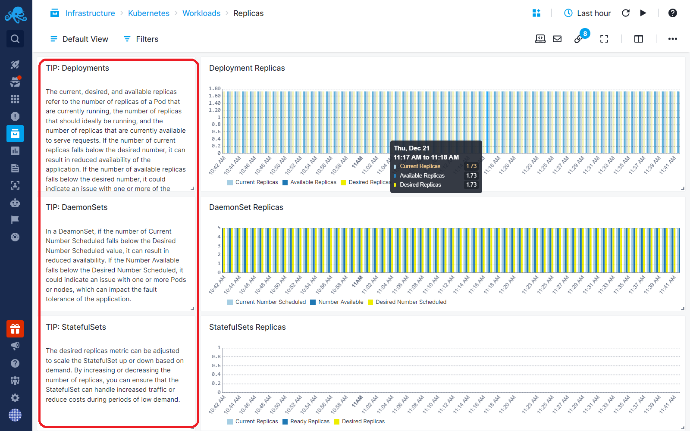

title: Markdown
description: Free-form text with Markdown

The Markdown component enables you to show free-form text using Markdown syntax. It is a tool for including helpful tips, describing how to analyze the data on dashboard, and including external links. 
The links can point to your internal documentation or external websites.

