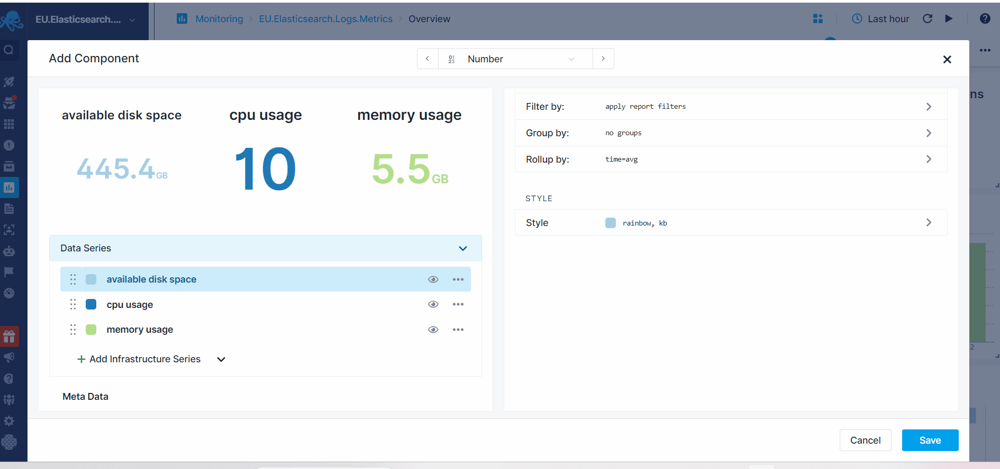

title: Numeric Component
description: Shows numeric values

Displays the value of the selected metric. The displayed values depends on the selected data time picker located at the top right of the dashboard.

## Configuration

You can configure the componenteither during its initial creation or afterward by clicking on the three dots that appear on hover and selecting 'Edit Component'.

- Choose All Apps or a specific App that you want to fetch data from.
- Choose one or more metrics metric
- Enter optional parameters such as:
  - [Transformation](https://sematext.com/docs/dashboards/chart-builder/#transformation)
  - [Filter By](https://sematext.com/docs/dashboards/chart-builder/#filter-by)
  - [Group by](https://sematext.com/docs/dashboards/chart-builder/#group-by)
  - [Rollup By](https://sematext.com/docs/dashboards/chart-builder/#rollup-by)
    
While building the component, a preview is available on the top left. Additionally, you have the option to add multiple data series, clone existing ones, adjust visibility.

### Conditional Coloring

Conditional coloring can be applied to numeric components, enabling the highlighting of significant changes. For example, increased metrics such as memory or CPU usage might demand attention, indicating the need to use red tones for higher values in these metrics.

Conversely, an increase in available disk space is generally positive and could be colored green. However, if it begins nearing zero, it warrants attention and should be represented using red tones.

Refer to the {Color Guidelines](https://sematext.com/docs/dashboards/color-guidelines/) for best practices in conditional coloring.

The conditional coloring feature enables you to assign colors based on specific conditions, like values exceeding, falling below, or equaling defined thresholds.

The conditions are applied based on the order they are set. If a rule overrides a previous one, the latter one will be valid for the visualization.
