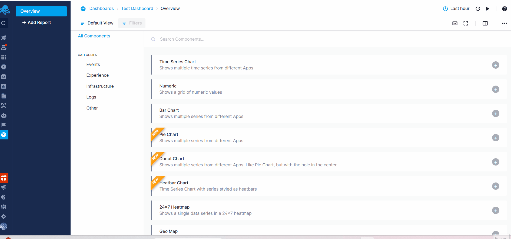

title: Sematext Dashboards Quick Start
description: Sematext Cloud Dashboards for monitoring metrics, logs, APIs, websites, etc.

Any type of component can be easily added to one or more Dashboard reports.

Once you have a dashboard created, you can start adding components to it. However, at least one or more Apps need to be created. As soon as your data is consumed and indexed by Sematext Cloud, logs, metrics, experience, events, and infrastructure components will become available to add to Dashboards. 

In the example below, we demonstrate the process of adding components from different solutions, selecting the preferred App to fetch data for each component, adding them to the Dashboard, and organizing the layout for improved visualization.

With the custom reports features you can first create specific logging, events or metric component, and add it to your Dashboard just as you can with out-of-the-box [integration](/integration/) specific components that come included when you first create an App.

The image below displays a sample of a customized Infrastructure component designed to automatically retrieve top data based on CPU, Disk, and Memory usage. To add this component, navigate to the 'Infrastructure' tab on the left and select the 'Top N Hosts' option.

## Available Dashboard Components

- Line, Area, Bar charts metrics component binned by data creation date
- Bar chart component binned by data creation date
- Table of events component in reverse chronological order
- Log table component with logs listed in reverse chronological order
- Logs count bar chart time series component 
- Numeric field time series component 
- Events count bar chart time series component
- Top N values of given log event field component
- Pie chart
- Doughnut chart
- Geo map
- 24x7 Heatmap
- Heatbar
- Numeric panel for a single numerical value
- Metric panel for multiple numerical values from different Apps
- Markdown free form editor component used to create textual panels used to add custom event notes
