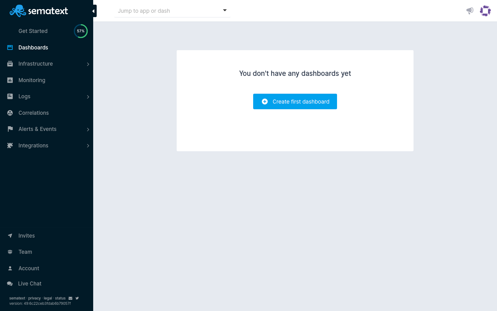
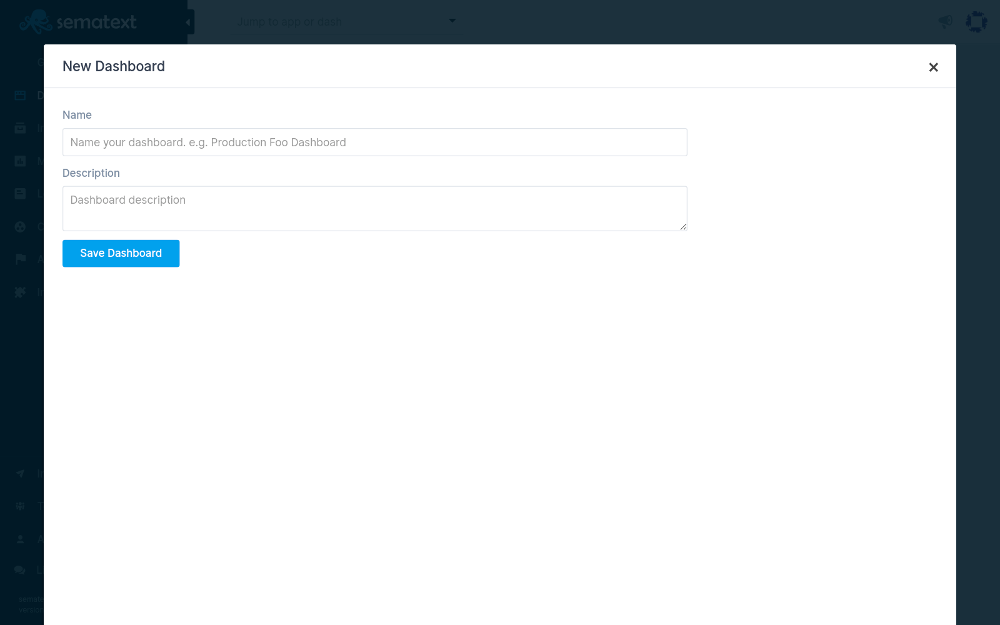

title: Sematext Dashboards Quick Start
description: Sematext Cloud is a modern monitoring, log management, transaction tracing, and real user monitoring system. Dashboarding is system's powerful feature for cohesive data analysis from multiple data sources such as logs, metrics, and events. 

After you get logged into Sematext Cloud at <https://apps.sematext.com> (or <https://apps.eu.sematext.com> if using Sematext Cloud Europe), the first step is to create a Dashboard. A Dashboard is a collection for different types of data. This is where you keep logs, metrics, events, infrastructure data and experience statistics in a single screen for easy correlation and troubleshooting.

For example, if you have a development and a production environment, it might make sense to have one Dashboard for each. You can create as many Dashboards as you want.

## Creating a Dashboard

You create a Dashboard by pressing the **+ Create Dashboard** button in the Monitoring tab.

Give it a name and description.

## Adding Components to a Dashboard

Any type of component can be easily added to one or more Dashboards.

Once you have a dashboard created, you can start adding components to it. However, at least one or more Apps need to be created. As soon as your data is consumed and indexed by Sematext Cloud, logs, metrics, experience, events, and infrastructure components will become available to add to Dashboards. 

<video style="display:block; width:100%; height:auto;" controls autoplay loop>
  <source src="https://sematext.com/wp-content/uploads/2019/07/add-components-to-dash-long.mp4" type="video/mp4" />
</video>

With the custom reports features you can first create specific logging, events or metric component, and add it to your Dashboard just as you can with out-of-the-box [integration](/integration/) specific components that come included when you first create an App.

The image below shows a sample of a custom Kafka report panel that was created by our DevOps team, and illustrates what will be displayed in a modal window when you add a component to a Dashboard using the components settings dropdown menu.

Available dashboard components in our on-premises and cloud SaaS tool:

- Line, Area, Bar charts metrics component binned by metric creation date
- Bar chart component binned by event creation date
- Table of events component in reverse chronological order
- Log Table component with logs listed in reverse chronological order
- Logs count bar chart time series component 
- Numeric field time series component 
- Events Count bar chart time series component
- Top N Values of given log event field component
- Markdown free form editor component ussed to create textual panels used to add custom event notes
