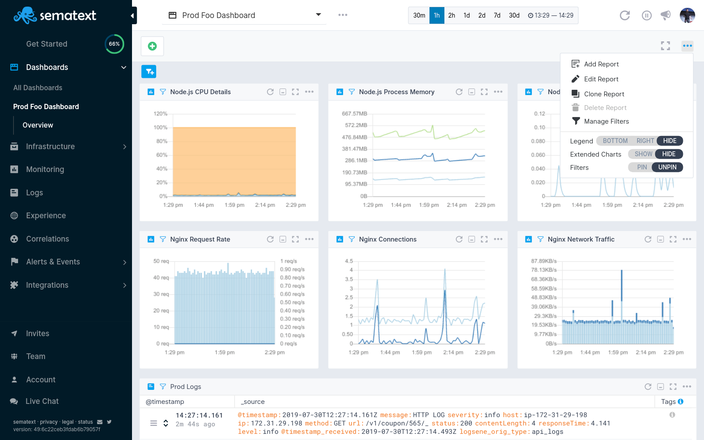

title: Sematext Dashboards Reports and Components
description: Sematext Cloud is a modern monitoring, log management, transaction tracing, real user monitoring, and synthetic monitoring system that includes a plethora of different integrations. It is a suite of products that combine high-quality logging experience with other monitoring and alerting devops tools helping fix IT production issues

## Dashboards Reports

The **Report Menu** is where the true power of Sematext's Dashboards lies. This is where Observability comes to life. **Events, Logs, Metrics, Experience, Synthetics, and Infrastructure data** are **integrated** in a **single Reports pane**, and used to **correlate metrics** with **application and server logs, events, alerts, anomalies**, and much more! 

Here's how you can **correlate Metrics with Events and Logs**, and view it all in a single view.

## Dashboard Components

The image below shows a common Monitoring App component showing its functionality and interactive elements. Using the component settings dropdown menu, you can easily add any metrics components from one or more Apps to the Dashboard. Create correlations reports, observe and analyze how multiple technologies coexist in your system. Zoom and time shift through charts, display a single component in full view, create alerts, and effortlessly share reports across your organization. 

Just like a Monitoring App component, a Logs App components have interactive elements as well. Here you can choose from Log Tables, Logs counts, and much more. Use the **+ Add New Component** button to add a Logs App component to your Dashboard, and combine them with Monitoring App components for full observability of your stack. 

Our tools will help your DevOps team find common exceptions, detect patterns in behaviours, and solve performance issues and availability problems.

### Saved Views

With [Saved Views](/guide/saved-views) you can save your filters and groups for faster access later. If you find yourself often applying the same filters on your data then this feature can be a time saver.
