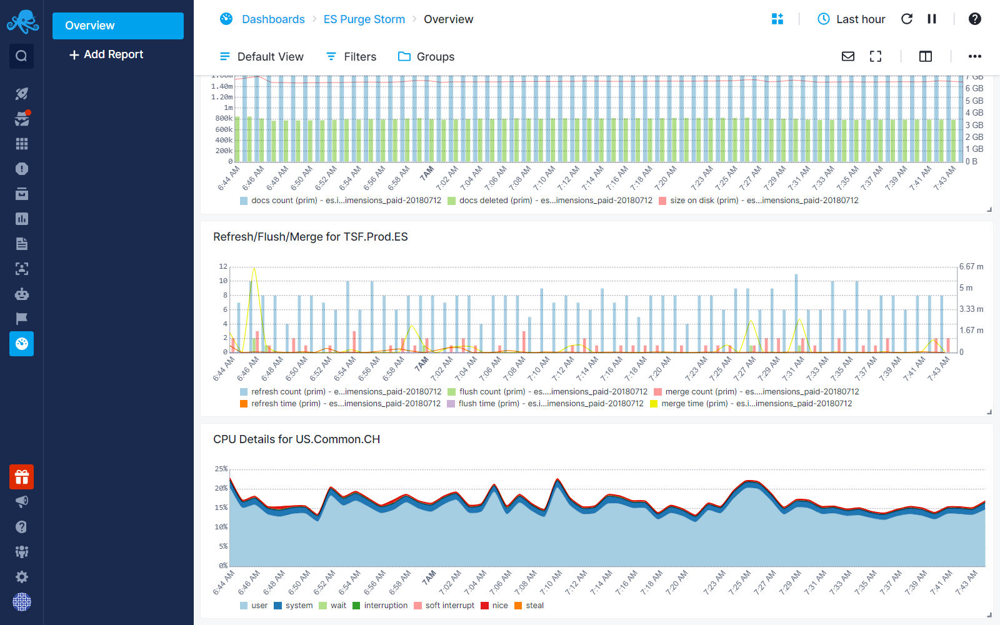
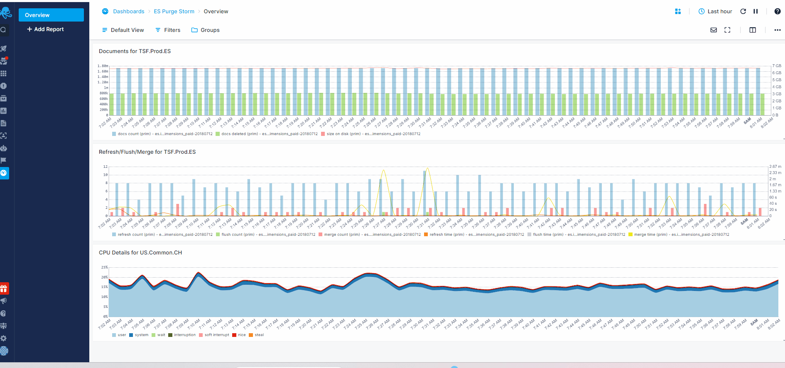

title: Time Series Chart
description: Shows multiple time series from different Apps.

The timeseries chart displays the progression of one or multiple metrics or log events over time. The displayed time window depends on the selected data time picker located at the top right of the dashboard.

## Configuration

You can configure the Time Series chart either during its initial creation or afterward by clicking on the three dots that appear on hover and selecting 'Edit Component.

- Choose All Apps or a specific App that you want to fetch data from.
- Choose one or more metrics metric
- Enter optional parameters such as:
  - [Transformation](https://sematext.com/docs/dashboards/chart-builder/#transformation)
  - [Filter By](https://sematext.com/docs/dashboards/chart-builder/#filter-by)
  - [Group by](https://sematext.com/docs/dashboards/chart-builder/#group-by)
  - [Rollup By](https://sematext.com/docs/dashboards/chart-builder/#rollup-by)
    
While building the chart, a preview is available on the top left. Additionally, you have the option to add multiple data series, clone existing ones, adjust visibility, and configure the legend's position from the 'Legend' tab.

## Style

Each data series can be displayed as lines, areas, bars, points, or heatbars. For styling the general axes of the time series, navigate to the Axes tab.
From the Axes tab, you can configure the X and Y axes, select the unit, and adjust the granularity.

### Granularity

Granularity controls how much time is presented as a single data point. By default it's automatically determined based on the selected time range. When data is sparse, or when you want make a data series smoother, you may want to increase minimal granularity to remove gaps between data points. To reduce smoothing make the minimal granularity smaller. Enable fixed granularity to prevent the system computing it based on the time range. This option can be used only if granularity is set to value greater than 10m.
