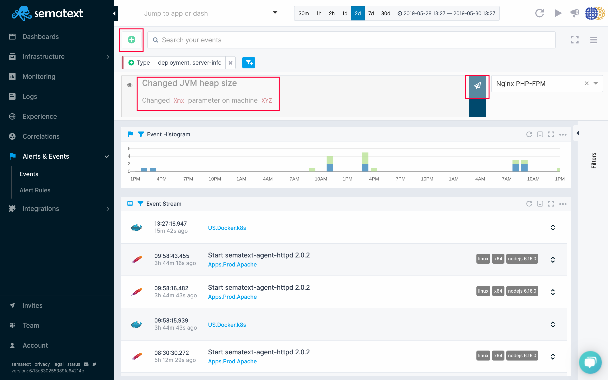

title: Adding Events to Sematext
description: How to add Events to Sematext interactively via the UI or via an API

Events can be added interactively via the UI, but you can also add them via the API as well.

## Event Fields

Each field has a few required and several optional fields.  See [Sematext Common Schema](../tags/common-schema/) for required and optional [event fields](../tags/common-schema/#events-tags).

## Event Types

Event `type` is one of the required event fields.  Events that originate from Sematext itself have types like `agent` for agent events, and `infra` for alert events.  Think of those as reserved keywords.

## Adding Events via API

The endpoint for the API used for adding events is:

`https://event-receiver.sematext.com/APP_TOKEN/event`

Because an event is always associated with a Sematext App, the App token must
be specified in the URL. Thus, to send multiple events associated with multiple
Apps, separate API call will need to be made for each App.  

## Examples

### Example 1

Consider an App with token ```1111111-2222-3333-4444-555555555555``` (find your real App tokens [here](https://apps.sematext.com/ui/integrations/apps)).  To send a ```server-info``` event
call the Events API with the App token in the URL:

`https://event-receiver.sematext.com/1111111-2222-3333-4444-555555555555/event`

with POST content, including event type, in ```JSON``` format like this:

```json
curl -XPOST "https://event-receiver.sematext.com/1111111-2222-3333-4444-555555555555/event" -d '
{
  "timestamp" : "2014-02-17T15:29:04+0100",
  "message" : "MyApp on MyHost04 restarted",
  "severity": "warn",
  "type" : "server-info"
}'
```

### Example 2

Same App, but we want to post a `deployment` event with more event properties populated:

```json
curl -XPOST "https://event-receiver.sematext.com/1111111-2222-3333-4444-555555555555/event" -d '
{
  "timestamp" : "2018-02-17T15:58:04+0100",
  "message" : "Solr 7.0.0 version deployed on prodhost06",
  "name" : "Solr 7.0.0 deployment",
  "tags" : ["solr", "7.0.0", "deployment", "upgrade"],
  "severity": "info",
  "priority" : "High",
  "creator" : "John Smith",
  "type" : "deployment"
}'
```

## Adding Events through UI

Calling API methods is not the only way to add an event. You can define an event
in the user interface. This is very useful for all kinds of events that are important and which are not
created automatically. Imagine you have an emergency deployment or configuration change
which doesn't go through CI/CD pipeline so there is no automatic event triggered. You may still
need to leave a message on the timeline for future analysis how the deployment impacts
system or application metrics.

[](../images/events/custom-event.png)

