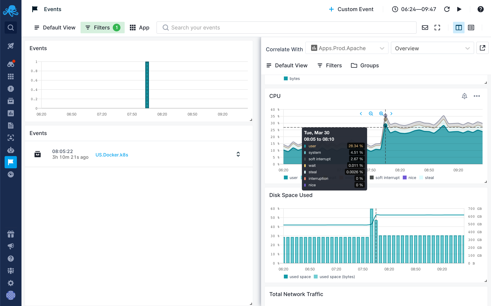

title: Correlation
description: Split Screen is product-wide correlation and data-pivoting feature. With Split Screen you can compare Events report with any other report or dashboard, even with Events report but with different filters in the two different screens.

### Manual Correlation

Manual correlation can be done using our [Split Screen](../guide/split-screen) feature. With [Split Screen](../guide/split-screen) you can compare and correlate Events report with any Monitoring, Logs, Infrastructure or Experience report. Correlation is also possible with Synthetic Monitor. It can be used to correlate even with Events report but with different filters in the two different screens. 

Correlation with Events can also be done from other reports by selecting Events from within [Split Screen](../guide/split-screen).

Once you select a report you want to correlate with, it’ll be remembered so you can quickly toggle it.