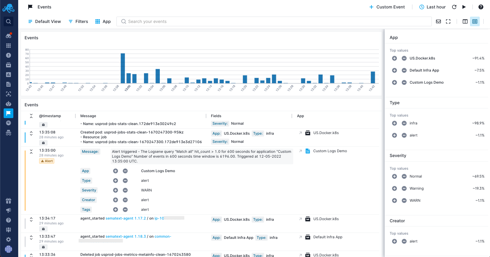

title: Viewing Events in Sematext
description: Viewing and accessing events in Sematext

## Events Histogram
All events are time-based. This means they are presented on a histogram (aka timeline). The default events chart
groups events by [event type](adding.md#event-types). You can rely on colors presented on the chart to quickly
figure out what are the most common event types at each point in time.

## List of Events
Events are listed in the Events table just below the chart. Each event row includes the severity, timestamp, a message with all the event details, [event fields](adding.md#event-fields), and the Sematext App associated with the event. The event rows can be expanded to reveal more information about each event. It's also possible to apply filtering to event fields. Some fields are hyperlinked with other areas of Sematext Cloud to enable easy identification of any potential issue in your environment.

## Searching Events
You find all events from a given time period by using the time selector. Additionally, with event search you can further narrow down events
to only those that match the input query. You can search on any event field included in the event when it was added.  The query syntax is the same as the [logs search syntax](/logs/search-syntax/).

## Event Filtering and Saved Views
Besides text search there are filters.  You can filter events by any event field or App and you can use [Saved Views](../guide/saved-views/) to save any combination of filters that you may want to access later on and don't want to have to specify again.
