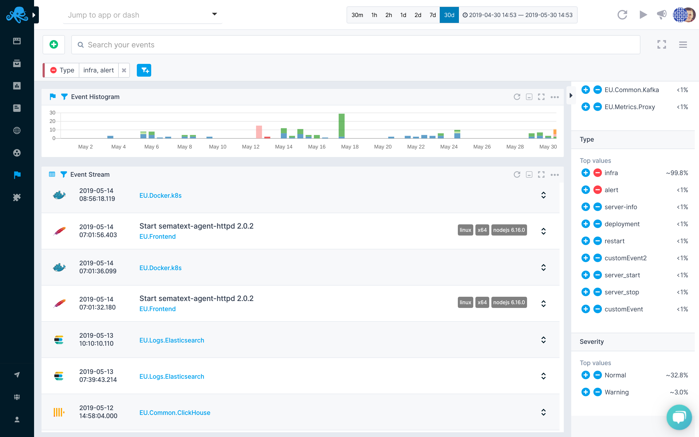

title:Timeline/Histogram

All events are time-based. This means they are presented on a histogram (aka timeline). Chart
contains events grouped by event type. You can rely on colors presented on the chart to quickly
figure out what are the most common event types at each point in time. Events chart behaves
the same way as all other charts in [Sematext Cloud](http://sematext.com/cloud/).

Events are listed in Events Stream just below the chart. Each event is associated with a single
Sematext App whose icon is displayed alongside the event.

