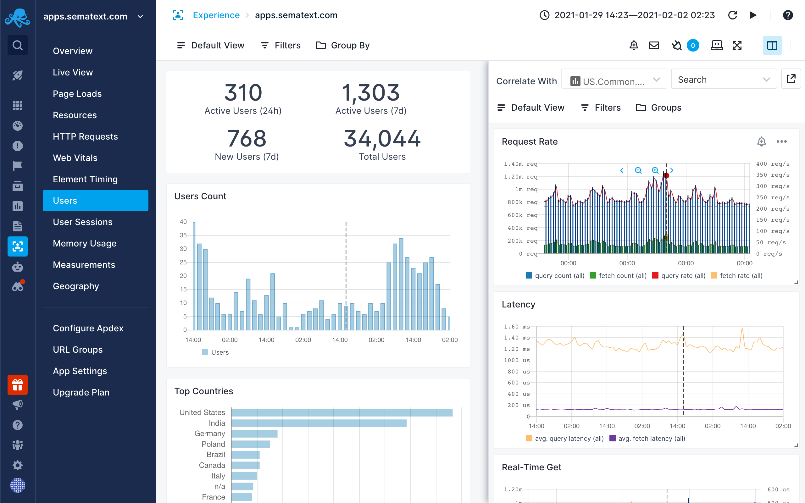

title: Correlation
description: Split Screen is product-wide correlation and data-pivoting feature. With Split Screen you can compare selected Expirience report with any other report or dashboard, even the same report but with different filters and groups in the two different screens.

### Manual Correlation

Manual correlation can be done using the [Split Screen](../guide/split-screen) feature. With [Split Screen](../guide/split-screen) you can compare and correlate selected Experience report with any Monitoring, Logs or Infrastructure reports. Correlation is also possible with Events or Synthetic Monitors. It can be used to correlate even with the same Experience report but with different filters and groups in the two different screens.

Once you select a report you want to correlate with, it’ll be remembered so you can quickly toggle it.
