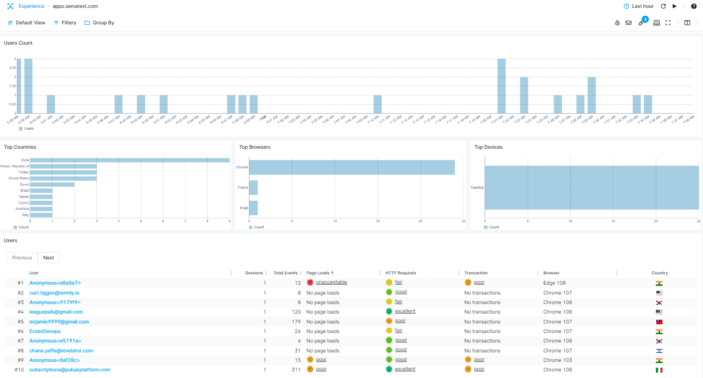

title: Identifying Users
description: Overview on how to identify users

By default, all users that interact with your website will be given an anonymous identifier. You will get an overview of the number of sessions for each given user, page loads and network requests, as well as User Satisfaction for these events, which browser was used and the country from which the user is interacting with your website. 



This behavior can be altered by calling the `identify` function that allows you to inform the script about the user's identity. Here's an example. If the user interacting with your application is already logged in, you can pass along their name and identifier (email, email hash, or anything that is unique) so that later you can find data for this user in Experience.

In order to properly identify the user you need to call the `identify` function just before the `config` function described in the [Getting Started](getting-started.md) section, i.e.:

```javascript
<script type="text/javascript">
  strum('identify', { name: 'mike', identifier: 'mike@company.com' });
  strum('config', ...);
</script>
```
Note that both 'name' and 'identifier' are required.

Deploy the changes to your website, and wait for new data to arrive.

### Tags

If you need to add Custom Tags for filtering additional attributes, check out the [Tags](./tags) section.
