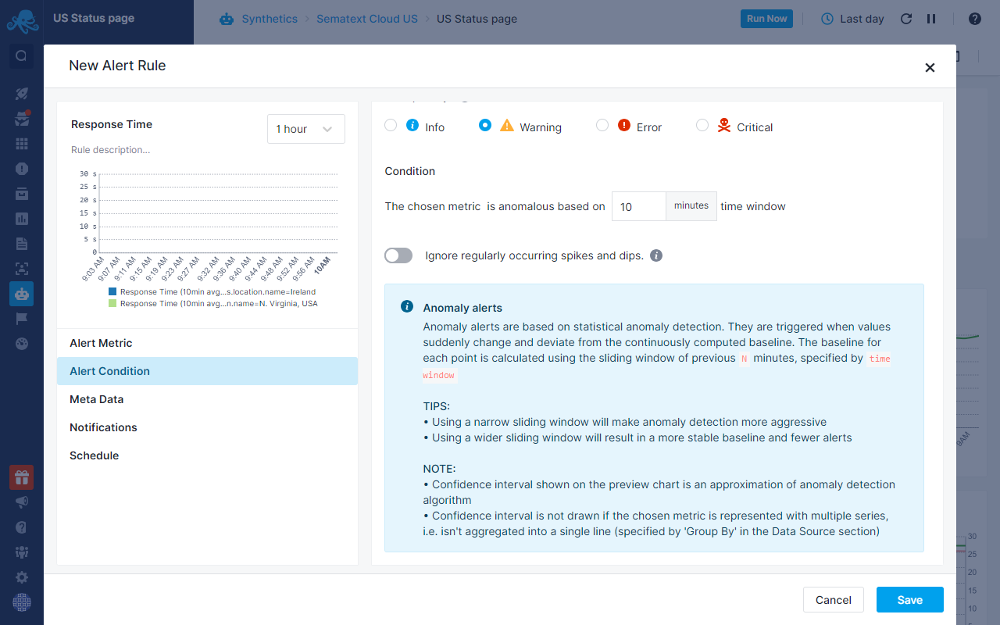

title: Sematext Alerts User Guide
description: Sematext Cloud Alerts give you a flexible centralized notification system that lets you manage Alert Rules and Alert Conditions across your whole stack. Use Events to correlate them with Metrics and/or Logs, and see what is happening with your infrastructure.  

<iframe src="https://www.youtube.com/embed/ik_L7Qk_Aug" 
frameborder="0" allow="autoplay; encrypted-media" 
allowfullscreen class="video"></iframe>

Receiving Alerts when your software is misbehaving or underperforming is crucial for every developer. Good alerting practices include:

- **Alert Rules** that **detect Anomalies** and notify when key **performance indicators spike or drop**
- **Criteria** that trigger **Alerts for monitored resources**
- **Thresholds** defined for **Alerts** when selected **metrics reach certain severity levels**
- [**Notification channels**](https://sematext.com/docs/alerts/alert-notifications/) through which the responsible team will be notified about the incident

[Sematext Alerts](../alerts) help you address underlying issues before they affect user experience. There are three types of Alerts. 

- **Threshold** - Alerts that are based on classic thresholds. They are **triggered** when something **crosses a pre-defined threshold**.
- **Heartbeat** - Alerts **triggered** when **something you are monitoring**, like your servers, containers, or your applications, **stops sending data** to Sematext Cloud.
- **Anomaly** - Alerts based on statistical anomaly detection. They are **triggered** when **values** suddenly **change and deviate from the baseline**. 

**Threshold** and **Anomaly** Alerts can be triggered for [Events](https://sematext.com/docs/events/) and [Monitoring](https://sematext.com/docs/alerts/creating-metrics-alerts/), [Logs](https://sematext.com/docs/alerts/creating-logs-alerts/), [Synthetics](https://sematext.com/docs/alerts/creating-synthetics-alerts/) and [Experience](https://sematext.com/docs/alerts/creating-experience-alerts/) Apps, while [**Heartbeat**](https://sematext.com/docs/alerts/creating-heartbeat-alerts/) Alerts are only available for Monitoring Apps.

Sematext lets you manage Alert Rules across your whole stack. You can use various [notification channels](https://sematext.com/docs/alerts/alert-notifications/) to get alerted when critical issues occur so you can take action and resolve them. Our Alerts easily integrate with notification and chat software. 

- [PagerDuty](https://sematext.com/docs/integration/alerts-pagerduty-integration/)
- [OpsGenie](https://sematext.com/docs/integration/alerts-opsgenie-integration/)
- [HipChat](https://sematext.com/docs/integration/alerts-hipchat-integration/)
- [Slack](https://sematext.com/docs/integration/alerts-slack-integration/), and [many more](https://sematext.com/docs/alerts/alert-notifications/). 

## Default Alerts

For [Logs](../logs) or [Monitoring](../monitoring), as soon as an [App](./app-guide) is created, you will see several app-specific Alerts Rules created for you by default. 

Default Alerts for a Logs App:

- **Anomaly Alerts** for **Error and Warning** search queries

Default Alerts for a Monitoring App: 

- **Metric Alert for Disk Usage**
- **Heartbeat Alert** if the **Agent stops sending data to the Monitoring App**
- **Metric Anomaly Alert** for misbehaving Nodes

There are also default alerts for [integrations](https://sematext.com/docs/integration/) which are designed based on crucial metrics and logs essential for monitoring and taking action within that specific service type.

In this example which is an Elasticsearch Monitoring App, the Java usage threshold and Elasticsearch Node Anomalies are integration-specific default Alerts.

You can view all the default and custom Alerts on the [Alert Rules](https://apps.sematext.com/ui/alerts/rules) page. This is where you can toggle, edit or delete any existing Alerts.

More detailed instructions are provided in [Alerts Overview](https://sematext.com/docs/alerts/#creating-an-alert-rule).
