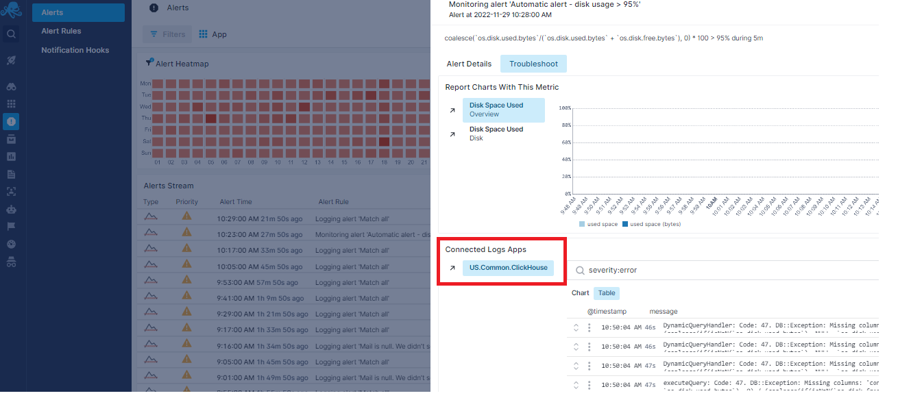
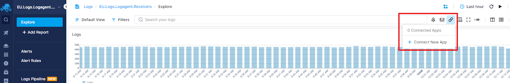
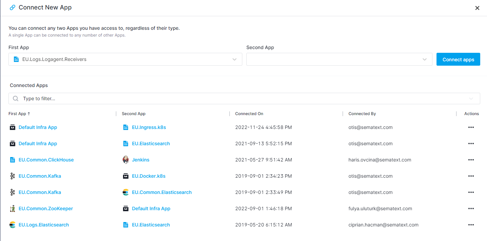
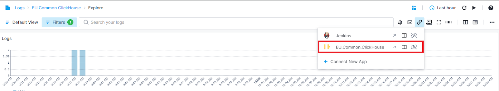
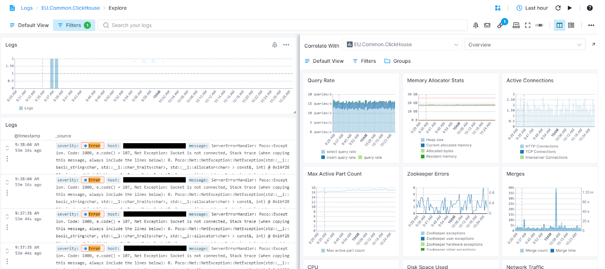
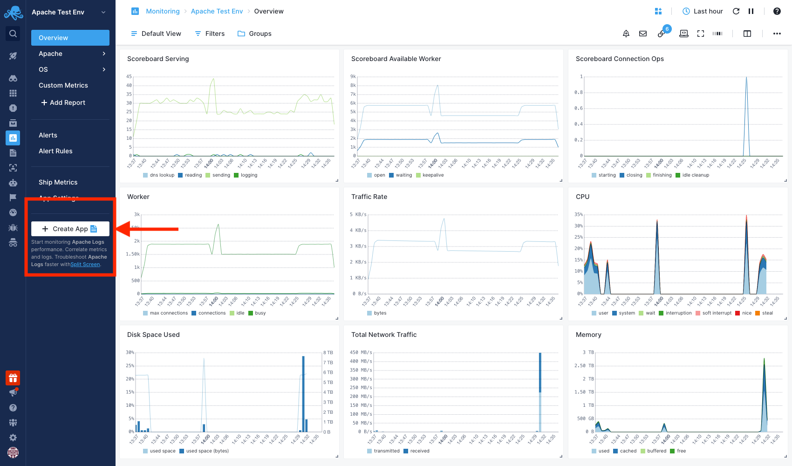
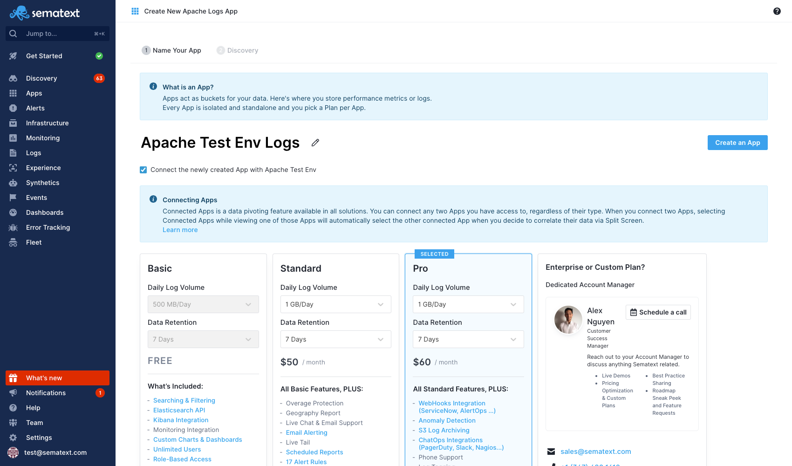

title: Connected Apps Guide
description: Connected Apps is a data pivoting feature and available in all solutions. You can connect any two Apps you have access to, regardless of their type.

Connected Apps is a data pivoting feature and available in all solutions. You can connect any two Apps you have access to, regardless of their type.  Any App can be connected to any number of other Apps.

## Benefits of Connecting Apps

Having Apps connected provides more context and enables faster troubleshooting.  Connecting Apps makes it easier to go from metrics to logs or vice versa, or to look at them side by side in order to correlate spikes, dips in performance or log volume or type patterns and discover the root cause of a problem easier and faster. Details below.

## When Connecting Apps is Handy

Here are just two examples for when connecting Apps is not only useful, but recommended.

- If you are collecting both performance metrics and logs for an Elasticsearch cluster, you might want to connect the Monitoring App and Logs App with these data so you can more easily switch from Elasticsearch metrics to logs and vice versa.
- Technologies like ClickHouse, Kafka, SolrCloud and others use ZooKeeper.  Thus, the performance and health of ZooKeeper is critical and affects the performance and health of these technologies.  In other words, not only do you want to monitor ZooKeeper if you are running SolrCloud, for example, but you may also want to connect any Monitoring or Logs Apps that with SolrCloud and ZooKeeper metrics or logs.

By connecting Apps you benefit from having more context when you get an alert and can troubleshoot faster, as described below.

### Connected Apps in Alert Notications

When Sematext emails an [alert notification](../alerts/alert-notifications/) it captures the screen with App reports where the alert rule that generated the notification was created.  This way you will immediately and visually see the problem on one of the charts included in the emailed report.  However, when the App whose alert was triggered is connected to other Apps, Sematext automatically captures the screen of all connected Apps and includes them in the notification.  Thus, you can get more context about the alert and your other related applications and infrastructure that might either be affected by the issue or may have been the cause of the problem to begin with.  You can simply look at all reports included in the alert notification and get the broader sense of what happened without opening an [alert event](../alerts/alert-events/) in Sematext to investigate.

### Connected Apps on the Alert Details Screen

In addition, when you look at the [individual alert event](../alerts/alert-events/) to troubleshoot, all connected Apps and their data will be right there, as shown below, to aid with discovering the root cause.

### Connected Apps in Split Screen Correlation

When you connect two Apps, selecting Connected Apps in the UI while viewing one of those Apps will automatically select the other connected App when you decide to correlate their data via [Split Screen](https://sematext.com/docs/guide/split-screen/).

### How to Connnect Apps

To connect Apps, click on the connect Apps icon on top right from any report and click **“+ Connect New App”** button.

Select the Apps and click **“Connect Apps”** button.

### Using Split Screen to Correlate Data in Connected Apps

Once you connect Apps, you can easily navigate from one App to the other with a single click or open the second App in [Split Screen](https://sematext.com/docs/guide/split-screen/) to correlate their data.

Let’s say you are monitoring a ClickHouse database and shipping its metrics and logs to Sematext Cloud. You started seeing a significant amount of error logs and you want to investigate it further by comparing with metrics.

If the two Apps are connected, you can easily open the Monitoring App in [Split Screen](https://sematext.com/docs/guide/split-screen/) as shown below.

Once both Apps' data is shown in the Split Screen you will be able to see whether there are any significant spikes in metrics that correlate with the spike in error logs.  For example, this may help you identify that it is the insufficient resources or the unexpected query rates or connections that are the source of error logs coming from your database.

## Companion Apps
Companion Apps allow you to create a Logs App directly from a Monitoring App and vice versa. Within your existing App, simply click on the Companion App. 

You can use the suggested name or edit a new one for your Companion App. A checkbox controls whether you want to connect both Apps, enabled by default. You always have the option to connect them manually later. Once you click the "Create an App" button, both Apps will be automatically connected. Furthermore, the already installed Agents can be used, allowing you to directly configure the newly created App.

With both Apps automatically connected, you can now correlate their data for further troubleshooting via [Split Screen](https://sematext.com/docs/guide/split-screen/).

