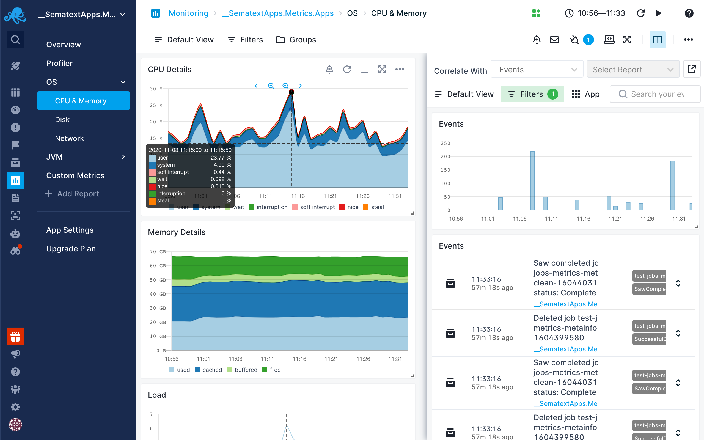

title: Sematext Events User Guide
description: Overview of Events in Sematext, their use and purpose

Sematext lets you visualize performance, metrics, logs, and [events](../events/). In Sematext, events are often used to represent what's happening with a server or cluster, with an application, a Docker container, and much more.

What are events? Why do you need them and how do you use them?

Think about when something happens in your infrastructure, such as:

- An **application starts/stops**
- or **server restarts**, 
- **CI/CD builds** finish running, 
- **deployments** succeed, 
- **alerts** send out **notifications**, etc.

These are all events.  See [event examples](../events/event-examples.md) for more.

Events can be visualized as time-series charts, heatbars, or tables using [Chart Builder](../dashboards/chart-builder/) and these data visualizations can be embedded in [Monitoring](../monitoring/) or [Logs](../logs/) reports or top-level [dashboards](../dashboards/).

## Events Correlations

You can [correlate events](../events/correlate.md) with metrics, logs, user experience or synthetic monitoring data using [split screen](./split-screen/). This type of correlation enables you to see how certain events, such as deployments, affected performance or to see whether a performance or error spike co-occured with an event such as application restart, or any other change in the application or infrastructure.  You can view events, logs, and metrics on the same timeline, saving you huge amounts of time when debugging.  See [correlation for metrics](../monitoring/correlation/) and [correlation for logs](../logs/correlation/).

## Learn More about Events
See [events docs](../events/) for more information about [adding events](../events/adding.md) via the API or UI, their types and fields, [viewing and searching events](../events/timeline.md), and more.
