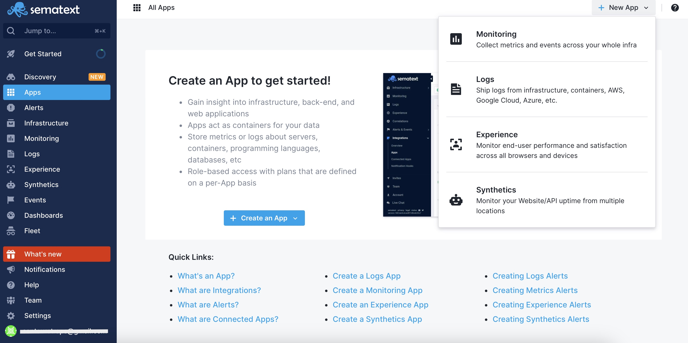
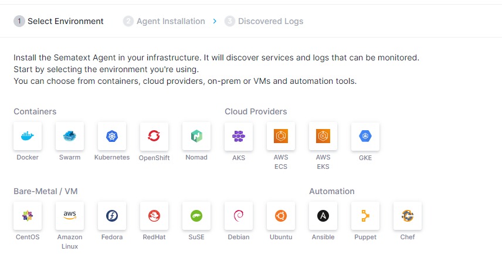
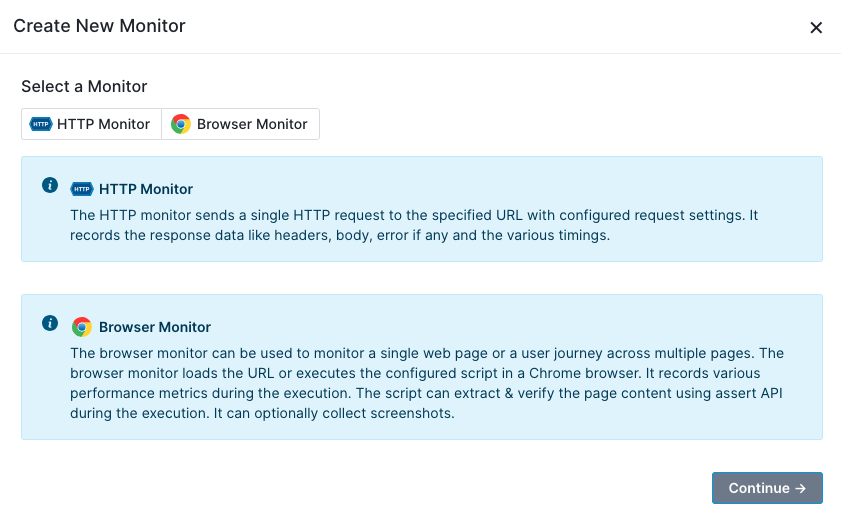
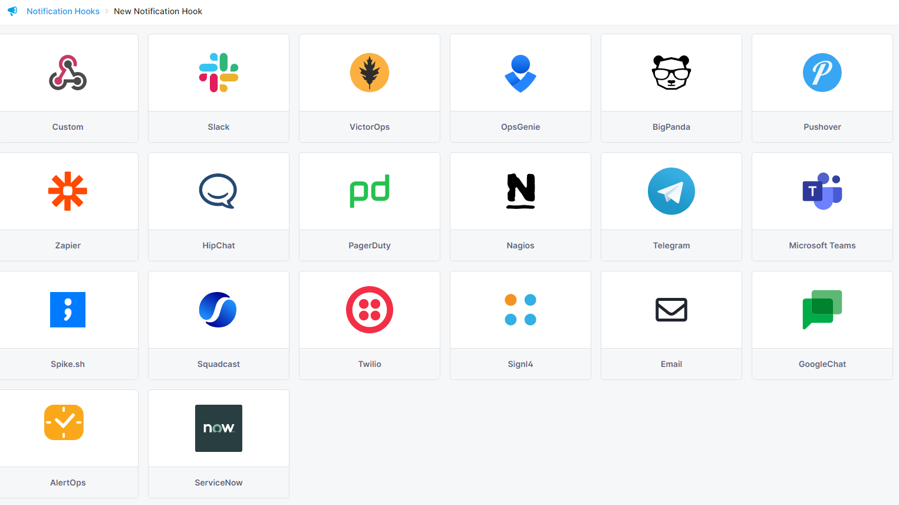
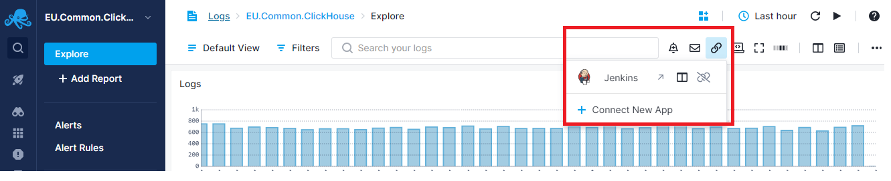

title: Sematext Integrations Guide
description: Sematext Cloud has 100+ built-in integrations for monitoring services, infrastructure, websites, APIs, etc.

Sematext Cloud provides over 100 built-in [integrations](https://sematext.com/integrations) used to monitor all your systems, apps, services, websites, APIs, etc.

## Understanding Integrations

Integrations provide everything you need to start monitoring in minutes. They include:
Simplified monitoring and log shipping for different scenarios
Collection of all key metrics and logs from your applications, services, and infrastructure
Out of the box parsing and structuring of known log formats
Valuable out of the box dashboards that can be customized to your specific requirements
Carefully selected alert rules that can be adjusted to suit your needs
Inline tips for better understanding of metrics and logs shown on dashboards

Whether you're interested in database performance, server health, application metrics or website and API monitoring, we've got an integration for you.

## Available Integrations
Explore our [extensive list of integrations](https://sematext.com/docs/integration/), each designed to support your specific use case.

## Adding a New Integration

An [App](app-guide) is a core concept in Sematext.  As part of the monitoring setup you will create an App for the desired integration type.

Go to the [Apps](https://apps.sematext.com/ui/integrations/apps) page to create a new App. Pick a solution type and all the available integrations for that solution will be listed. 

Hover over any integration card and click to create the respective App.

### Monitoring Infrastructure, Services, and Logs
After you create a Monitoring or Logs App, pick the environment that runs the service you want to monitor.

After you select your environment, the agent installation page will provide the step-by-step instructions for installing [Sematext Agent](../agents/sematext-agent/).

The Sematext Agent discovers services and logs on all hosts where it’s running. This allows you to start monitoring any of the discovered services or logs directly from the UI.  There will be no need to modify or restart your services to start monitoring them or their logs. Thanks to [service discovery](../monitoring/autodiscovery/) and [logs discovery](../logs/discovery/intro/), the whole process is automated, making it simple to monitor services and ship logs with minimal effort.

Once the Sematext Agent is installed, integrations provide monitoring capabilities for the following types of data:

- [Metrics](../monitoring) from your infrastructure or services running on it
- [Logs](../logs) from your applications, servers, etc.
- [Events](../events) such as services starting or restarting, package installs and version updates, builds, deployments, alerts, etc. Events are graphed in timeseries charts and these charts can be correlated with metrics or logs components to enable faster troubleshooting.

### Monitoring Websites, User Journeys, APIs, and User Experience

For a [Synthetics](../synthetics) or [Experience](../experience) App, the Sematext Agent is not needed to monitor your website, user journeys, APIs, or user experience. 

Synthetic monitoring of websites, user journeys, or APIs requires no installation of any kind - it is all configurable in the UI.

When creating an Experience App, you’ll get step-by-step instructions to add and configure a snippet of JavaScript for insertion in your web pages. This library is securely delivered to your website visitors via HTTPS with the rest of your site.

### Notification Hooks

When an App is first created you may find that Sematext automatically created an e-mail [default alert](../alerts/default-alerts/). User account email is used as a [default notification hook](https://sematext.com/docs/alerts/account-default-hooks/) to send those alert notifications. If you want to use any of the popular third party messaging services that you use in your operations workflow, you can do so by creating additional [notification hooks](https://sematext.com/docs/integration/#alerts-notifications).

After you install and activate an integration for a service you want to monitor, you can:

- Filter and analyze the metrics and log events
- Query your data and create custom dashboards
- Create alert rules to detect problems with your services, infrastructure, website, etc. and get alerted via one or more [alert notification hooks](../alerts/alert-notifications).

## Connecting Apps

To help speed up troubleshooting make use of [Connected Apps](connected-apps). For example, connecting a Monitoring App to a Logs App will pre-select that Logs App when you decide to correlate metrics using [Split Screen](https://sematext.com/docs/guide/split-screen/). When you receive an alert notification for an App, the alert notification will contain charts from connected Apps, and thus provide more information and context for you. You can connect any two Apps you have access to, regardless of their type. A single App can be connected to any number of other Apps. 

To connect Apps go to App Table View and choose Connect App from Integration Menu. 

Or navigate to the App and click on the Connect New App button on the top right of the page.

## Get Started
Ready to create your first integration? Get started by creating a new App for monitoring.

- [Infrastructure and backend services](https://sematext.com/docs/monitoring/quick-start/)
- [Logs](https://sematext.com/docs/logs/quick-start/)
- [User experience](https://sematext.com/docs/experience/getting-started/)
- [Websites and APIs](https://sematext.com/docs/synthetics/getting-started)

